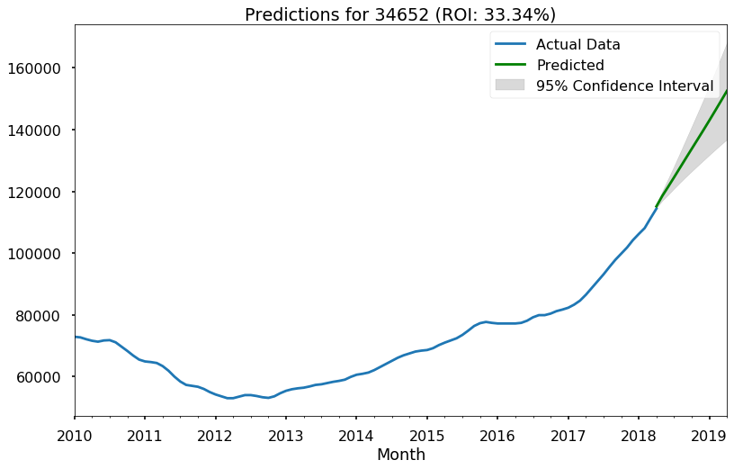

## Final Project Submission

Please fill out:
* Student name: Devin Belden
* Student pace: full time
* Scheduled project review date/time: Wed, Jan 15, 2020, 2:00 PM - 3:00 PM MST
* Instructor name: James Irving, Ph.D
* Blog post URL: https://devinbelden.github.io/the_ocarina_of_time_series

# Business Case

For this project, we attempt to parse through real estate sales data throughout the US and nail down the five best ZIP codes in which to invest. The definition of "best" we have chosen for this project is to have a high return on investment (ROI) while having a narrow confidence band for that ROI. Specifically, the heuristic we use to penalize a wide confidence band is

$$\large \text{Score} = \begin{cases}\dfrac{10R}{\log(P_H-P_L+2)}, & \text{if } R>0, \newline
\phantom{----}R, & \text{if } R\leq 0.\end{cases}$$

where $R$ is the predicted ROI as a percentage, and $P_H$ and $P_L$ are the highest and lowest prediction values within the 95% confidence band at the end of the prediction time period, respectively. Further reading on this heuristic, including the derivation, can be found in the Appendix.

Note: The last datapoint in the Zillow dataset is April 2018. All of our predictions are made up to and including April 2019.

# Importing/Exploring Data

First, let's import relevant packages, as well as import the dataset.


```python
import pandas as pd
import numpy as np
import pickle
import matplotlib
import matplotlib.pyplot as plt
%matplotlib inline

plt.style.use('seaborn-poster')
pd.set_option('display.max_columns', 0)

zillow = pd.read_csv('zillow_data.csv')

zillow.head()
```


<div>
<style scoped>
    .dataframe tbody tr th:only-of-type {
        vertical-align: middle;
    }

    .dataframe tbody tr th {
        vertical-align: top;
    }

    .dataframe thead th {
        text-align: right;
    }
</style>
<table border="1" class="dataframe">
  <thead>
    <tr style="text-align: right;">
      <th></th>
      <th>RegionID</th>
      <th>RegionName</th>
      <th>City</th>
      <th>State</th>
      <th>Metro</th>
      <th>CountyName</th>
      <th>SizeRank</th>
      <th>1996-04</th>
      <th>1996-05</th>
      <th>1996-06</th>
      <th>1996-07</th>
      <th>1996-08</th>
      <th>1996-09</th>
      <th>1996-10</th>
      <th>1996-11</th>
      <th>1996-12</th>
      <th>1997-01</th>
      <th>1997-02</th>
      <th>1997-03</th>
      <th>1997-04</th>
      <th>1997-05</th>
      <th>1997-06</th>
      <th>1997-07</th>
      <th>1997-08</th>
      <th>1997-09</th>
      <th>1997-10</th>
      <th>1997-11</th>
      <th>1997-12</th>
      <th>1998-01</th>
      <th>1998-02</th>
      <th>1998-03</th>
      <th>1998-04</th>
      <th>1998-05</th>
      <th>1998-06</th>
      <th>1998-07</th>
      <th>1998-08</th>
      <th>1998-09</th>
      <th>1998-10</th>
      <th>1998-11</th>
      <th>1998-12</th>
      <th>...</th>
      <th>2015-01</th>
      <th>2015-02</th>
      <th>2015-03</th>
      <th>2015-04</th>
      <th>2015-05</th>
      <th>2015-06</th>
      <th>2015-07</th>
      <th>2015-08</th>
      <th>2015-09</th>
      <th>2015-10</th>
      <th>2015-11</th>
      <th>2015-12</th>
      <th>2016-01</th>
      <th>2016-02</th>
      <th>2016-03</th>
      <th>2016-04</th>
      <th>2016-05</th>
      <th>2016-06</th>
      <th>2016-07</th>
      <th>2016-08</th>
      <th>2016-09</th>
      <th>2016-10</th>
      <th>2016-11</th>
      <th>2016-12</th>
      <th>2017-01</th>
      <th>2017-02</th>
      <th>2017-03</th>
      <th>2017-04</th>
      <th>2017-05</th>
      <th>2017-06</th>
      <th>2017-07</th>
      <th>2017-08</th>
      <th>2017-09</th>
      <th>2017-10</th>
      <th>2017-11</th>
      <th>2017-12</th>
      <th>2018-01</th>
      <th>2018-02</th>
      <th>2018-03</th>
      <th>2018-04</th>
    </tr>
  </thead>
  <tbody>
    <tr>
      <th>0</th>
      <td>84654</td>
      <td>60657</td>
      <td>Chicago</td>
      <td>IL</td>
      <td>Chicago</td>
      <td>Cook</td>
      <td>1</td>
      <td>334200.0</td>
      <td>335400.0</td>
      <td>336500.0</td>
      <td>337600.0</td>
      <td>338500.0</td>
      <td>339500.0</td>
      <td>340400.0</td>
      <td>341300.0</td>
      <td>342600.0</td>
      <td>344400.0</td>
      <td>345700.0</td>
      <td>346700.0</td>
      <td>347800.0</td>
      <td>349000.0</td>
      <td>350400.0</td>
      <td>352000.0</td>
      <td>353900.0</td>
      <td>356200.0</td>
      <td>358800.0</td>
      <td>361800.0</td>
      <td>365700.0</td>
      <td>370200.0</td>
      <td>374700.0</td>
      <td>378900.0</td>
      <td>383500.0</td>
      <td>388300.0</td>
      <td>393300.0</td>
      <td>398500.0</td>
      <td>403800.0</td>
      <td>409100.0</td>
      <td>414600.0</td>
      <td>420100.0</td>
      <td>426200.0</td>
      <td>...</td>
      <td>893000</td>
      <td>895000</td>
      <td>901200</td>
      <td>909400</td>
      <td>915000</td>
      <td>916700</td>
      <td>917700</td>
      <td>919800</td>
      <td>925800</td>
      <td>937100</td>
      <td>948200</td>
      <td>951000</td>
      <td>952500</td>
      <td>958600</td>
      <td>966200</td>
      <td>970400</td>
      <td>973900</td>
      <td>974700</td>
      <td>972600</td>
      <td>974300</td>
      <td>980800</td>
      <td>988000</td>
      <td>994700</td>
      <td>998700</td>
      <td>997000</td>
      <td>993700</td>
      <td>991300</td>
      <td>989200</td>
      <td>991300</td>
      <td>999100</td>
      <td>1005500</td>
      <td>1007500</td>
      <td>1007800</td>
      <td>1009600</td>
      <td>1013300</td>
      <td>1018700</td>
      <td>1024400</td>
      <td>1030700</td>
      <td>1033800</td>
      <td>1030600</td>
    </tr>
    <tr>
      <th>1</th>
      <td>90668</td>
      <td>75070</td>
      <td>McKinney</td>
      <td>TX</td>
      <td>Dallas-Fort Worth</td>
      <td>Collin</td>
      <td>2</td>
      <td>235700.0</td>
      <td>236900.0</td>
      <td>236700.0</td>
      <td>235400.0</td>
      <td>233300.0</td>
      <td>230600.0</td>
      <td>227300.0</td>
      <td>223400.0</td>
      <td>219600.0</td>
      <td>215800.0</td>
      <td>211100.0</td>
      <td>205700.0</td>
      <td>200900.0</td>
      <td>196800.0</td>
      <td>193600.0</td>
      <td>191400.0</td>
      <td>190400.0</td>
      <td>190800.0</td>
      <td>192700.0</td>
      <td>196000.0</td>
      <td>201300.0</td>
      <td>207400.0</td>
      <td>212200.0</td>
      <td>214600.0</td>
      <td>215100.0</td>
      <td>213400.0</td>
      <td>210200.0</td>
      <td>206100.0</td>
      <td>202100.0</td>
      <td>198800.0</td>
      <td>196100.0</td>
      <td>194100.0</td>
      <td>193400.0</td>
      <td>...</td>
      <td>251400</td>
      <td>253000</td>
      <td>255200</td>
      <td>258000</td>
      <td>261200</td>
      <td>264700</td>
      <td>268400</td>
      <td>271400</td>
      <td>273600</td>
      <td>275200</td>
      <td>276400</td>
      <td>277000</td>
      <td>277900</td>
      <td>280000</td>
      <td>282600</td>
      <td>285400</td>
      <td>288400</td>
      <td>290800</td>
      <td>292000</td>
      <td>292800</td>
      <td>293700</td>
      <td>295200</td>
      <td>297000</td>
      <td>299000</td>
      <td>300800</td>
      <td>301800</td>
      <td>302800</td>
      <td>304400</td>
      <td>306200</td>
      <td>307000</td>
      <td>308000</td>
      <td>310000</td>
      <td>312500</td>
      <td>314100</td>
      <td>315000</td>
      <td>316600</td>
      <td>318100</td>
      <td>319600</td>
      <td>321100</td>
      <td>321800</td>
    </tr>
    <tr>
      <th>2</th>
      <td>91982</td>
      <td>77494</td>
      <td>Katy</td>
      <td>TX</td>
      <td>Houston</td>
      <td>Harris</td>
      <td>3</td>
      <td>210400.0</td>
      <td>212200.0</td>
      <td>212200.0</td>
      <td>210700.0</td>
      <td>208300.0</td>
      <td>205500.0</td>
      <td>202500.0</td>
      <td>199800.0</td>
      <td>198300.0</td>
      <td>197300.0</td>
      <td>195400.0</td>
      <td>193000.0</td>
      <td>191800.0</td>
      <td>191800.0</td>
      <td>193000.0</td>
      <td>195200.0</td>
      <td>198400.0</td>
      <td>202800.0</td>
      <td>208000.0</td>
      <td>213800.0</td>
      <td>220700.0</td>
      <td>227500.0</td>
      <td>231800.0</td>
      <td>233400.0</td>
      <td>233900.0</td>
      <td>233500.0</td>
      <td>233300.0</td>
      <td>234300.0</td>
      <td>237400.0</td>
      <td>242800.0</td>
      <td>250200.0</td>
      <td>258600.0</td>
      <td>268000.0</td>
      <td>...</td>
      <td>301700</td>
      <td>302400</td>
      <td>303600</td>
      <td>306200</td>
      <td>309100</td>
      <td>311900</td>
      <td>314100</td>
      <td>316300</td>
      <td>319000</td>
      <td>322000</td>
      <td>324300</td>
      <td>326100</td>
      <td>327300</td>
      <td>327000</td>
      <td>327200</td>
      <td>328500</td>
      <td>329800</td>
      <td>330000</td>
      <td>329000</td>
      <td>327800</td>
      <td>326700</td>
      <td>325500</td>
      <td>324700</td>
      <td>324500</td>
      <td>323700</td>
      <td>322300</td>
      <td>320700</td>
      <td>320000</td>
      <td>320000</td>
      <td>320900</td>
      <td>321000</td>
      <td>320600</td>
      <td>320200</td>
      <td>320400</td>
      <td>320800</td>
      <td>321200</td>
      <td>321200</td>
      <td>323000</td>
      <td>326900</td>
      <td>329900</td>
    </tr>
    <tr>
      <th>3</th>
      <td>84616</td>
      <td>60614</td>
      <td>Chicago</td>
      <td>IL</td>
      <td>Chicago</td>
      <td>Cook</td>
      <td>4</td>
      <td>498100.0</td>
      <td>500900.0</td>
      <td>503100.0</td>
      <td>504600.0</td>
      <td>505500.0</td>
      <td>505700.0</td>
      <td>505300.0</td>
      <td>504200.0</td>
      <td>503600.0</td>
      <td>503400.0</td>
      <td>502200.0</td>
      <td>500000.0</td>
      <td>497900.0</td>
      <td>496300.0</td>
      <td>495200.0</td>
      <td>494700.0</td>
      <td>494900.0</td>
      <td>496200.0</td>
      <td>498600.0</td>
      <td>502000.0</td>
      <td>507600.0</td>
      <td>514900.0</td>
      <td>522200.0</td>
      <td>529500.0</td>
      <td>537900.0</td>
      <td>546900.0</td>
      <td>556400.0</td>
      <td>566100.0</td>
      <td>575600.0</td>
      <td>584800.0</td>
      <td>593500.0</td>
      <td>601600.0</td>
      <td>610100.0</td>
      <td>...</td>
      <td>1176400</td>
      <td>1174600</td>
      <td>1178500</td>
      <td>1185700</td>
      <td>1192900</td>
      <td>1198800</td>
      <td>1200400</td>
      <td>1198900</td>
      <td>1200200</td>
      <td>1207400</td>
      <td>1218600</td>
      <td>1226600</td>
      <td>1230700</td>
      <td>1235400</td>
      <td>1241300</td>
      <td>1245700</td>
      <td>1247000</td>
      <td>1246700</td>
      <td>1245700</td>
      <td>1246000</td>
      <td>1247700</td>
      <td>1252900</td>
      <td>1260900</td>
      <td>1267900</td>
      <td>1272600</td>
      <td>1276600</td>
      <td>1280300</td>
      <td>1282500</td>
      <td>1286000</td>
      <td>1289000</td>
      <td>1289800</td>
      <td>1287700</td>
      <td>1287400</td>
      <td>1291500</td>
      <td>1296600</td>
      <td>1299000</td>
      <td>1302700</td>
      <td>1306400</td>
      <td>1308500</td>
      <td>1307000</td>
    </tr>
    <tr>
      <th>4</th>
      <td>93144</td>
      <td>79936</td>
      <td>El Paso</td>
      <td>TX</td>
      <td>El Paso</td>
      <td>El Paso</td>
      <td>5</td>
      <td>77300.0</td>
      <td>77300.0</td>
      <td>77300.0</td>
      <td>77300.0</td>
      <td>77400.0</td>
      <td>77500.0</td>
      <td>77600.0</td>
      <td>77700.0</td>
      <td>77700.0</td>
      <td>77800.0</td>
      <td>77900.0</td>
      <td>77900.0</td>
      <td>77800.0</td>
      <td>77800.0</td>
      <td>77800.0</td>
      <td>77800.0</td>
      <td>77800.0</td>
      <td>77900.0</td>
      <td>78100.0</td>
      <td>78200.0</td>
      <td>78400.0</td>
      <td>78600.0</td>
      <td>78800.0</td>
      <td>79000.0</td>
      <td>79100.0</td>
      <td>79200.0</td>
      <td>79300.0</td>
      <td>79300.0</td>
      <td>79300.0</td>
      <td>79400.0</td>
      <td>79500.0</td>
      <td>79500.0</td>
      <td>79600.0</td>
      <td>...</td>
      <td>114700</td>
      <td>115000</td>
      <td>115000</td>
      <td>115200</td>
      <td>115600</td>
      <td>115900</td>
      <td>115600</td>
      <td>115400</td>
      <td>115400</td>
      <td>115500</td>
      <td>115800</td>
      <td>116300</td>
      <td>116200</td>
      <td>115600</td>
      <td>115000</td>
      <td>114500</td>
      <td>114200</td>
      <td>114000</td>
      <td>114000</td>
      <td>113900</td>
      <td>114100</td>
      <td>114900</td>
      <td>115700</td>
      <td>116300</td>
      <td>116900</td>
      <td>117300</td>
      <td>117600</td>
      <td>118000</td>
      <td>118600</td>
      <td>118900</td>
      <td>119100</td>
      <td>119400</td>
      <td>120000</td>
      <td>120300</td>
      <td>120300</td>
      <td>120300</td>
      <td>120300</td>
      <td>120500</td>
      <td>121000</td>
      <td>121500</td>
    </tr>
  </tbody>
</table>
<p>5 rows × 272 columns</p>
</div>


We'll need to convert this data such that it has a datetime index. We can do this using the `melt()` method built into pandas, as well as the `to_datetime()` and `set_index()` methods.


```python
def melt_data(df): #formerly called it melt_data_student with REED
    melted = pd.melt(df, id_vars=['RegionID','RegionName', 'City', 'State', 'Metro', 'CountyName', 
                                  'SizeRank'], var_name='Month', value_name='MeanValue')
    melted['Month'] = pd.to_datetime(melted['Month'], format='%Y-%m')
    melted = melted.dropna(subset=['MeanValue'])
    return melted
```


```python
df = melt_data(zillow)
df.head()
```


<div>
<style scoped>
    .dataframe tbody tr th:only-of-type {
        vertical-align: middle;
    }

    .dataframe tbody tr th {
        vertical-align: top;
    }

    .dataframe thead th {
        text-align: right;
    }
</style>
<table border="1" class="dataframe">
  <thead>
    <tr style="text-align: right;">
      <th></th>
      <th>RegionID</th>
      <th>RegionName</th>
      <th>City</th>
      <th>State</th>
      <th>Metro</th>
      <th>CountyName</th>
      <th>SizeRank</th>
      <th>Month</th>
      <th>MeanValue</th>
    </tr>
  </thead>
  <tbody>
    <tr>
      <th>0</th>
      <td>84654</td>
      <td>60657</td>
      <td>Chicago</td>
      <td>IL</td>
      <td>Chicago</td>
      <td>Cook</td>
      <td>1</td>
      <td>1996-04-01</td>
      <td>334200.0</td>
    </tr>
    <tr>
      <th>1</th>
      <td>90668</td>
      <td>75070</td>
      <td>McKinney</td>
      <td>TX</td>
      <td>Dallas-Fort Worth</td>
      <td>Collin</td>
      <td>2</td>
      <td>1996-04-01</td>
      <td>235700.0</td>
    </tr>
    <tr>
      <th>2</th>
      <td>91982</td>
      <td>77494</td>
      <td>Katy</td>
      <td>TX</td>
      <td>Houston</td>
      <td>Harris</td>
      <td>3</td>
      <td>1996-04-01</td>
      <td>210400.0</td>
    </tr>
    <tr>
      <th>3</th>
      <td>84616</td>
      <td>60614</td>
      <td>Chicago</td>
      <td>IL</td>
      <td>Chicago</td>
      <td>Cook</td>
      <td>4</td>
      <td>1996-04-01</td>
      <td>498100.0</td>
    </tr>
    <tr>
      <th>4</th>
      <td>93144</td>
      <td>79936</td>
      <td>El Paso</td>
      <td>TX</td>
      <td>El Paso</td>
      <td>El Paso</td>
      <td>5</td>
      <td>1996-04-01</td>
      <td>77300.0</td>
    </tr>
  </tbody>
</table>
</div>


```python
df['Month'] = pd.to_datetime(df['Month'], errors='coerce')
df = df.set_index('Month', drop=False)
df.head()
```


<div>
<style scoped>
    .dataframe tbody tr th:only-of-type {
        vertical-align: middle;
    }

    .dataframe tbody tr th {
        vertical-align: top;
    }

    .dataframe thead th {
        text-align: right;
    }
</style>
<table border="1" class="dataframe">
  <thead>
    <tr style="text-align: right;">
      <th></th>
      <th>RegionID</th>
      <th>RegionName</th>
      <th>City</th>
      <th>State</th>
      <th>Metro</th>
      <th>CountyName</th>
      <th>SizeRank</th>
      <th>Month</th>
      <th>MeanValue</th>
    </tr>
    <tr>
      <th>Month</th>
      <th></th>
      <th></th>
      <th></th>
      <th></th>
      <th></th>
      <th></th>
      <th></th>
      <th></th>
      <th></th>
    </tr>
  </thead>
  <tbody>
    <tr>
      <th>1996-04-01</th>
      <td>84654</td>
      <td>60657</td>
      <td>Chicago</td>
      <td>IL</td>
      <td>Chicago</td>
      <td>Cook</td>
      <td>1</td>
      <td>1996-04-01</td>
      <td>334200.0</td>
    </tr>
    <tr>
      <th>1996-04-01</th>
      <td>90668</td>
      <td>75070</td>
      <td>McKinney</td>
      <td>TX</td>
      <td>Dallas-Fort Worth</td>
      <td>Collin</td>
      <td>2</td>
      <td>1996-04-01</td>
      <td>235700.0</td>
    </tr>
    <tr>
      <th>1996-04-01</th>
      <td>91982</td>
      <td>77494</td>
      <td>Katy</td>
      <td>TX</td>
      <td>Houston</td>
      <td>Harris</td>
      <td>3</td>
      <td>1996-04-01</td>
      <td>210400.0</td>
    </tr>
    <tr>
      <th>1996-04-01</th>
      <td>84616</td>
      <td>60614</td>
      <td>Chicago</td>
      <td>IL</td>
      <td>Chicago</td>
      <td>Cook</td>
      <td>4</td>
      <td>1996-04-01</td>
      <td>498100.0</td>
    </tr>
    <tr>
      <th>1996-04-01</th>
      <td>93144</td>
      <td>79936</td>
      <td>El Paso</td>
      <td>TX</td>
      <td>El Paso</td>
      <td>El Paso</td>
      <td>5</td>
      <td>1996-04-01</td>
      <td>77300.0</td>
    </tr>
  </tbody>
</table>
</div>


It's worth mentioning that RegionID and RegionName seem to be two sides of the same coin, but in reality, RegionName is just the ZIP code. It's unknown what RegionID means, but we'll keep it in the dataframe anyway. It might come in handy later.

For RegionName, however, let's just rename that column ZipCode. 


```python
df.rename(columns={'RegionName': 'ZipCode'}, inplace=True)
```

# EDA and Data Visualization

As part of EDA, we'll need to plot graphs of different ZIP codes' prices as functions of time. Let's create a new dataframe re-indexed by `ZipCode` and write a function to plot ZIP codes of our choice.


```python
df2 = df.groupby('ZipCode').resample('MS').asfreq()
df2
```


<div>
<style scoped>
    .dataframe tbody tr th:only-of-type {
        vertical-align: middle;
    }

    .dataframe tbody tr th {
        vertical-align: top;
    }

    .dataframe thead th {
        text-align: right;
    }
</style>
<table border="1" class="dataframe">
  <thead>
    <tr style="text-align: right;">
      <th></th>
      <th></th>
      <th>RegionID</th>
      <th>ZipCode</th>
      <th>City</th>
      <th>State</th>
      <th>Metro</th>
      <th>CountyName</th>
      <th>SizeRank</th>
      <th>Month</th>
      <th>MeanValue</th>
    </tr>
    <tr>
      <th>ZipCode</th>
      <th>Month</th>
      <th></th>
      <th></th>
      <th></th>
      <th></th>
      <th></th>
      <th></th>
      <th></th>
      <th></th>
      <th></th>
    </tr>
  </thead>
  <tbody>
    <tr>
      <th rowspan="5" valign="top">1001</th>
      <th>1996-04-01</th>
      <td>58196</td>
      <td>1001</td>
      <td>Agawam</td>
      <td>MA</td>
      <td>Springfield</td>
      <td>Hampden</td>
      <td>5851</td>
      <td>1996-04-01</td>
      <td>113100.0</td>
    </tr>
    <tr>
      <th>1996-05-01</th>
      <td>58196</td>
      <td>1001</td>
      <td>Agawam</td>
      <td>MA</td>
      <td>Springfield</td>
      <td>Hampden</td>
      <td>5851</td>
      <td>1996-05-01</td>
      <td>112800.0</td>
    </tr>
    <tr>
      <th>1996-06-01</th>
      <td>58196</td>
      <td>1001</td>
      <td>Agawam</td>
      <td>MA</td>
      <td>Springfield</td>
      <td>Hampden</td>
      <td>5851</td>
      <td>1996-06-01</td>
      <td>112600.0</td>
    </tr>
    <tr>
      <th>1996-07-01</th>
      <td>58196</td>
      <td>1001</td>
      <td>Agawam</td>
      <td>MA</td>
      <td>Springfield</td>
      <td>Hampden</td>
      <td>5851</td>
      <td>1996-07-01</td>
      <td>112300.0</td>
    </tr>
    <tr>
      <th>1996-08-01</th>
      <td>58196</td>
      <td>1001</td>
      <td>Agawam</td>
      <td>MA</td>
      <td>Springfield</td>
      <td>Hampden</td>
      <td>5851</td>
      <td>1996-08-01</td>
      <td>112100.0</td>
    </tr>
    <tr>
      <th>...</th>
      <th>...</th>
      <td>...</td>
      <td>...</td>
      <td>...</td>
      <td>...</td>
      <td>...</td>
      <td>...</td>
      <td>...</td>
      <td>...</td>
      <td>...</td>
    </tr>
    <tr>
      <th rowspan="5" valign="top">99901</th>
      <th>2017-12-01</th>
      <td>100478</td>
      <td>99901</td>
      <td>Ketchikan</td>
      <td>AK</td>
      <td>Ketchikan</td>
      <td>Ketchikan Gateway</td>
      <td>7294</td>
      <td>2017-12-01</td>
      <td>291900.0</td>
    </tr>
    <tr>
      <th>2018-01-01</th>
      <td>100478</td>
      <td>99901</td>
      <td>Ketchikan</td>
      <td>AK</td>
      <td>Ketchikan</td>
      <td>Ketchikan Gateway</td>
      <td>7294</td>
      <td>2018-01-01</td>
      <td>294200.0</td>
    </tr>
    <tr>
      <th>2018-02-01</th>
      <td>100478</td>
      <td>99901</td>
      <td>Ketchikan</td>
      <td>AK</td>
      <td>Ketchikan</td>
      <td>Ketchikan Gateway</td>
      <td>7294</td>
      <td>2018-02-01</td>
      <td>297500.0</td>
    </tr>
    <tr>
      <th>2018-03-01</th>
      <td>100478</td>
      <td>99901</td>
      <td>Ketchikan</td>
      <td>AK</td>
      <td>Ketchikan</td>
      <td>Ketchikan Gateway</td>
      <td>7294</td>
      <td>2018-03-01</td>
      <td>302100.0</td>
    </tr>
    <tr>
      <th>2018-04-01</th>
      <td>100478</td>
      <td>99901</td>
      <td>Ketchikan</td>
      <td>AK</td>
      <td>Ketchikan</td>
      <td>Ketchikan Gateway</td>
      <td>7294</td>
      <td>2018-04-01</td>
      <td>305100.0</td>
    </tr>
  </tbody>
</table>
<p>3744704 rows × 9 columns</p>
</div>


## Preliminary Visualization of Raw Data

For preliminary data visualization, let's write a function that takes in a list of ZIP codes as input, and outputs a plot of the `MeanValue` over time.


```python
def plot_ts(zipcodes=[1001], df=df2, col='MeanValue', show_crash=False):
    
    fig, ax = plt.subplots(figsize=(14,7))
    
    for zipcode in zipcodes:
        ts = df[col].loc[zipcode]
        if zipcode/10000 < 1:
            label='0'+str(zipcode)+': '+df['City'][zipcode][0]+', '+df['State'][zipcode][0]
        else:
            label=str(zipcode)+': '+df['City'][zipcode][0]+', '+df['State'][zipcode][0]
        ts.plot(label=label, ax=ax)
        
    if show_crash:
        ax.axvline('08-2008', label='Housing Market Crash', color='red', ls=':')
    
    ax.legend()
    plt.show()

plot_ts(zipcodes=[85719, 85224,75068,95688,94561,94903,1267], show_crash=True)
```


Here, we've defined August of 2008 as the start of the real estate crash. As can be seen from the above visualization, nearly all of the ZIP codes follow a similar trend over time. Isolating one ZIP code, the blue line:


```python
plot_ts([85719], show_crash=True)
```


# Eliminating Data I

For purposes of this project, we're going to move forward with data from 2010 onwards, as using pre-crash data would not only drastically increase our computing needs, but it's a reasonable assumption that it would also lead to somewhat unreliable predictions. However, we don't want to just use post-recovery data (2012 onwards), as the future predictions would be less conservative than we might want. Therefore, picking 2010 as our cutoff point is a decent combination of conservative estimation and computing power. 


```python
df = df[df['Month'] > '2009-12-31']
df.head()
```


<div>
<style scoped>
    .dataframe tbody tr th:only-of-type {
        vertical-align: middle;
    }

    .dataframe tbody tr th {
        vertical-align: top;
    }

    .dataframe thead th {
        text-align: right;
    }
</style>
<table border="1" class="dataframe">
  <thead>
    <tr style="text-align: right;">
      <th></th>
      <th>RegionID</th>
      <th>ZipCode</th>
      <th>City</th>
      <th>State</th>
      <th>Metro</th>
      <th>CountyName</th>
      <th>SizeRank</th>
      <th>Month</th>
      <th>MeanValue</th>
    </tr>
    <tr>
      <th>Month</th>
      <th></th>
      <th></th>
      <th></th>
      <th></th>
      <th></th>
      <th></th>
      <th></th>
      <th></th>
      <th></th>
    </tr>
  </thead>
  <tbody>
    <tr>
      <th>2010-01-01</th>
      <td>84654</td>
      <td>60657</td>
      <td>Chicago</td>
      <td>IL</td>
      <td>Chicago</td>
      <td>Cook</td>
      <td>1</td>
      <td>2010-01-01</td>
      <td>775600.0</td>
    </tr>
    <tr>
      <th>2010-01-01</th>
      <td>90668</td>
      <td>75070</td>
      <td>McKinney</td>
      <td>TX</td>
      <td>Dallas-Fort Worth</td>
      <td>Collin</td>
      <td>2</td>
      <td>2010-01-01</td>
      <td>201300.0</td>
    </tr>
    <tr>
      <th>2010-01-01</th>
      <td>91982</td>
      <td>77494</td>
      <td>Katy</td>
      <td>TX</td>
      <td>Houston</td>
      <td>Harris</td>
      <td>3</td>
      <td>2010-01-01</td>
      <td>249200.0</td>
    </tr>
    <tr>
      <th>2010-01-01</th>
      <td>84616</td>
      <td>60614</td>
      <td>Chicago</td>
      <td>IL</td>
      <td>Chicago</td>
      <td>Cook</td>
      <td>4</td>
      <td>2010-01-01</td>
      <td>984100.0</td>
    </tr>
    <tr>
      <th>2010-01-01</th>
      <td>93144</td>
      <td>79936</td>
      <td>El Paso</td>
      <td>TX</td>
      <td>El Paso</td>
      <td>El Paso</td>
      <td>5</td>
      <td>2010-01-01</td>
      <td>117400.0</td>
    </tr>
  </tbody>
</table>
</div>


Let's isolate the same ZIP code from above as a time series.


```python
ts = df.loc[df['ZipCode'] == 85719]['MeanValue'].rename(85719)
ts.name
```


    85719


```python
plt.rcParams['figure.figsize'] = (14, 7)

ts = ts.resample('MS').asfreq()
ts.plot();
```


Now that we've got our timetable down, let's eliminate any missing or null values.


```python
df.isna().sum()
```


    RegionID           0
    ZipCode            0
    City               0
    State              0
    Metro         102910
    CountyName         0
    SizeRank           0
    Month              0
    MeanValue          0
    dtype: int64


```python
df['Metro'].fillna('Missing',inplace=True)
df.isna().sum()
```


    RegionID      0
    ZipCode       0
    City          0
    State         0
    Metro         0
    CountyName    0
    SizeRank      0
    Month         0
    MeanValue     0
    dtype: int64


# Eliminating Data II

As time series modeling is extremely sensitive to missing data, we want to isolate our dataframe such that it contains only those ZIP codes that have no missing data throughout the entirety of our timeframe. Let's see how much of our data we're cutting out, just in case it's a huge percentage.


```python
zipcodes = list(df[df['Month'] == '2010-01-01']['ZipCode'].unique())
print(len(zipcodes)/(df['ZipCode'].nunique()))
```

    0.9606737757250561
    

We'll be left with 96% of unique ZIP codes, which is a large enough percentage that we can move forward.


```python
for zipcode in df['ZipCode'].unique():
    if zipcode not in zipcodes:
        df = df[df['ZipCode'] != zipcode]
        
df.head()
```


<div>
<style scoped>
    .dataframe tbody tr th:only-of-type {
        vertical-align: middle;
    }

    .dataframe tbody tr th {
        vertical-align: top;
    }

    .dataframe thead th {
        text-align: right;
    }
</style>
<table border="1" class="dataframe">
  <thead>
    <tr style="text-align: right;">
      <th></th>
      <th>RegionID</th>
      <th>ZipCode</th>
      <th>City</th>
      <th>State</th>
      <th>Metro</th>
      <th>CountyName</th>
      <th>SizeRank</th>
      <th>Month</th>
      <th>MeanValue</th>
    </tr>
    <tr>
      <th>Month</th>
      <th></th>
      <th></th>
      <th></th>
      <th></th>
      <th></th>
      <th></th>
      <th></th>
      <th></th>
      <th></th>
    </tr>
  </thead>
  <tbody>
    <tr>
      <th>2010-01-01</th>
      <td>84654</td>
      <td>60657</td>
      <td>Chicago</td>
      <td>IL</td>
      <td>Chicago</td>
      <td>Cook</td>
      <td>1</td>
      <td>2010-01-01</td>
      <td>775600.0</td>
    </tr>
    <tr>
      <th>2010-01-01</th>
      <td>90668</td>
      <td>75070</td>
      <td>McKinney</td>
      <td>TX</td>
      <td>Dallas-Fort Worth</td>
      <td>Collin</td>
      <td>2</td>
      <td>2010-01-01</td>
      <td>201300.0</td>
    </tr>
    <tr>
      <th>2010-01-01</th>
      <td>91982</td>
      <td>77494</td>
      <td>Katy</td>
      <td>TX</td>
      <td>Houston</td>
      <td>Harris</td>
      <td>3</td>
      <td>2010-01-01</td>
      <td>249200.0</td>
    </tr>
    <tr>
      <th>2010-01-01</th>
      <td>84616</td>
      <td>60614</td>
      <td>Chicago</td>
      <td>IL</td>
      <td>Chicago</td>
      <td>Cook</td>
      <td>4</td>
      <td>2010-01-01</td>
      <td>984100.0</td>
    </tr>
    <tr>
      <th>2010-01-01</th>
      <td>93144</td>
      <td>79936</td>
      <td>El Paso</td>
      <td>TX</td>
      <td>El Paso</td>
      <td>El Paso</td>
      <td>5</td>
      <td>2010-01-01</td>
      <td>117400.0</td>
    </tr>
  </tbody>
</table>
</div>


As we've cut out all ZIP codes with fewer than 100 months' worth of data, we should have 100 months x 14,144 ZIP codes = 1,414,400 rows of data. 


```python
len(df)
```


    1414400


# ARIMA Modeling

Now we're ready for our ARIMA modeling, but first we have to choose which one. Do we run SARIMAX or ARIMA proper? To help us answer this question, we'll plot our ACF and PACF.


```python
from  statsmodels.graphics.tsaplots import plot_acf,plot_pacf

fig,ax = plt.subplots(nrows=2,figsize=(10,6))

plot_acf(ts,ax=ax[0],lags=40);
plot_pacf(ts, ax=ax[1],lags=40);
plt.tight_layout()
```


If this were just AutoRegressive, the ACF would tail off, and PACF would cut off. If it were just a Moving Average, the ACF would cut off and the PACF would tail off. If it were ARMA, both ACF and PACF would tail off. Additionally, this time series could use at least one order of differencing. Given those statements, this looks sort of like simply AutoRegressive, but let's do a seasonal decomposition just to check.


```python
from statsmodels.tsa.seasonal import seasonal_decompose

plt.rcParams['figure.figsize'] = (14, 9)

seasonal_decompose(ts).plot();
```


Just as expected, the seasonal component is +/-250 dollars, whereas our data ranges from \\$160,000 to \\$220,000. To save on computing power, we'll run a regular ARIMA model with one order of differencing, as the seasonal component makes such a miniscule difference that the tradeoff is not worth it.

# Function Junction

Let's create a series of helper functions that will be responsible for train-test splitting, gridsearching for an ARIMA model, running diagnostics on the best model, and using the best model for predicting future data. 

## Train-Test with Gridsearch

First we'll need a couple of functions that will split our data, and grid search for the best pdq values. 


```python
def get_train_test(ts, test_size=0.1):
    
    """Takes in a time series and returns a train-test split."""
    
    import math
    
    ts_split = math.floor(len(ts.index) * (1-test_size))

    ts_train = ts.iloc[:ts_split]
    ts_test = ts.iloc[ts_split:]
    
    return ts_train, ts_test


def grid_search(ts, p=range(6), d=[1], q=range(6), 
                include_dataframe=False):
    
    """Takes in a time series, a test size, and lists
    for pdq values to gridsearch for the best ARIMA model."""
    
    import itertools
    from statsmodels.tsa.statespace.sarimax import SARIMAX
    import warnings
    warnings.filterwarnings('ignore')
    
    ts_train, ts_test = get_train_test(ts)
    
    results = []
    combinations = list(itertools.product(p, d, q))

    for comb in combinations:
        try:
            model = SARIMAX(ts_train, order=comb, 
                            enforce_stationarity=False, 
                            enforce_invertibility=False)
            output = model.fit()
            results.append([comb, output.aic])
        except:
            continue
    
    df_results = pd.DataFrame(results, columns=['pdq', 'AIC'])
    best_pdq = df_results[df_results['AIC'] == df_results['AIC'].min()]['pdq']
    
    if include_dataframe:
        
        display(df_results.sort_values('AIC'))
    
    return best_pdq.values[0]
```


```python
ts_train, ts_test = get_train_test(ts)
pdq = grid_search(ts, include_dataframe=True)
pdq
```


<div>
<style scoped>
    .dataframe tbody tr th:only-of-type {
        vertical-align: middle;
    }

    .dataframe tbody tr th {
        vertical-align: top;
    }

    .dataframe thead th {
        text-align: right;
    }
</style>
<table border="1" class="dataframe">
  <thead>
    <tr style="text-align: right;">
      <th></th>
      <th>pdq</th>
      <th>AIC</th>
    </tr>
  </thead>
  <tbody>
    <tr>
      <th>17</th>
      <td>(2, 1, 5)</td>
      <td>1284.03</td>
    </tr>
    <tr>
      <th>23</th>
      <td>(3, 1, 5)</td>
      <td>1285.62</td>
    </tr>
    <tr>
      <th>29</th>
      <td>(4, 1, 5)</td>
      <td>1287.49</td>
    </tr>
    <tr>
      <th>35</th>
      <td>(5, 1, 5)</td>
      <td>1287.61</td>
    </tr>
    <tr>
      <th>5</th>
      <td>(0, 1, 5)</td>
      <td>1291.87</td>
    </tr>
    <tr>
      <th>11</th>
      <td>(1, 1, 5)</td>
      <td>1292.56</td>
    </tr>
    <tr>
      <th>16</th>
      <td>(2, 1, 4)</td>
      <td>1296.49</td>
    </tr>
    <tr>
      <th>22</th>
      <td>(3, 1, 4)</td>
      <td>1298.39</td>
    </tr>
    <tr>
      <th>28</th>
      <td>(4, 1, 4)</td>
      <td>1299.69</td>
    </tr>
    <tr>
      <th>33</th>
      <td>(5, 1, 3)</td>
      <td>1300.98</td>
    </tr>
    <tr>
      <th>32</th>
      <td>(5, 1, 2)</td>
      <td>1301.64</td>
    </tr>
    <tr>
      <th>4</th>
      <td>(0, 1, 4)</td>
      <td>1305.85</td>
    </tr>
    <tr>
      <th>15</th>
      <td>(2, 1, 3)</td>
      <td>1311.50</td>
    </tr>
    <tr>
      <th>21</th>
      <td>(3, 1, 3)</td>
      <td>1314.07</td>
    </tr>
    <tr>
      <th>10</th>
      <td>(1, 1, 4)</td>
      <td>1314.75</td>
    </tr>
    <tr>
      <th>30</th>
      <td>(5, 1, 0)</td>
      <td>1315.21</td>
    </tr>
    <tr>
      <th>27</th>
      <td>(4, 1, 3)</td>
      <td>1315.35</td>
    </tr>
    <tr>
      <th>31</th>
      <td>(5, 1, 1)</td>
      <td>1317.18</td>
    </tr>
    <tr>
      <th>24</th>
      <td>(4, 1, 0)</td>
      <td>1328.08</td>
    </tr>
    <tr>
      <th>9</th>
      <td>(1, 1, 3)</td>
      <td>1329.60</td>
    </tr>
    <tr>
      <th>25</th>
      <td>(4, 1, 1)</td>
      <td>1329.90</td>
    </tr>
    <tr>
      <th>34</th>
      <td>(5, 1, 4)</td>
      <td>1331.44</td>
    </tr>
    <tr>
      <th>26</th>
      <td>(4, 1, 2)</td>
      <td>1337.36</td>
    </tr>
    <tr>
      <th>3</th>
      <td>(0, 1, 3)</td>
      <td>1341.62</td>
    </tr>
    <tr>
      <th>8</th>
      <td>(1, 1, 2)</td>
      <td>1342.09</td>
    </tr>
    <tr>
      <th>20</th>
      <td>(3, 1, 2)</td>
      <td>1342.31</td>
    </tr>
    <tr>
      <th>18</th>
      <td>(3, 1, 0)</td>
      <td>1342.81</td>
    </tr>
    <tr>
      <th>19</th>
      <td>(3, 1, 1)</td>
      <td>1343.81</td>
    </tr>
    <tr>
      <th>14</th>
      <td>(2, 1, 2)</td>
      <td>1343.89</td>
    </tr>
    <tr>
      <th>2</th>
      <td>(0, 1, 2)</td>
      <td>1354.94</td>
    </tr>
    <tr>
      <th>13</th>
      <td>(2, 1, 1)</td>
      <td>1357.98</td>
    </tr>
    <tr>
      <th>12</th>
      <td>(2, 1, 0)</td>
      <td>1361.82</td>
    </tr>
    <tr>
      <th>7</th>
      <td>(1, 1, 1)</td>
      <td>1363.17</td>
    </tr>
    <tr>
      <th>6</th>
      <td>(1, 1, 0)</td>
      <td>1386.19</td>
    </tr>
    <tr>
      <th>1</th>
      <td>(0, 1, 1)</td>
      <td>1432.35</td>
    </tr>
    <tr>
      <th>0</th>
      <td>(0, 1, 0)</td>
      <td>1532.73</td>
    </tr>
  </tbody>
</table>
</div>


    (2, 1, 5)


## Creating Model Output and Diagnostics

Now we'll write a function that takes in our `best_pdq` tuple and outputs the corresponding model object. Optionally, this function will also output the model's summary and diagnostics.


```python
def model_output(ts, pdq, plot=False, predict='test'):
    
    """Takes in a time series and a tuple of pdq values, and returns
    a SARIMAXResultsWrapper object. Optionally returns output of 
    SARIMAX().fit().plot_diagnostics() and SARIMAX().fit().summary()."""
    
    from statsmodels.tsa.statespace.sarimax import SARIMAX
    
    if predict == 'test':
        
        #train-test split and use given pdq combination on train
        #data to predict test data. used for model evaluation.
        
        ts_train, ts_test = get_train_test(ts, test_size=0.1)
        
        model = SARIMAX(ts_train, order=pdq,
                        enforce_stationarity=False, 
                        enforce_invertibility=False)
    
        
    if predict == 'future':
        
        #use given pdq combination on entire time series to 
        #generate a model that will be used to make predictions 
        #beyond test data.
        
        model = SARIMAX(ts, order=pdq,
                        enforce_stationarity=False, 
                        enforce_invertibility=False)
        
    output = model.fit()        
    
    if plot:
        display(output.summary())
        output.plot_diagnostics(figsize=(12,8));
        plt.tight_layout()
    
    return output
```

## Prediction Generation

Next, we need a function that takes in our time series and our model object from the previous function, and outputs the actual values predicted by the model. This function will either compare its training predictions to the test data, or will make future predictions based on the entire time series. As an option, the function will also plot the predicted data in conjunction with the given data.


```python
def get_predictions(ts, model_output, show_plot=False,
                    predict='test'):
    
    """Takes in a time series and a SARIMAXResultsWrapper object, 
    and outputs a dataframe of predicted values spanning 1 year
    from end of test data."""
    
    #if we wish to compare predictions against test data, 
    #set predict to 'test'
    
    if predict == 'test': 
        
        ts_train, ts_test = get_train_test(ts)
        
        prediction = model_output.get_prediction(start=ts_test.index[0],
                                                 end=ts_test.index[-1], 
                                                 dynamic=True)
        
        #store prediction results and identification information in a 
        #pandas dataframe object to be returned.
        
        df_pred = prediction.conf_int()
        df_pred['predicted_mean'] = prediction.predicted_mean
        df_pred['city'] = df[df['ZipCode'] == ts.name]['City']
        df_pred['state'] = df[df['ZipCode'] == ts.name]['State']
        
        if show_plot:
            df_plot = pd.concat([df_pred,ts_train], axis=1)
        
            fig, ax = plt.subplots(figsize=(13,8))
            ts_train.plot(ax=ax,label='Training Data')
            ts_test.plot(ax=ax,label='Test Data')
            df_pred['predicted_mean'].plot(ax=ax, label='Predicted', color='g')
            ax.fill_between(df_pred.index, df_pred[f'lower {ts.name}'],
                            df_pred[f'upper {ts.name}'], color="k", alpha=.15,
                            label = '95% Confidence Interval')
            ax.legend()
            ax.set(title=f"Predictions for {ts.name}")
            plt.show()
        
    #if we wish to use our model to forecast 1 year in the future,
    #set predict to 'future'
    
    if predict == 'future':
        
        prediction = model_output.get_prediction(start=ts.index[-1],
                                                 end=ts.index.shift(12)[-1], 
                                                 dynamic=True)
        df_pred = prediction.conf_int()
        df_pred['predicted_mean'] = prediction.predicted_mean
        df_pred['city'] = df[df['ZipCode'] == ts.name]['City']
        df_pred['state'] = df[df['ZipCode'] == ts.name]['State']
    
        predicted_roi = round(((df_pred['predicted_mean'][-1] - ts[-1])/ts[-1])*100, 2)
        
        if show_plot:
            df_plot = pd.concat([df_pred, ts], axis=1)
        
            fig, ax = plt.subplots(figsize=(13,8))
            ts.plot(ax=ax,label='Actual Data')
            df_pred['predicted_mean'].plot(ax=ax, label='Predicted', color='g')
            ax.fill_between(df_pred.index, df_pred[f'lower {ts.name}'],
                            df_pred[f'upper {ts.name}'], color="k", alpha=.15,
                            label = '95% Confidence Interval')
            ax.legend()
            ax.set(title=f"Predictions for {ts.name} (ROI: {predicted_roi}%)")
            plt.show()
        
    return df_pred
```


```python
# testing model_output and get_predictions on 85719 using train-test split option

output = model_output(ts, pdq, plot=True, predict='test')
```


<table class="simpletable">
<caption>Statespace Model Results</caption>
<tr>
  <th>Dep. Variable:</th>         <td>85719</td>      <th>  No. Observations:  </th>    <td>90</td>   
</tr>
<tr>
  <th>Model:</th>           <td>SARIMAX(2, 1, 5)</td> <th>  Log Likelihood     </th> <td>-634.017</td>
</tr>
<tr>
  <th>Date:</th>            <td>Tue, 21 Jan 2020</td> <th>  AIC                </th> <td>1284.033</td>
</tr>
<tr>
  <th>Time:</th>                <td>12:06:08</td>     <th>  BIC                </th> <td>1303.384</td>
</tr>
<tr>
  <th>Sample:</th>             <td>01-01-2010</td>    <th>  HQIC               </th> <td>1291.808</td>
</tr>
<tr>
  <th></th>                   <td>- 06-01-2017</td>   <th>                     </th>     <td> </td>   
</tr>
<tr>
  <th>Covariance Type:</th>        <td>opg</td>       <th>                     </th>     <td> </td>   
</tr>
</table>
<table class="simpletable">
<tr>
     <td></td>       <th>coef</th>     <th>std err</th>      <th>z</th>      <th>P>|z|</th>  <th>[0.025</th>    <th>0.975]</th>  
</tr>
<tr>
  <th>ar.L1</th>  <td>    0.3829</td> <td>    0.142</td> <td>    2.691</td> <td> 0.007</td> <td>    0.104</td> <td>    0.662</td>
</tr>
<tr>
  <th>ar.L2</th>  <td>    0.4202</td> <td>    0.158</td> <td>    2.655</td> <td> 0.008</td> <td>    0.110</td> <td>    0.730</td>
</tr>
<tr>
  <th>ma.L1</th>  <td>    1.2471</td> <td>    2.386</td> <td>    0.523</td> <td> 0.601</td> <td>   -3.429</td> <td>    5.923</td>
</tr>
<tr>
  <th>ma.L2</th>  <td>    0.2841</td> <td>    1.534</td> <td>    0.185</td> <td> 0.853</td> <td>   -2.723</td> <td>    3.291</td>
</tr>
<tr>
  <th>ma.L3</th>  <td>   -0.2400</td> <td>    0.987</td> <td>   -0.243</td> <td> 0.808</td> <td>   -2.174</td> <td>    1.694</td>
</tr>
<tr>
  <th>ma.L4</th>  <td>    0.0892</td> <td>    0.476</td> <td>    0.188</td> <td> 0.851</td> <td>   -0.843</td> <td>    1.021</td>
</tr>
<tr>
  <th>ma.L5</th>  <td>   -0.0541</td> <td>    0.182</td> <td>   -0.296</td> <td> 0.767</td> <td>   -0.412</td> <td>    0.303</td>
</tr>
<tr>
  <th>sigma2</th> <td> 2.417e+05</td> <td>  6.9e+05</td> <td>    0.351</td> <td> 0.726</td> <td>-1.11e+06</td> <td> 1.59e+06</td>
</tr>
</table>
<table class="simpletable">
<tr>
  <th>Ljung-Box (Q):</th>          <td>21.21</td> <th>  Jarque-Bera (JB):  </th> <td>1.53</td> 
</tr>
<tr>
  <th>Prob(Q):</th>                <td>0.99</td>  <th>  Prob(JB):          </th> <td>0.47</td> 
</tr>
<tr>
  <th>Heteroskedasticity (H):</th> <td>0.62</td>  <th>  Skew:              </th> <td>-0.33</td>
</tr>
<tr>
  <th>Prob(H) (two-sided):</th>    <td>0.22</td>  <th>  Kurtosis:          </th> <td>2.96</td> 
</tr>
</table><br/><br/>Warnings:<br/>[1] Covariance matrix calculated using the outer product of gradients (complex-step).


```python
df_pred = get_predictions(ts, model_output=output, show_plot=True, predict='test')
df_pred
```


<div>
<style scoped>
    .dataframe tbody tr th:only-of-type {
        vertical-align: middle;
    }

    .dataframe tbody tr th {
        vertical-align: top;
    }

    .dataframe thead th {
        text-align: right;
    }
</style>
<table border="1" class="dataframe">
  <thead>
    <tr style="text-align: right;">
      <th></th>
      <th>lower 85719</th>
      <th>upper 85719</th>
      <th>predicted_mean</th>
      <th>city</th>
      <th>state</th>
    </tr>
  </thead>
  <tbody>
    <tr>
      <th>2017-07-01</th>
      <td>213275.854288</td>
      <td>215224.140447</td>
      <td>214249.997367</td>
      <td>Tucson</td>
      <td>AZ</td>
    </tr>
    <tr>
      <th>2017-08-01</th>
      <td>212559.309033</td>
      <td>218006.641095</td>
      <td>215282.975064</td>
      <td>Tucson</td>
      <td>AZ</td>
    </tr>
    <tr>
      <th>2017-09-01</th>
      <td>211675.876466</td>
      <td>221057.398991</td>
      <td>216366.637728</td>
      <td>Tucson</td>
      <td>AZ</td>
    </tr>
    <tr>
      <th>2017-10-01</th>
      <td>210502.581853</td>
      <td>223840.359739</td>
      <td>217171.470796</td>
      <td>Tucson</td>
      <td>AZ</td>
    </tr>
    <tr>
      <th>2017-11-01</th>
      <td>209157.447017</td>
      <td>226720.396772</td>
      <td>217938.921895</td>
      <td>Tucson</td>
      <td>AZ</td>
    </tr>
    <tr>
      <th>2017-12-01</th>
      <td>207692.247287</td>
      <td>229449.722795</td>
      <td>218570.985041</td>
      <td>Tucson</td>
      <td>AZ</td>
    </tr>
    <tr>
      <th>2018-01-01</th>
      <td>206144.198471</td>
      <td>232126.805828</td>
      <td>219135.502149</td>
      <td>Tucson</td>
      <td>AZ</td>
    </tr>
    <tr>
      <th>2018-02-01</th>
      <td>204536.285083</td>
      <td>234698.238270</td>
      <td>219617.261676</td>
      <td>Tucson</td>
      <td>AZ</td>
    </tr>
    <tr>
      <th>2018-03-01</th>
      <td>202892.633167</td>
      <td>237185.266196</td>
      <td>220038.949681</td>
      <td>Tucson</td>
      <td>AZ</td>
    </tr>
    <tr>
      <th>2018-04-01</th>
      <td>201227.802124</td>
      <td>239577.916876</td>
      <td>220402.859500</td>
      <td>Tucson</td>
      <td>AZ</td>
    </tr>
  </tbody>
</table>
</div>


```python
#testing model_output and get_predictions using the entire time series to generate predictions

output = model_output(ts, pdq, plot=True, predict='future')
```


<table class="simpletable">
<caption>Statespace Model Results</caption>
<tr>
  <th>Dep. Variable:</th>         <td>85719</td>      <th>  No. Observations:  </th>    <td>100</td>  
</tr>
<tr>
  <th>Model:</th>           <td>SARIMAX(2, 1, 5)</td> <th>  Log Likelihood     </th> <td>-708.271</td>
</tr>
<tr>
  <th>Date:</th>            <td>Tue, 21 Jan 2020</td> <th>  AIC                </th> <td>1432.543</td>
</tr>
<tr>
  <th>Time:</th>                <td>12:06:09</td>     <th>  BIC                </th> <td>1452.804</td>
</tr>
<tr>
  <th>Sample:</th>             <td>01-01-2010</td>    <th>  HQIC               </th> <td>1440.723</td>
</tr>
<tr>
  <th></th>                   <td>- 04-01-2018</td>   <th>                     </th>     <td> </td>   
</tr>
<tr>
  <th>Covariance Type:</th>        <td>opg</td>       <th>                     </th>     <td> </td>   
</tr>
</table>
<table class="simpletable">
<tr>
     <td></td>       <th>coef</th>     <th>std err</th>      <th>z</th>      <th>P>|z|</th>  <th>[0.025</th>    <th>0.975]</th>  
</tr>
<tr>
  <th>ar.L1</th>  <td>    0.3779</td> <td>    0.134</td> <td>    2.819</td> <td> 0.005</td> <td>    0.115</td> <td>    0.641</td>
</tr>
<tr>
  <th>ar.L2</th>  <td>    0.4275</td> <td>    0.145</td> <td>    2.949</td> <td> 0.003</td> <td>    0.143</td> <td>    0.712</td>
</tr>
<tr>
  <th>ma.L1</th>  <td>    1.2721</td> <td>    0.248</td> <td>    5.120</td> <td> 0.000</td> <td>    0.785</td> <td>    1.759</td>
</tr>
<tr>
  <th>ma.L2</th>  <td>    0.2901</td> <td>    0.299</td> <td>    0.970</td> <td> 0.332</td> <td>   -0.296</td> <td>    0.876</td>
</tr>
<tr>
  <th>ma.L3</th>  <td>   -0.2667</td> <td>    0.314</td> <td>   -0.849</td> <td> 0.396</td> <td>   -0.882</td> <td>    0.349</td>
</tr>
<tr>
  <th>ma.L4</th>  <td>    0.0821</td> <td>    0.233</td> <td>    0.352</td> <td> 0.725</td> <td>   -0.375</td> <td>    0.540</td>
</tr>
<tr>
  <th>ma.L5</th>  <td>   -0.0605</td> <td>    0.083</td> <td>   -0.727</td> <td> 0.467</td> <td>   -0.223</td> <td>    0.102</td>
</tr>
<tr>
  <th>sigma2</th> <td> 2.159e+05</td> <td>  4.1e+04</td> <td>    5.267</td> <td> 0.000</td> <td> 1.36e+05</td> <td> 2.96e+05</td>
</tr>
</table>
<table class="simpletable">
<tr>
  <th>Ljung-Box (Q):</th>          <td>21.62</td> <th>  Jarque-Bera (JB):  </th> <td>1.33</td> 
</tr>
<tr>
  <th>Prob(Q):</th>                <td>0.99</td>  <th>  Prob(JB):          </th> <td>0.51</td> 
</tr>
<tr>
  <th>Heteroskedasticity (H):</th> <td>0.67</td>  <th>  Skew:              </th> <td>-0.29</td>
</tr>
<tr>
  <th>Prob(H) (two-sided):</th>    <td>0.27</td>  <th>  Kurtosis:          </th> <td>3.05</td> 
</tr>
</table><br/><br/>Warnings:<br/>[1] Covariance matrix calculated using the outer product of gradients (complex-step).


```python
df_pred = get_predictions(ts, model_output=output, show_plot=True, predict='future')
df_pred
```


<div>
<style scoped>
    .dataframe tbody tr th:only-of-type {
        vertical-align: middle;
    }

    .dataframe tbody tr th {
        vertical-align: top;
    }

    .dataframe thead th {
        text-align: right;
    }
</style>
<table border="1" class="dataframe">
  <thead>
    <tr style="text-align: right;">
      <th></th>
      <th>lower 85719</th>
      <th>upper 85719</th>
      <th>predicted_mean</th>
      <th>city</th>
      <th>state</th>
    </tr>
  </thead>
  <tbody>
    <tr>
      <th>2018-04-01</th>
      <td>224251.401923</td>
      <td>226133.201438</td>
      <td>225192.301680</td>
      <td>Tucson</td>
      <td>AZ</td>
    </tr>
    <tr>
      <th>2018-05-01</th>
      <td>223660.616054</td>
      <td>228890.152530</td>
      <td>226275.384292</td>
      <td>NaN</td>
      <td>NaN</td>
    </tr>
    <tr>
      <th>2018-06-01</th>
      <td>222652.169528</td>
      <td>231628.593883</td>
      <td>227140.381705</td>
      <td>NaN</td>
      <td>NaN</td>
    </tr>
    <tr>
      <th>2018-07-01</th>
      <td>221599.755426</td>
      <td>234333.848621</td>
      <td>227966.802024</td>
      <td>NaN</td>
      <td>NaN</td>
    </tr>
    <tr>
      <th>2018-08-01</th>
      <td>220261.660022</td>
      <td>236997.893965</td>
      <td>228629.776993</td>
      <td>NaN</td>
      <td>NaN</td>
    </tr>
    <tr>
      <th>2018-09-01</th>
      <td>218882.068465</td>
      <td>239585.177413</td>
      <td>229233.622939</td>
      <td>NaN</td>
      <td>NaN</td>
    </tr>
    <tr>
      <th>2018-10-01</th>
      <td>217395.679048</td>
      <td>242094.823209</td>
      <td>229745.251128</td>
      <td>NaN</td>
      <td>NaN</td>
    </tr>
    <tr>
      <th>2018-11-01</th>
      <td>215870.896714</td>
      <td>244522.603374</td>
      <td>230196.750044</td>
      <td>NaN</td>
      <td>NaN</td>
    </tr>
    <tr>
      <th>2018-12-01</th>
      <td>214306.052158</td>
      <td>246866.151955</td>
      <td>230586.102057</td>
      <td>NaN</td>
      <td>NaN</td>
    </tr>
    <tr>
      <th>2019-01-01</th>
      <td>212725.842763</td>
      <td>249126.681332</td>
      <td>230926.262048</td>
      <td>NaN</td>
      <td>NaN</td>
    </tr>
    <tr>
      <th>2019-02-01</th>
      <td>211137.211531</td>
      <td>251305.315703</td>
      <td>231221.263617</td>
      <td>NaN</td>
      <td>NaN</td>
    </tr>
    <tr>
      <th>2019-03-01</th>
      <td>209551.379805</td>
      <td>253404.958700</td>
      <td>231478.169253</td>
      <td>NaN</td>
      <td>NaN</td>
    </tr>
    <tr>
      <th>2019-04-01</th>
      <td>207974.216052</td>
      <td>255428.528811</td>
      <td>231701.372431</td>
      <td>NaN</td>
      <td>NaN</td>
    </tr>
  </tbody>
</table>
</div>


## Model Evaluation

We'll need a function to evaluate the models we create for each ZIP code. Below is a function that will return a dataframe of four goodness-of-fit metrics: MSE, RMSE, R-squared, and [Theil's U](https://docs.oracle.com/cd/E57185_01/CBREG/ch06s02s03s04.html). For the latter, we'll need to write the function from scratch, as it is not included in `sklearn.metrics`.

Note that the `evaluate_model` function only works on `output` and `df_pred` objects obtained from running `model_output` and `get_predictions` with ```predict='test'```.


```python
def get_theils_u(y_true, y_pred):
    
    """Returns Theil's U statistic for model validation."""
    
    nums = []
    denoms = []
    
    for i in range(len(y_true) - 1):
        num = (y_pred[i + 1] - y_true[i + 1])/y_true[i]
        nums.append([num ** 2])
        denom = (y_true[i + 1] - y_true[i])/y_true[i]
        denoms.append([denom ** 2])
        
    u = np.sqrt(np.sum(nums) / np.sum(denoms))
    return u

def evaluate_model(ts_true, ts_pred):
    
    """Takes in a series of actual data, and a series of 
    predicted data, and outputs model statistics."""
    
    from sklearn.metrics import mean_squared_error, r2_score
    
    mse = mean_squared_error(ts_true, ts_pred)
    rmse = np.sqrt(mse)
    r2 = r2_score(ts_true, ts_pred)
    u = get_theils_u(ts_true, ts_pred)

    evaluation = pd.DataFrame({'Metric': ['MSE','RMSE','R2',"Theil's U"],
                               'Value': [mse,rmse,r2,u]})
    
    return evaluation
```


```python
pd.options.display.float_format = '{:.2f}'.format
ts = df.loc[df['ZipCode'] == 85719]['MeanValue'].rename(85719)
ts = ts.resample('MS').asfreq()
output = model_output(ts, pdq, predict='test')
df_pred = get_predictions(ts, model_output=output, predict='test')

evaluate_model(ts_test, df_pred['predicted_mean'])
```


<div>
<style scoped>
    .dataframe tbody tr th:only-of-type {
        vertical-align: middle;
    }

    .dataframe tbody tr th {
        vertical-align: top;
    }

    .dataframe thead th {
        text-align: right;
    }
</style>
<table border="1" class="dataframe">
  <thead>
    <tr style="text-align: right;">
      <th></th>
      <th>Metric</th>
      <th>Value</th>
    </tr>
  </thead>
  <tbody>
    <tr>
      <th>0</th>
      <td>MSE</td>
      <td>5248004.36</td>
    </tr>
    <tr>
      <th>1</th>
      <td>RMSE</td>
      <td>2290.85</td>
    </tr>
    <tr>
      <th>2</th>
      <td>R2</td>
      <td>0.61</td>
    </tr>
    <tr>
      <th>3</th>
      <td>Theil's U</td>
      <td>1.92</td>
    </tr>
  </tbody>
</table>
</div>


## Obtaining ROI and Overall Score

Finally, we'll need to write a function that returns the results of running our data through the equation described in the Business Case. For convenience, here it is again:

$$\large \text{Score} = \begin{cases}\dfrac{10R}{\log(P_H-P_L+2)}, & \text{if } R>0, \newline
\phantom{----}R, & \text{if } R\leq 0.\end{cases}$$

The following function will return the value for $R$ and the corresponding value for Score, the two numbers on which business recommendations will be made.


```python
def get_score_roi(ts, df_pred):
    
    predicted_roi = round(((df_pred['predicted_mean'][-1] - ts[-1])/ts[-1])*100, 2)
    
    if predicted_roi <= 0:
        score = predicted_roi
    
    else:
        num = 10 * predicted_roi
        denom = np.log(df_pred[f"upper {ts.name}"][-1] - df_pred[f"lower {ts.name}"][-1] + 2)
    
        score = num / denom
        
    return predicted_roi, score
```


```python
#testing get_score_roi on ZIP 85719

output = model_output(ts, pdq, predict='future')
df_pred = get_predictions(ts, model_output=output, predict='future')
get_score_roi(ts, df_pred)
```


    (3.16, 2.934739700477313)


# Putting it All Together

Now that we're done writing functions, it's time to use them to transform our data into actionable intelligence. Below is a test of all of our functions on a small subset of the data, as proof-of-concept of the workflow.


```python
#testing entire workflow on 5 ZIPs

list_roi_score = []

for zipcode in list(df[(df['Metro'] == 'Tucson') & (df['State'] == 'AZ')]['ZipCode'].unique()[:5]):
    ts_ = df[df['ZipCode'] == zipcode]['MeanValue'].rename(zipcode)
    ts_ = ts_.resample('MS').asfreq()
    pdq = grid_search(ts_)
    output = model_output(ts_, pdq, predict='future')
    df_pred = get_predictions(ts_, output, predict='future')
    roi, score = get_score_roi(ts_, df_pred)
    investment = ts_[-1]
    profit = investment * roi / 100
    list_roi_score.append([zipcode,
                           roi, 
                           score,
                           pdq.values[0],
                           output.aic,
                           investment,
                           profit
                            ])
    
list_roi_score
```


    [[85710,
      4.98,
      4.753120509457564,
      (1, 1, 5),
      1371.1627698048242,
      180600.0,
      8993.880000000001],
     [85705,
      3.26,
      3.126274986668906,
      (4, 1, 5),
      1364.4534743745,
      147700.0,
      4815.0199999999995],
     [85711,
      8.43,
      7.992600197732552,
      (1, 1, 5),
      1364.0260686297845,
      161000.0,
      13572.3],
     [85719,
      3.16,
      2.934739700477313,
      (2, 1, 5),
      1432.5427666845171,
      224600.0,
      7097.36],
     [85706,
      9.59,
      9.15706993567488,
      (1, 1, 5),
      1377.5081639207262,
      137200.0,
      13157.48]]


```python
score_df_ = pd.DataFrame(list_roi_score, columns=['Zip',
                                                  'ROI',
                                                  'Score',
                                                  'PDQ',
                                                  'AIC',
                                                  'Initial Investment',
                                                  '1-Year Profit'])
score_df_
```


<div>
<style scoped>
    .dataframe tbody tr th:only-of-type {
        vertical-align: middle;
    }

    .dataframe tbody tr th {
        vertical-align: top;
    }

    .dataframe thead th {
        text-align: right;
    }
</style>
<table border="1" class="dataframe">
  <thead>
    <tr style="text-align: right;">
      <th></th>
      <th>Zip</th>
      <th>ROI</th>
      <th>Score</th>
      <th>PDQ</th>
      <th>AIC</th>
      <th>Initial Investment</th>
      <th>1-Year Profit</th>
    </tr>
  </thead>
  <tbody>
    <tr>
      <th>0</th>
      <td>85710</td>
      <td>4.98</td>
      <td>4.75</td>
      <td>(1, 1, 5)</td>
      <td>1371.16</td>
      <td>180600.00</td>
      <td>8993.88</td>
    </tr>
    <tr>
      <th>1</th>
      <td>85705</td>
      <td>3.26</td>
      <td>3.13</td>
      <td>(4, 1, 5)</td>
      <td>1364.45</td>
      <td>147700.00</td>
      <td>4815.02</td>
    </tr>
    <tr>
      <th>2</th>
      <td>85711</td>
      <td>8.43</td>
      <td>7.99</td>
      <td>(1, 1, 5)</td>
      <td>1364.03</td>
      <td>161000.00</td>
      <td>13572.30</td>
    </tr>
    <tr>
      <th>3</th>
      <td>85719</td>
      <td>3.16</td>
      <td>2.93</td>
      <td>(2, 1, 5)</td>
      <td>1432.54</td>
      <td>224600.00</td>
      <td>7097.36</td>
    </tr>
    <tr>
      <th>4</th>
      <td>85706</td>
      <td>9.59</td>
      <td>9.16</td>
      <td>(1, 1, 5)</td>
      <td>1377.51</td>
      <td>137200.00</td>
      <td>13157.48</td>
    </tr>
  </tbody>
</table>
</div>


# Eliminating Data III

Obtaining `list_roi_score` took roughly 19.8 seconds to run for 5 ZIP codes. At that rate, it would take over 15.5 hours to run all 14,144 ZIPs in our dataframe! Since this is rather infeasible, we'll look to collect further domain knowledge. 

For this task, we'll be looking at [this article](https://www.businessinsider.com/best-places-to-invest-in-real-estate-in-the-us-2019-7), which gives ten metro areas that Zillow predicts to have the highest growth. Further narrowing our scope in this way will decrease computational resources while also making the information gleaned from this project much more palatable.


```python
metros = {'Tampa': 'FL','Las Vegas': 'NV','Phoenix': 'AZ','Atlanta': 'GA','Orlando': 'FL','Miami-Fort Lauderdale': 'FL',
          'Detroit': 'MI','Dallas-Fort Worth': 'TX','Nashville': 'TN','Charlotte': 'NC'}

total_length = 0
for key in metros:
    total_length += len(df[(df['Metro'] == key) & (df['State'] == metros[key])])
    
# return total_length divided by 100 months per ZIP code to get total number of ZIP codes
    
total_length/100
```


    1208.0


At the same processing rate, 1,208 ZIPs will take one hour and twenty minutes. As this time frame is deemed appropriate for the scope of this project, the below cell will be run. At the end of the process, the resulting dataframe will be saved to a pickle file for easy retrieval.


```python
list_roi_score = []

for city in metros:
    for zipcode in list(df[(df['Metro'] == city) & (df['State'] == metros[city])]['ZipCode'].unique()):
        ts_ = df[df['ZipCode'] == zipcode]['MeanValue'].rename(zipcode)
        ts_ = ts_.resample('MS').asfreq()
        pdq = grid_search(ts_)
        output = model_output(ts_, pdq, predict='future')
        df_pred = get_predictions(ts_, output, predict='future')
        roi, score = get_score_roi(ts_, df_pred)
        investment = ts_[-1]
        profit = investment * roi / 100
        list_roi_score.append([city,
                               zipcode,
                               roi, 
                               score,
                               pdq.values[0],
                               output.aic,
                               investment,
                               profit
                              ])
        
score_df = pd.DataFrame(list_roi_score, columns=['City',
                                                 'Zip',
                                                 'ROI',
                                                 'Score',
                                                 'PDQ',
                                                 'AIC',
                                                 'Initial Investment',
                                                 '1-Year Profit'])

score_df.to_pickle('score_df.pickle')
```

# Analyzing Results

The above cell takes over one hour to run, so for convenience, the pickle file is accessible by running the following block of code.


```python
score_df = pd.read_pickle('score_df.pickle')
score_df.head()
```


<div>
<style scoped>
    .dataframe tbody tr th:only-of-type {
        vertical-align: middle;
    }

    .dataframe tbody tr th {
        vertical-align: top;
    }

    .dataframe thead th {
        text-align: right;
    }
</style>
<table border="1" class="dataframe">
  <thead>
    <tr style="text-align: right;">
      <th></th>
      <th>City</th>
      <th>Zip</th>
      <th>ROI</th>
      <th>Score</th>
      <th>PDQ</th>
      <th>AIC</th>
      <th>Initial Investment</th>
      <th>1-Year Profit</th>
    </tr>
  </thead>
  <tbody>
    <tr>
      <th>0</th>
      <td>Tampa</td>
      <td>33647</td>
      <td>3.50</td>
      <td>3.31</td>
      <td>(2, 1, 5)</td>
      <td>1429.49</td>
      <td>295700.00</td>
      <td>10349.50</td>
    </tr>
    <tr>
      <th>1</th>
      <td>Tampa</td>
      <td>33511</td>
      <td>4.72</td>
      <td>4.42</td>
      <td>(5, 1, 5)</td>
      <td>1397.53</td>
      <td>209700.00</td>
      <td>9897.84</td>
    </tr>
    <tr>
      <th>2</th>
      <td>Tampa</td>
      <td>34668</td>
      <td>18.63</td>
      <td>18.09</td>
      <td>(5, 1, 5)</td>
      <td>1323.40</td>
      <td>107700.00</td>
      <td>20064.51</td>
    </tr>
    <tr>
      <th>3</th>
      <td>Tampa</td>
      <td>34698</td>
      <td>16.16</td>
      <td>15.14</td>
      <td>(1, 1, 5)</td>
      <td>1419.56</td>
      <td>262100.00</td>
      <td>42355.36</td>
    </tr>
    <tr>
      <th>4</th>
      <td>Tampa</td>
      <td>33578</td>
      <td>3.99</td>
      <td>3.76</td>
      <td>(1, 1, 5)</td>
      <td>1393.42</td>
      <td>198800.00</td>
      <td>7932.12</td>
    </tr>
  </tbody>
</table>
</div>


We should have 1,208 rows, or one row for every ZIP code:


```python
len(score_df)
```


    1208


Finally, here is the list of top ten predicted ZIP codes in which to invest, ranked by highest score to lowest:


```python
score_df.sort_values('Score', ascending=False).head(10)
```


<div>
<style scoped>
    .dataframe tbody tr th:only-of-type {
        vertical-align: middle;
    }

    .dataframe tbody tr th {
        vertical-align: top;
    }

    .dataframe thead th {
        text-align: right;
    }
</style>
<table border="1" class="dataframe">
  <thead>
    <tr style="text-align: right;">
      <th></th>
      <th>City</th>
      <th>Zip</th>
      <th>ROI</th>
      <th>Score</th>
      <th>PDQ</th>
      <th>AIC</th>
      <th>Initial Investment</th>
      <th>1-Year Profit</th>
    </tr>
  </thead>
  <tbody>
    <tr>
      <th>966</th>
      <td>Dallas-Fort Worth</td>
      <td>76114</td>
      <td>35.18</td>
      <td>34.75</td>
      <td>(1, 1, 5)</td>
      <td>1386.02</td>
      <td>137000.00</td>
      <td>48196.60</td>
    </tr>
    <tr>
      <th>45</th>
      <td>Tampa</td>
      <td>34691</td>
      <td>32.85</td>
      <td>32.20</td>
      <td>(1, 1, 5)</td>
      <td>1337.44</td>
      <td>104800.00</td>
      <td>34426.80</td>
    </tr>
    <tr>
      <th>29</th>
      <td>Tampa</td>
      <td>34652</td>
      <td>33.34</td>
      <td>32.19</td>
      <td>(3, 1, 5)</td>
      <td>1335.76</td>
      <td>114400.00</td>
      <td>38140.96</td>
    </tr>
    <tr>
      <th>1159</th>
      <td>Charlotte</td>
      <td>28208</td>
      <td>30.39</td>
      <td>29.98</td>
      <td>(1, 1, 5)</td>
      <td>1432.94</td>
      <td>113400.00</td>
      <td>34462.26</td>
    </tr>
    <tr>
      <th>1121</th>
      <td>Nashville</td>
      <td>37085</td>
      <td>30.38</td>
      <td>29.80</td>
      <td>(1, 1, 5)</td>
      <td>1445.61</td>
      <td>290900.00</td>
      <td>88375.42</td>
    </tr>
    <tr>
      <th>986</th>
      <td>Dallas-Fort Worth</td>
      <td>76009</td>
      <td>29.37</td>
      <td>27.95</td>
      <td>(1, 1, 5)</td>
      <td>1458.89</td>
      <td>165200.00</td>
      <td>48519.24</td>
    </tr>
    <tr>
      <th>90</th>
      <td>Tampa</td>
      <td>34690</td>
      <td>27.14</td>
      <td>26.23</td>
      <td>(4, 1, 5)</td>
      <td>1327.62</td>
      <td>88100.00</td>
      <td>23910.34</td>
    </tr>
    <tr>
      <th>851</th>
      <td>Dallas-Fort Worth</td>
      <td>75217</td>
      <td>24.70</td>
      <td>25.23</td>
      <td>(1, 1, 5)</td>
      <td>1401.65</td>
      <td>111300.00</td>
      <td>27491.10</td>
    </tr>
    <tr>
      <th>614</th>
      <td>Miami-Fort Lauderdale</td>
      <td>33069</td>
      <td>24.94</td>
      <td>24.73</td>
      <td>(1, 1, 5)</td>
      <td>1389.13</td>
      <td>170300.00</td>
      <td>42472.82</td>
    </tr>
    <tr>
      <th>1022</th>
      <td>Dallas-Fort Worth</td>
      <td>75233</td>
      <td>26.83</td>
      <td>24.53</td>
      <td>(1, 1, 5)</td>
      <td>1438.76</td>
      <td>204100.00</td>
      <td>54760.03</td>
    </tr>
  </tbody>
</table>
</div>


Side note: It is interesting to note that nearly every PDQ combination in this list is (1, 1, 5). ARIMA models with this configuration are of the [damped-trend linear exponential smoothing variety](https://www.bauer.uh.edu/gardner/docs/pdf/Damped-trend-Modelling.pdf). 


```python
score_df.drop(columns=['PDQ','AIC']).sort_values('Score', ascending=False).reset_index(drop=True).head()
```


<div>
<style scoped>
    .dataframe tbody tr th:only-of-type {
        vertical-align: middle;
    }

    .dataframe tbody tr th {
        vertical-align: top;
    }

    .dataframe thead th {
        text-align: right;
    }
</style>
<table border="1" class="dataframe">
  <thead>
    <tr style="text-align: right;">
      <th></th>
      <th>City</th>
      <th>Zip</th>
      <th>ROI</th>
      <th>Score</th>
      <th>Initial Investment</th>
      <th>1-Year Profit</th>
    </tr>
  </thead>
  <tbody>
    <tr>
      <th>0</th>
      <td>Dallas-Fort Worth</td>
      <td>76114</td>
      <td>35.18</td>
      <td>34.75</td>
      <td>137000.00</td>
      <td>48196.60</td>
    </tr>
    <tr>
      <th>1</th>
      <td>Tampa</td>
      <td>34691</td>
      <td>32.85</td>
      <td>32.20</td>
      <td>104800.00</td>
      <td>34426.80</td>
    </tr>
    <tr>
      <th>2</th>
      <td>Tampa</td>
      <td>34652</td>
      <td>33.34</td>
      <td>32.19</td>
      <td>114400.00</td>
      <td>38140.96</td>
    </tr>
    <tr>
      <th>3</th>
      <td>Charlotte</td>
      <td>28208</td>
      <td>30.39</td>
      <td>29.98</td>
      <td>113400.00</td>
      <td>34462.26</td>
    </tr>
    <tr>
      <th>4</th>
      <td>Nashville</td>
      <td>37085</td>
      <td>30.38</td>
      <td>29.80</td>
      <td>290900.00</td>
      <td>88375.42</td>
    </tr>
  </tbody>
</table>
</div>


## How Close Did We Get?

For our top 5, let's run our `evaluate_model` function in order to quantify how close we got to the test data. Given the nature of damped-trend linear exponential smoothing models, we should generally expect to see more conservative estimates than the test data might show; however, literature supports the usage of such models for longer-term predictions.


```python
for zipcode in score_df.sort_values('Score', ascending=False)['Zip'].head():

    ts = df.loc[df['ZipCode'] == zipcode]['MeanValue'].rename(zipcode)
    ts = ts.resample('MS').asfreq()
    ts_train, ts_test = get_train_test(ts)
    
    pdq = score_df[score_df['Zip'] == zipcode]['PDQ'].values[0]

    model = model_output(ts, pdq, predict='test')
    df_pred = get_predictions(ts, model, show_plot=True,
                              predict='test')
    
    display(evaluate_model(ts_test, df_pred['predicted_mean']))
```


<div>
<style scoped>
    .dataframe tbody tr th:only-of-type {
        vertical-align: middle;
    }

    .dataframe tbody tr th {
        vertical-align: top;
    }

    .dataframe thead th {
        text-align: right;
    }
</style>
<table border="1" class="dataframe">
  <thead>
    <tr style="text-align: right;">
      <th></th>
      <th>Metric</th>
      <th>Value</th>
    </tr>
  </thead>
  <tbody>
    <tr>
      <th>0</th>
      <td>MSE</td>
      <td>16351679.56</td>
    </tr>
    <tr>
      <th>1</th>
      <td>RMSE</td>
      <td>4043.72</td>
    </tr>
    <tr>
      <th>2</th>
      <td>R2</td>
      <td>0.76</td>
    </tr>
    <tr>
      <th>3</th>
      <td>Theil's U</td>
      <td>1.40</td>
    </tr>
  </tbody>
</table>
</div>


<div>
<style scoped>
    .dataframe tbody tr th:only-of-type {
        vertical-align: middle;
    }

    .dataframe tbody tr th {
        vertical-align: top;
    }

    .dataframe thead th {
        text-align: right;
    }
</style>
<table border="1" class="dataframe">
  <thead>
    <tr style="text-align: right;">
      <th></th>
      <th>Metric</th>
      <th>Value</th>
    </tr>
  </thead>
  <tbody>
    <tr>
      <th>0</th>
      <td>MSE</td>
      <td>13544838.51</td>
    </tr>
    <tr>
      <th>1</th>
      <td>RMSE</td>
      <td>3680.33</td>
    </tr>
    <tr>
      <th>2</th>
      <td>R2</td>
      <td>0.55</td>
    </tr>
    <tr>
      <th>3</th>
      <td>Theil's U</td>
      <td>1.73</td>
    </tr>
  </tbody>
</table>
</div>


<div>
<style scoped>
    .dataframe tbody tr th:only-of-type {
        vertical-align: middle;
    }

    .dataframe tbody tr th {
        vertical-align: top;
    }

    .dataframe thead th {
        text-align: right;
    }
</style>
<table border="1" class="dataframe">
  <thead>
    <tr style="text-align: right;">
      <th></th>
      <th>Metric</th>
      <th>Value</th>
    </tr>
  </thead>
  <tbody>
    <tr>
      <th>0</th>
      <td>MSE</td>
      <td>10122590.62</td>
    </tr>
    <tr>
      <th>1</th>
      <td>RMSE</td>
      <td>3181.60</td>
    </tr>
    <tr>
      <th>2</th>
      <td>R2</td>
      <td>0.76</td>
    </tr>
    <tr>
      <th>3</th>
      <td>Theil's U</td>
      <td>1.33</td>
    </tr>
  </tbody>
</table>
</div>


<div>
<style scoped>
    .dataframe tbody tr th:only-of-type {
        vertical-align: middle;
    }

    .dataframe tbody tr th {
        vertical-align: top;
    }

    .dataframe thead th {
        text-align: right;
    }
</style>
<table border="1" class="dataframe">
  <thead>
    <tr style="text-align: right;">
      <th></th>
      <th>Metric</th>
      <th>Value</th>
    </tr>
  </thead>
  <tbody>
    <tr>
      <th>0</th>
      <td>MSE</td>
      <td>19487171.34</td>
    </tr>
    <tr>
      <th>1</th>
      <td>RMSE</td>
      <td>4414.43</td>
    </tr>
    <tr>
      <th>2</th>
      <td>R2</td>
      <td>0.58</td>
    </tr>
    <tr>
      <th>3</th>
      <td>Theil's U</td>
      <td>1.81</td>
    </tr>
  </tbody>
</table>
</div>


<div>
<style scoped>
    .dataframe tbody tr th:only-of-type {
        vertical-align: middle;
    }

    .dataframe tbody tr th {
        vertical-align: top;
    }

    .dataframe thead th {
        text-align: right;
    }
</style>
<table border="1" class="dataframe">
  <thead>
    <tr style="text-align: right;">
      <th></th>
      <th>Metric</th>
      <th>Value</th>
    </tr>
  </thead>
  <tbody>
    <tr>
      <th>0</th>
      <td>MSE</td>
      <td>119711559.61</td>
    </tr>
    <tr>
      <th>1</th>
      <td>RMSE</td>
      <td>10941.28</td>
    </tr>
    <tr>
      <th>2</th>
      <td>R2</td>
      <td>0.48</td>
    </tr>
    <tr>
      <th>3</th>
      <td>Theil's U</td>
      <td>1.99</td>
    </tr>
  </tbody>
</table>
</div>


Interestingly enough, our R-squared values for the top 5 range from 0.48 to 0.76, with no model producing Theil's U within the acceptable confidence range. 


```python
for zipcode in score_df.sort_values('Score', ascending=False)['Zip'].head():

    ts = df.loc[df['ZipCode'] == zipcode]['MeanValue'].rename(zipcode)
    ts = ts.resample('MS').asfreq()
    pdq = score_df[score_df['Zip'] == zipcode]['PDQ'].values[0]

    model = model_output(ts, pdq, predict='future')
    get_predictions(ts, model, show_plot=True,
                    predict='future')
```





## Other Metrics for Determining "Best"

Of course, while Score is one of the more useful metrics for determining the best ZIP code, it is far from the only one. Below, we've ranked ZIP codes by their estimated profit after one year, as well as ranking by lowest initial investment. For the latter, we've only kept ZIP codes that have a positive score, and an ROI of at least 6%.


```python
score_df.drop(columns=['PDQ','AIC']).sort_values('1-Year Profit', 
                                                 ascending=False).head()
```


<div>
<style scoped>
    .dataframe tbody tr th:only-of-type {
        vertical-align: middle;
    }

    .dataframe tbody tr th {
        vertical-align: top;
    }

    .dataframe thead th {
        text-align: right;
    }
</style>
<table border="1" class="dataframe">
  <thead>
    <tr style="text-align: right;">
      <th></th>
      <th>City</th>
      <th>Zip</th>
      <th>ROI</th>
      <th>Score</th>
      <th>Initial Investment</th>
      <th>1-Year Profit</th>
    </tr>
  </thead>
  <tbody>
    <tr>
      <th>645</th>
      <td>Miami-Fort Lauderdale</td>
      <td>33480</td>
      <td>4.02</td>
      <td>2.96</td>
      <td>4686200.00</td>
      <td>188385.24</td>
    </tr>
    <tr>
      <th>667</th>
      <td>Miami-Fort Lauderdale</td>
      <td>33316</td>
      <td>14.77</td>
      <td>11.83</td>
      <td>1079800.00</td>
      <td>159486.46</td>
    </tr>
    <tr>
      <th>69</th>
      <td>Tampa</td>
      <td>33606</td>
      <td>16.09</td>
      <td>13.54</td>
      <td>674600.00</td>
      <td>108543.14</td>
    </tr>
    <tr>
      <th>1175</th>
      <td>Charlotte</td>
      <td>28203</td>
      <td>15.60</td>
      <td>13.91</td>
      <td>612100.00</td>
      <td>95487.60</td>
    </tr>
    <tr>
      <th>641</th>
      <td>Miami-Fort Lauderdale</td>
      <td>33301</td>
      <td>7.98</td>
      <td>6.42</td>
      <td>1145800.00</td>
      <td>91434.84</td>
    </tr>
  </tbody>
</table>
</div>


```python
# the top five worst, just for completion's sake

score_df.drop(columns=['PDQ','AIC']).sort_values('1-Year Profit').head()
```


<div>
<style scoped>
    .dataframe tbody tr th:only-of-type {
        vertical-align: middle;
    }

    .dataframe tbody tr th {
        vertical-align: top;
    }

    .dataframe thead th {
        text-align: right;
    }
</style>
<table border="1" class="dataframe">
  <thead>
    <tr style="text-align: right;">
      <th></th>
      <th>City</th>
      <th>Zip</th>
      <th>ROI</th>
      <th>Score</th>
      <th>Initial Investment</th>
      <th>1-Year Profit</th>
    </tr>
  </thead>
  <tbody>
    <tr>
      <th>668</th>
      <td>Miami-Fort Lauderdale</td>
      <td>33149</td>
      <td>-9.56</td>
      <td>-9.56</td>
      <td>2871700.00</td>
      <td>-274534.52</td>
    </tr>
    <tr>
      <th>601</th>
      <td>Miami-Fort Lauderdale</td>
      <td>33140</td>
      <td>-4.57</td>
      <td>-4.57</td>
      <td>1725600.00</td>
      <td>-78859.92</td>
    </tr>
    <tr>
      <th>275</th>
      <td>Phoenix</td>
      <td>85262</td>
      <td>-3.32</td>
      <td>-3.32</td>
      <td>907500.00</td>
      <td>-30129.00</td>
    </tr>
    <tr>
      <th>533</th>
      <td>Miami-Fort Lauderdale</td>
      <td>33139</td>
      <td>-0.84</td>
      <td>-0.84</td>
      <td>2914100.00</td>
      <td>-24478.44</td>
    </tr>
    <tr>
      <th>438</th>
      <td>Atlanta</td>
      <td>30625</td>
      <td>-5.73</td>
      <td>-5.73</td>
      <td>267300.00</td>
      <td>-15316.29</td>
    </tr>
  </tbody>
</table>
</div>


```python
score_df[(score_df['Score'] > 0) & 
         (score_df['ROI'] >= 6)].drop(columns=['PDQ','AIC']).sort_values('Initial Investment').head()
```


<div>
<style scoped>
    .dataframe tbody tr th:only-of-type {
        vertical-align: middle;
    }

    .dataframe tbody tr th {
        vertical-align: top;
    }

    .dataframe thead th {
        text-align: right;
    }
</style>
<table border="1" class="dataframe">
  <thead>
    <tr style="text-align: right;">
      <th></th>
      <th>City</th>
      <th>Zip</th>
      <th>ROI</th>
      <th>Score</th>
      <th>Initial Investment</th>
      <th>1-Year Profit</th>
    </tr>
  </thead>
  <tbody>
    <tr>
      <th>705</th>
      <td>Detroit</td>
      <td>48146</td>
      <td>9.02</td>
      <td>9.38</td>
      <td>75000.00</td>
      <td>6765.00</td>
    </tr>
    <tr>
      <th>776</th>
      <td>Detroit</td>
      <td>48240</td>
      <td>20.47</td>
      <td>20.09</td>
      <td>76800.00</td>
      <td>15720.96</td>
    </tr>
    <tr>
      <th>717</th>
      <td>Detroit</td>
      <td>48021</td>
      <td>11.96</td>
      <td>11.98</td>
      <td>79100.00</td>
      <td>9460.36</td>
    </tr>
    <tr>
      <th>443</th>
      <td>Atlanta</td>
      <td>30216</td>
      <td>17.67</td>
      <td>17.25</td>
      <td>82700.00</td>
      <td>14613.09</td>
    </tr>
    <tr>
      <th>1046</th>
      <td>Dallas-Fort Worth</td>
      <td>75453</td>
      <td>8.22</td>
      <td>8.72</td>
      <td>85400.00</td>
      <td>7019.88</td>
    </tr>
  </tbody>
</table>
</div>


# Conclusions

There are many potential definitions and metrics by which we can define and measure "best", and there are therefore many different "Top 5" lists that can be created, given the data. For this work, we have three separate lists depending on the investor's goals. 

## **For investors looking to maximize ROI and Confidence:**


```python
score_df.drop(columns=['PDQ','AIC']).sort_values('Score', ascending=False).reset_index(drop=True).head()
```


<div>
<style scoped>
    .dataframe tbody tr th:only-of-type {
        vertical-align: middle;
    }

    .dataframe tbody tr th {
        vertical-align: top;
    }

    .dataframe thead th {
        text-align: right;
    }
</style>
<table border="1" class="dataframe">
  <thead>
    <tr style="text-align: right;">
      <th></th>
      <th>City</th>
      <th>Zip</th>
      <th>ROI</th>
      <th>Score</th>
      <th>Initial Investment</th>
      <th>1-Year Profit</th>
    </tr>
  </thead>
  <tbody>
    <tr>
      <th>0</th>
      <td>Dallas-Fort Worth</td>
      <td>76114</td>
      <td>35.18</td>
      <td>34.75</td>
      <td>137000.00</td>
      <td>48196.60</td>
    </tr>
    <tr>
      <th>1</th>
      <td>Tampa</td>
      <td>34691</td>
      <td>32.85</td>
      <td>32.20</td>
      <td>104800.00</td>
      <td>34426.80</td>
    </tr>
    <tr>
      <th>2</th>
      <td>Tampa</td>
      <td>34652</td>
      <td>33.34</td>
      <td>32.19</td>
      <td>114400.00</td>
      <td>38140.96</td>
    </tr>
    <tr>
      <th>3</th>
      <td>Charlotte</td>
      <td>28208</td>
      <td>30.39</td>
      <td>29.98</td>
      <td>113400.00</td>
      <td>34462.26</td>
    </tr>
    <tr>
      <th>4</th>
      <td>Nashville</td>
      <td>37085</td>
      <td>30.38</td>
      <td>29.80</td>
      <td>290900.00</td>
      <td>88375.42</td>
    </tr>
  </tbody>
</table>
</div>


## **For investors looking to maximize their raw profit after one year:**


```python
score_df.drop(columns=['PDQ','AIC']).sort_values('1-Year Profit', ascending=False).reset_index(drop=True).head()
```


<div>
<style scoped>
    .dataframe tbody tr th:only-of-type {
        vertical-align: middle;
    }

    .dataframe tbody tr th {
        vertical-align: top;
    }

    .dataframe thead th {
        text-align: right;
    }
</style>
<table border="1" class="dataframe">
  <thead>
    <tr style="text-align: right;">
      <th></th>
      <th>City</th>
      <th>Zip</th>
      <th>ROI</th>
      <th>Score</th>
      <th>Initial Investment</th>
      <th>1-Year Profit</th>
    </tr>
  </thead>
  <tbody>
    <tr>
      <th>0</th>
      <td>Miami-Fort Lauderdale</td>
      <td>33480</td>
      <td>4.02</td>
      <td>2.96</td>
      <td>4686200.00</td>
      <td>188385.24</td>
    </tr>
    <tr>
      <th>1</th>
      <td>Miami-Fort Lauderdale</td>
      <td>33316</td>
      <td>14.77</td>
      <td>11.83</td>
      <td>1079800.00</td>
      <td>159486.46</td>
    </tr>
    <tr>
      <th>2</th>
      <td>Tampa</td>
      <td>33606</td>
      <td>16.09</td>
      <td>13.54</td>
      <td>674600.00</td>
      <td>108543.14</td>
    </tr>
    <tr>
      <th>3</th>
      <td>Charlotte</td>
      <td>28203</td>
      <td>15.60</td>
      <td>13.91</td>
      <td>612100.00</td>
      <td>95487.60</td>
    </tr>
    <tr>
      <th>4</th>
      <td>Miami-Fort Lauderdale</td>
      <td>33301</td>
      <td>7.98</td>
      <td>6.42</td>
      <td>1145800.00</td>
      <td>91434.84</td>
    </tr>
  </tbody>
</table>
</div>


## **For investors looking to minimize their initial investment while striving for a reasonable ROI:**

Note: ROIs of 6% or higher were considered "reasonable".


```python
score_df[score_df['ROI'] >= 6].drop(columns=['PDQ','AIC']).sort_values('Initial Investment').reset_index(drop=True).head()
```


<div>
<style scoped>
    .dataframe tbody tr th:only-of-type {
        vertical-align: middle;
    }

    .dataframe tbody tr th {
        vertical-align: top;
    }

    .dataframe thead th {
        text-align: right;
    }
</style>
<table border="1" class="dataframe">
  <thead>
    <tr style="text-align: right;">
      <th></th>
      <th>City</th>
      <th>Zip</th>
      <th>ROI</th>
      <th>Score</th>
      <th>Initial Investment</th>
      <th>1-Year Profit</th>
    </tr>
  </thead>
  <tbody>
    <tr>
      <th>0</th>
      <td>Detroit</td>
      <td>48146</td>
      <td>9.02</td>
      <td>9.38</td>
      <td>75000.00</td>
      <td>6765.00</td>
    </tr>
    <tr>
      <th>1</th>
      <td>Detroit</td>
      <td>48240</td>
      <td>20.47</td>
      <td>20.09</td>
      <td>76800.00</td>
      <td>15720.96</td>
    </tr>
    <tr>
      <th>2</th>
      <td>Detroit</td>
      <td>48021</td>
      <td>11.96</td>
      <td>11.98</td>
      <td>79100.00</td>
      <td>9460.36</td>
    </tr>
    <tr>
      <th>3</th>
      <td>Atlanta</td>
      <td>30216</td>
      <td>17.67</td>
      <td>17.25</td>
      <td>82700.00</td>
      <td>14613.09</td>
    </tr>
    <tr>
      <th>4</th>
      <td>Dallas-Fort Worth</td>
      <td>75453</td>
      <td>8.22</td>
      <td>8.72</td>
      <td>85400.00</td>
      <td>7019.88</td>
    </tr>
  </tbody>
</table>
</div>


# Appendix

In discussing how we arrived at the derivation of the Score heuristic, particularly the "penalty" for wide confidence bands, it is appropriate to note a few points about the source data.

$(1)$ $P_H$ and $P_L$ will always be non-negative integers. In other words:

$$\large \forall P_H \forall P_L,  \phantom{-}P_H, P_L \in \mathbb{N}$$

where $\mathbb{N}$ is the natural numbers set, rather than the prime numbers set.

$(2)$ $P_H$ will always be greater than or equal to $P_L$:

$$\large \forall P_H \forall P_L,\phantom{-}P_H\geq P_L $$

Thinking about what $P_H$ and $P_L$ stand for, both points make sense; after all, houses never sell for negative value, and confidence bands can never be negative, i.e. the highball estimate, by definition, will always be higher than the lowball estimate. This leads to our next point:

$(3)$ Given $(1)$ and $(2)$, $(P_H - P_L)$ will always be a non-negative integer:

$$\large \forall P_H \forall P_L,\phantom{-}(P_H - P_L) \in \mathbb{N}$$

Given $(3)$, the logarithm of $(P_H - P_L)$ for any $P_H$ and $P_L$ will be positive except for exactly two cases:

$$\large \log(P_H-P_L) = \begin{cases}-\infty, & \text{if } P_H-P_L = 0, \newline \phantom{-}0, & \text{if } P_H-P_L = 1, \newline >0, & \text{if } P_H-P_L>1.\end{cases}$$

Strictly speaking, we've defined $\log(0)$ as $\lim\limits_{x \to 0} \log(x) = -\infty$, but for practical purposes, we can consider the two to be equivalent. In either case, having $0$ or $-\infty$ in the denominator, while exceedingly rare, is counterproductive for the above work. Therefore, we add 2 to $(P_H-P_L)$ to prevent ever having to take the logarithm of 0 or 1. This addition affects every confidence band in the same macroscopic way: the narrower confidence bands will still have smaller denominators (and therefore higher scores) than the wider ones.

As for the numerator, every ROI (and therefore Score) is multipled by 10 to widen the range of values that the real data produced, so as to increase the palatability and level of interpretability of such a heuristic, particularly for the layman.

For the second case definition of Score, it's worth noting that ranking ZIP codes by the first case definition is inappropriate for those with negative predicted ROI, as a wide confidence band will increase the Score rather than decrease it as intended. For this reason, we rank ZIP codes with negative Score by their predicted ROI instead.

Given the above points, we can generalize the definition of Score as follows:

$$\large \text{Score} = \begin{cases}\dfrac{10R}{\log(P_H-P_L+2)}, & \text{if } R>0, \newline
\phantom{----}R, & \text{if } R\leq 0.\end{cases}$$

Given $(1)$, the function produced is, even in theory, discontinuous and not differentiable with respect to $R$ everywhere, due to the stepwise nature of $P_H$ and $P_L$. However, even if we were to allow $P_H$ and $P_L$ to be subsets of $\mathbb{R}$, rather than $\mathbb{N}$, the function, while made continuous, would still not be differentiable at $R=0$. 

The Score function certainly permits Score to be greater than $R$, and in fact many Scores were calculated as such in the empirical results. In the case where $P_H-P_L=0$, that is, when $P_H$ and $P_L$ are equal, Score reaches a maximal value of $\dfrac{10R}{\log(2)} \approx 14.4R$. 
