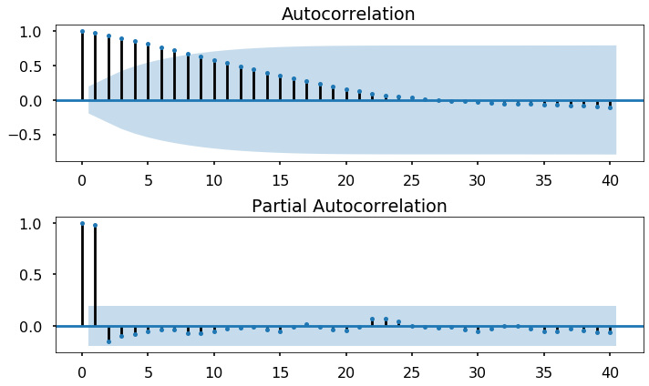
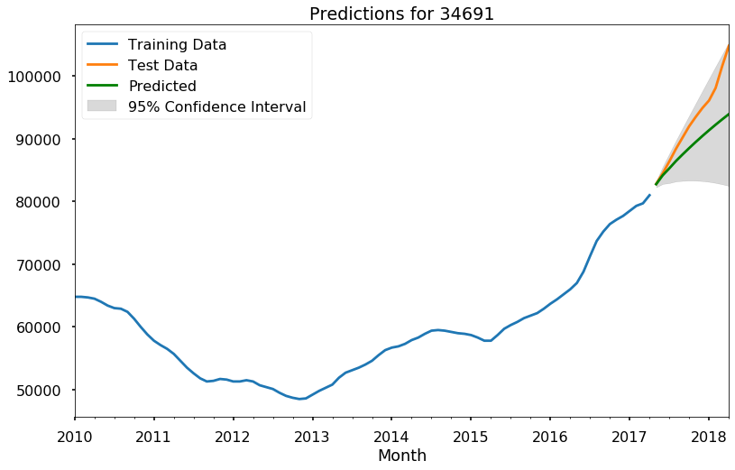

## Final Project Submission

Please fill out:
* Student name: Devin Belden
* Student pace: full time
* Scheduled project review date/time: Wed, Jan 15, 2020, 2:00 PM - 3:00 PM MST
* Instructor name: James Irving, Ph.D
* Blog post URL: https://devinbelden.github.io/the_ocarina_of_time_series

# Business Case

For this project, we attempt to parse through real estate sales data throughout the US and nail down the five best ZIP codes in which to invest. The definition of "best" we have chosen for this project is to have a high return on investment (ROI) while having a narrow confidence band for that ROI. Additionally, we glance at which ZIP codes are least profitable in the short term, thereby giving a two-pronged approach to real estate investment. 

All of the predictions are made one year from the end of the Zillow dataset.

# Importing/Exploring Data

First, let's import relevant packages, as well as import the dataset.


```python
import pandas as pd
import numpy as np
import matplotlib
import matplotlib.pyplot as plt
%matplotlib inline

plt.style.use('seaborn-poster')
pd.set_option('display.max_columns', 0)

zillow = pd.read_csv('zillow_data.csv')

zillow.head()
```


<div>
<style scoped>
    .dataframe tbody tr th:only-of-type {
        vertical-align: middle;
    }

    .dataframe tbody tr th {
        vertical-align: top;
    }

    .dataframe thead th {
        text-align: right;
    }
</style>
<table border="1" class="dataframe">
  <thead>
    <tr style="text-align: right;">
      <th></th>
      <th>RegionID</th>
      <th>RegionName</th>
      <th>City</th>
      <th>State</th>
      <th>Metro</th>
      <th>CountyName</th>
      <th>SizeRank</th>
      <th>1996-04</th>
      <th>1996-05</th>
      <th>1996-06</th>
      <th>1996-07</th>
      <th>1996-08</th>
      <th>1996-09</th>
      <th>1996-10</th>
      <th>1996-11</th>
      <th>1996-12</th>
      <th>1997-01</th>
      <th>1997-02</th>
      <th>1997-03</th>
      <th>1997-04</th>
      <th>1997-05</th>
      <th>1997-06</th>
      <th>1997-07</th>
      <th>1997-08</th>
      <th>1997-09</th>
      <th>1997-10</th>
      <th>1997-11</th>
      <th>1997-12</th>
      <th>1998-01</th>
      <th>1998-02</th>
      <th>1998-03</th>
      <th>1998-04</th>
      <th>1998-05</th>
      <th>1998-06</th>
      <th>1998-07</th>
      <th>1998-08</th>
      <th>1998-09</th>
      <th>1998-10</th>
      <th>1998-11</th>
      <th>1998-12</th>
      <th>...</th>
      <th>2015-01</th>
      <th>2015-02</th>
      <th>2015-03</th>
      <th>2015-04</th>
      <th>2015-05</th>
      <th>2015-06</th>
      <th>2015-07</th>
      <th>2015-08</th>
      <th>2015-09</th>
      <th>2015-10</th>
      <th>2015-11</th>
      <th>2015-12</th>
      <th>2016-01</th>
      <th>2016-02</th>
      <th>2016-03</th>
      <th>2016-04</th>
      <th>2016-05</th>
      <th>2016-06</th>
      <th>2016-07</th>
      <th>2016-08</th>
      <th>2016-09</th>
      <th>2016-10</th>
      <th>2016-11</th>
      <th>2016-12</th>
      <th>2017-01</th>
      <th>2017-02</th>
      <th>2017-03</th>
      <th>2017-04</th>
      <th>2017-05</th>
      <th>2017-06</th>
      <th>2017-07</th>
      <th>2017-08</th>
      <th>2017-09</th>
      <th>2017-10</th>
      <th>2017-11</th>
      <th>2017-12</th>
      <th>2018-01</th>
      <th>2018-02</th>
      <th>2018-03</th>
      <th>2018-04</th>
    </tr>
  </thead>
  <tbody>
    <tr>
      <th>0</th>
      <td>84654</td>
      <td>60657</td>
      <td>Chicago</td>
      <td>IL</td>
      <td>Chicago</td>
      <td>Cook</td>
      <td>1</td>
      <td>334200.0</td>
      <td>335400.0</td>
      <td>336500.0</td>
      <td>337600.0</td>
      <td>338500.0</td>
      <td>339500.0</td>
      <td>340400.0</td>
      <td>341300.0</td>
      <td>342600.0</td>
      <td>344400.0</td>
      <td>345700.0</td>
      <td>346700.0</td>
      <td>347800.0</td>
      <td>349000.0</td>
      <td>350400.0</td>
      <td>352000.0</td>
      <td>353900.0</td>
      <td>356200.0</td>
      <td>358800.0</td>
      <td>361800.0</td>
      <td>365700.0</td>
      <td>370200.0</td>
      <td>374700.0</td>
      <td>378900.0</td>
      <td>383500.0</td>
      <td>388300.0</td>
      <td>393300.0</td>
      <td>398500.0</td>
      <td>403800.0</td>
      <td>409100.0</td>
      <td>414600.0</td>
      <td>420100.0</td>
      <td>426200.0</td>
      <td>...</td>
      <td>893000</td>
      <td>895000</td>
      <td>901200</td>
      <td>909400</td>
      <td>915000</td>
      <td>916700</td>
      <td>917700</td>
      <td>919800</td>
      <td>925800</td>
      <td>937100</td>
      <td>948200</td>
      <td>951000</td>
      <td>952500</td>
      <td>958600</td>
      <td>966200</td>
      <td>970400</td>
      <td>973900</td>
      <td>974700</td>
      <td>972600</td>
      <td>974300</td>
      <td>980800</td>
      <td>988000</td>
      <td>994700</td>
      <td>998700</td>
      <td>997000</td>
      <td>993700</td>
      <td>991300</td>
      <td>989200</td>
      <td>991300</td>
      <td>999100</td>
      <td>1005500</td>
      <td>1007500</td>
      <td>1007800</td>
      <td>1009600</td>
      <td>1013300</td>
      <td>1018700</td>
      <td>1024400</td>
      <td>1030700</td>
      <td>1033800</td>
      <td>1030600</td>
    </tr>
    <tr>
      <th>1</th>
      <td>90668</td>
      <td>75070</td>
      <td>McKinney</td>
      <td>TX</td>
      <td>Dallas-Fort Worth</td>
      <td>Collin</td>
      <td>2</td>
      <td>235700.0</td>
      <td>236900.0</td>
      <td>236700.0</td>
      <td>235400.0</td>
      <td>233300.0</td>
      <td>230600.0</td>
      <td>227300.0</td>
      <td>223400.0</td>
      <td>219600.0</td>
      <td>215800.0</td>
      <td>211100.0</td>
      <td>205700.0</td>
      <td>200900.0</td>
      <td>196800.0</td>
      <td>193600.0</td>
      <td>191400.0</td>
      <td>190400.0</td>
      <td>190800.0</td>
      <td>192700.0</td>
      <td>196000.0</td>
      <td>201300.0</td>
      <td>207400.0</td>
      <td>212200.0</td>
      <td>214600.0</td>
      <td>215100.0</td>
      <td>213400.0</td>
      <td>210200.0</td>
      <td>206100.0</td>
      <td>202100.0</td>
      <td>198800.0</td>
      <td>196100.0</td>
      <td>194100.0</td>
      <td>193400.0</td>
      <td>...</td>
      <td>251400</td>
      <td>253000</td>
      <td>255200</td>
      <td>258000</td>
      <td>261200</td>
      <td>264700</td>
      <td>268400</td>
      <td>271400</td>
      <td>273600</td>
      <td>275200</td>
      <td>276400</td>
      <td>277000</td>
      <td>277900</td>
      <td>280000</td>
      <td>282600</td>
      <td>285400</td>
      <td>288400</td>
      <td>290800</td>
      <td>292000</td>
      <td>292800</td>
      <td>293700</td>
      <td>295200</td>
      <td>297000</td>
      <td>299000</td>
      <td>300800</td>
      <td>301800</td>
      <td>302800</td>
      <td>304400</td>
      <td>306200</td>
      <td>307000</td>
      <td>308000</td>
      <td>310000</td>
      <td>312500</td>
      <td>314100</td>
      <td>315000</td>
      <td>316600</td>
      <td>318100</td>
      <td>319600</td>
      <td>321100</td>
      <td>321800</td>
    </tr>
    <tr>
      <th>2</th>
      <td>91982</td>
      <td>77494</td>
      <td>Katy</td>
      <td>TX</td>
      <td>Houston</td>
      <td>Harris</td>
      <td>3</td>
      <td>210400.0</td>
      <td>212200.0</td>
      <td>212200.0</td>
      <td>210700.0</td>
      <td>208300.0</td>
      <td>205500.0</td>
      <td>202500.0</td>
      <td>199800.0</td>
      <td>198300.0</td>
      <td>197300.0</td>
      <td>195400.0</td>
      <td>193000.0</td>
      <td>191800.0</td>
      <td>191800.0</td>
      <td>193000.0</td>
      <td>195200.0</td>
      <td>198400.0</td>
      <td>202800.0</td>
      <td>208000.0</td>
      <td>213800.0</td>
      <td>220700.0</td>
      <td>227500.0</td>
      <td>231800.0</td>
      <td>233400.0</td>
      <td>233900.0</td>
      <td>233500.0</td>
      <td>233300.0</td>
      <td>234300.0</td>
      <td>237400.0</td>
      <td>242800.0</td>
      <td>250200.0</td>
      <td>258600.0</td>
      <td>268000.0</td>
      <td>...</td>
      <td>301700</td>
      <td>302400</td>
      <td>303600</td>
      <td>306200</td>
      <td>309100</td>
      <td>311900</td>
      <td>314100</td>
      <td>316300</td>
      <td>319000</td>
      <td>322000</td>
      <td>324300</td>
      <td>326100</td>
      <td>327300</td>
      <td>327000</td>
      <td>327200</td>
      <td>328500</td>
      <td>329800</td>
      <td>330000</td>
      <td>329000</td>
      <td>327800</td>
      <td>326700</td>
      <td>325500</td>
      <td>324700</td>
      <td>324500</td>
      <td>323700</td>
      <td>322300</td>
      <td>320700</td>
      <td>320000</td>
      <td>320000</td>
      <td>320900</td>
      <td>321000</td>
      <td>320600</td>
      <td>320200</td>
      <td>320400</td>
      <td>320800</td>
      <td>321200</td>
      <td>321200</td>
      <td>323000</td>
      <td>326900</td>
      <td>329900</td>
    </tr>
    <tr>
      <th>3</th>
      <td>84616</td>
      <td>60614</td>
      <td>Chicago</td>
      <td>IL</td>
      <td>Chicago</td>
      <td>Cook</td>
      <td>4</td>
      <td>498100.0</td>
      <td>500900.0</td>
      <td>503100.0</td>
      <td>504600.0</td>
      <td>505500.0</td>
      <td>505700.0</td>
      <td>505300.0</td>
      <td>504200.0</td>
      <td>503600.0</td>
      <td>503400.0</td>
      <td>502200.0</td>
      <td>500000.0</td>
      <td>497900.0</td>
      <td>496300.0</td>
      <td>495200.0</td>
      <td>494700.0</td>
      <td>494900.0</td>
      <td>496200.0</td>
      <td>498600.0</td>
      <td>502000.0</td>
      <td>507600.0</td>
      <td>514900.0</td>
      <td>522200.0</td>
      <td>529500.0</td>
      <td>537900.0</td>
      <td>546900.0</td>
      <td>556400.0</td>
      <td>566100.0</td>
      <td>575600.0</td>
      <td>584800.0</td>
      <td>593500.0</td>
      <td>601600.0</td>
      <td>610100.0</td>
      <td>...</td>
      <td>1176400</td>
      <td>1174600</td>
      <td>1178500</td>
      <td>1185700</td>
      <td>1192900</td>
      <td>1198800</td>
      <td>1200400</td>
      <td>1198900</td>
      <td>1200200</td>
      <td>1207400</td>
      <td>1218600</td>
      <td>1226600</td>
      <td>1230700</td>
      <td>1235400</td>
      <td>1241300</td>
      <td>1245700</td>
      <td>1247000</td>
      <td>1246700</td>
      <td>1245700</td>
      <td>1246000</td>
      <td>1247700</td>
      <td>1252900</td>
      <td>1260900</td>
      <td>1267900</td>
      <td>1272600</td>
      <td>1276600</td>
      <td>1280300</td>
      <td>1282500</td>
      <td>1286000</td>
      <td>1289000</td>
      <td>1289800</td>
      <td>1287700</td>
      <td>1287400</td>
      <td>1291500</td>
      <td>1296600</td>
      <td>1299000</td>
      <td>1302700</td>
      <td>1306400</td>
      <td>1308500</td>
      <td>1307000</td>
    </tr>
    <tr>
      <th>4</th>
      <td>93144</td>
      <td>79936</td>
      <td>El Paso</td>
      <td>TX</td>
      <td>El Paso</td>
      <td>El Paso</td>
      <td>5</td>
      <td>77300.0</td>
      <td>77300.0</td>
      <td>77300.0</td>
      <td>77300.0</td>
      <td>77400.0</td>
      <td>77500.0</td>
      <td>77600.0</td>
      <td>77700.0</td>
      <td>77700.0</td>
      <td>77800.0</td>
      <td>77900.0</td>
      <td>77900.0</td>
      <td>77800.0</td>
      <td>77800.0</td>
      <td>77800.0</td>
      <td>77800.0</td>
      <td>77800.0</td>
      <td>77900.0</td>
      <td>78100.0</td>
      <td>78200.0</td>
      <td>78400.0</td>
      <td>78600.0</td>
      <td>78800.0</td>
      <td>79000.0</td>
      <td>79100.0</td>
      <td>79200.0</td>
      <td>79300.0</td>
      <td>79300.0</td>
      <td>79300.0</td>
      <td>79400.0</td>
      <td>79500.0</td>
      <td>79500.0</td>
      <td>79600.0</td>
      <td>...</td>
      <td>114700</td>
      <td>115000</td>
      <td>115000</td>
      <td>115200</td>
      <td>115600</td>
      <td>115900</td>
      <td>115600</td>
      <td>115400</td>
      <td>115400</td>
      <td>115500</td>
      <td>115800</td>
      <td>116300</td>
      <td>116200</td>
      <td>115600</td>
      <td>115000</td>
      <td>114500</td>
      <td>114200</td>
      <td>114000</td>
      <td>114000</td>
      <td>113900</td>
      <td>114100</td>
      <td>114900</td>
      <td>115700</td>
      <td>116300</td>
      <td>116900</td>
      <td>117300</td>
      <td>117600</td>
      <td>118000</td>
      <td>118600</td>
      <td>118900</td>
      <td>119100</td>
      <td>119400</td>
      <td>120000</td>
      <td>120300</td>
      <td>120300</td>
      <td>120300</td>
      <td>120300</td>
      <td>120500</td>
      <td>121000</td>
      <td>121500</td>
    </tr>
  </tbody>
</table>
<p>5 rows × 272 columns</p>
</div>


We'll need to convert this data such that it has a datetime index. We can do this using the `melt()` method built into pandas, as well as the `to_datetime()` and `set_index()` methods.


```python
def melt_data(df): #formerly called it melt_data_student with REED
    melted = pd.melt(df, id_vars=['RegionID','RegionName', 'City', 'State', 'Metro', 'CountyName', 
                                  'SizeRank'], var_name='Month', value_name='MeanValue')
    melted['Month'] = pd.to_datetime(melted['Month'], format='%Y-%m')
    melted = melted.dropna(subset=['MeanValue'])
    return melted
```


```python
df = melt_data(zillow)
df.head()
```


<div>
<style scoped>
    .dataframe tbody tr th:only-of-type {
        vertical-align: middle;
    }

    .dataframe tbody tr th {
        vertical-align: top;
    }

    .dataframe thead th {
        text-align: right;
    }
</style>
<table border="1" class="dataframe">
  <thead>
    <tr style="text-align: right;">
      <th></th>
      <th>RegionID</th>
      <th>RegionName</th>
      <th>City</th>
      <th>State</th>
      <th>Metro</th>
      <th>CountyName</th>
      <th>SizeRank</th>
      <th>Month</th>
      <th>MeanValue</th>
    </tr>
  </thead>
  <tbody>
    <tr>
      <th>0</th>
      <td>84654</td>
      <td>60657</td>
      <td>Chicago</td>
      <td>IL</td>
      <td>Chicago</td>
      <td>Cook</td>
      <td>1</td>
      <td>1996-04-01</td>
      <td>334200.0</td>
    </tr>
    <tr>
      <th>1</th>
      <td>90668</td>
      <td>75070</td>
      <td>McKinney</td>
      <td>TX</td>
      <td>Dallas-Fort Worth</td>
      <td>Collin</td>
      <td>2</td>
      <td>1996-04-01</td>
      <td>235700.0</td>
    </tr>
    <tr>
      <th>2</th>
      <td>91982</td>
      <td>77494</td>
      <td>Katy</td>
      <td>TX</td>
      <td>Houston</td>
      <td>Harris</td>
      <td>3</td>
      <td>1996-04-01</td>
      <td>210400.0</td>
    </tr>
    <tr>
      <th>3</th>
      <td>84616</td>
      <td>60614</td>
      <td>Chicago</td>
      <td>IL</td>
      <td>Chicago</td>
      <td>Cook</td>
      <td>4</td>
      <td>1996-04-01</td>
      <td>498100.0</td>
    </tr>
    <tr>
      <th>4</th>
      <td>93144</td>
      <td>79936</td>
      <td>El Paso</td>
      <td>TX</td>
      <td>El Paso</td>
      <td>El Paso</td>
      <td>5</td>
      <td>1996-04-01</td>
      <td>77300.0</td>
    </tr>
  </tbody>
</table>
</div>


```python
df['Month'] = pd.to_datetime(df['Month'], errors='coerce')
df = df.set_index('Month', drop=False)
df.head()
```


<div>
<style scoped>
    .dataframe tbody tr th:only-of-type {
        vertical-align: middle;
    }

    .dataframe tbody tr th {
        vertical-align: top;
    }

    .dataframe thead th {
        text-align: right;
    }
</style>
<table border="1" class="dataframe">
  <thead>
    <tr style="text-align: right;">
      <th></th>
      <th>RegionID</th>
      <th>RegionName</th>
      <th>City</th>
      <th>State</th>
      <th>Metro</th>
      <th>CountyName</th>
      <th>SizeRank</th>
      <th>Month</th>
      <th>MeanValue</th>
    </tr>
    <tr>
      <th>Month</th>
      <th></th>
      <th></th>
      <th></th>
      <th></th>
      <th></th>
      <th></th>
      <th></th>
      <th></th>
      <th></th>
    </tr>
  </thead>
  <tbody>
    <tr>
      <th>1996-04-01</th>
      <td>84654</td>
      <td>60657</td>
      <td>Chicago</td>
      <td>IL</td>
      <td>Chicago</td>
      <td>Cook</td>
      <td>1</td>
      <td>1996-04-01</td>
      <td>334200.0</td>
    </tr>
    <tr>
      <th>1996-04-01</th>
      <td>90668</td>
      <td>75070</td>
      <td>McKinney</td>
      <td>TX</td>
      <td>Dallas-Fort Worth</td>
      <td>Collin</td>
      <td>2</td>
      <td>1996-04-01</td>
      <td>235700.0</td>
    </tr>
    <tr>
      <th>1996-04-01</th>
      <td>91982</td>
      <td>77494</td>
      <td>Katy</td>
      <td>TX</td>
      <td>Houston</td>
      <td>Harris</td>
      <td>3</td>
      <td>1996-04-01</td>
      <td>210400.0</td>
    </tr>
    <tr>
      <th>1996-04-01</th>
      <td>84616</td>
      <td>60614</td>
      <td>Chicago</td>
      <td>IL</td>
      <td>Chicago</td>
      <td>Cook</td>
      <td>4</td>
      <td>1996-04-01</td>
      <td>498100.0</td>
    </tr>
    <tr>
      <th>1996-04-01</th>
      <td>93144</td>
      <td>79936</td>
      <td>El Paso</td>
      <td>TX</td>
      <td>El Paso</td>
      <td>El Paso</td>
      <td>5</td>
      <td>1996-04-01</td>
      <td>77300.0</td>
    </tr>
  </tbody>
</table>
</div>


It's worth mentioning that RegionID and RegionName seem to be two sides of the same coin, but in reality, RegionName is just the ZIP code. It's unknown what RegionID means, but we'll keep it in the dataframe anyway. It might come in handy later.

For RegionName, however, let's just rename that column ZipCode. 


```python
df.rename(columns={'RegionName': 'ZipCode'}, inplace=True)
```

# EDA and Data Visualization

As part of EDA, we'll need to plot graphs of different ZIP codes' prices as functions of time. Let's create a new dataframe re-indexed by `ZipCode` and write a function to plot ZIP codes of our choice.


```python
df2 = df.groupby('ZipCode').resample('MS').asfreq()
df2
```


<div>
<style scoped>
    .dataframe tbody tr th:only-of-type {
        vertical-align: middle;
    }

    .dataframe tbody tr th {
        vertical-align: top;
    }

    .dataframe thead th {
        text-align: right;
    }
</style>
<table border="1" class="dataframe">
  <thead>
    <tr style="text-align: right;">
      <th></th>
      <th></th>
      <th>RegionID</th>
      <th>ZipCode</th>
      <th>City</th>
      <th>State</th>
      <th>Metro</th>
      <th>CountyName</th>
      <th>SizeRank</th>
      <th>Month</th>
      <th>MeanValue</th>
    </tr>
    <tr>
      <th>ZipCode</th>
      <th>Month</th>
      <th></th>
      <th></th>
      <th></th>
      <th></th>
      <th></th>
      <th></th>
      <th></th>
      <th></th>
      <th></th>
    </tr>
  </thead>
  <tbody>
    <tr>
      <th rowspan="5" valign="top">1001</th>
      <th>1996-04-01</th>
      <td>58196</td>
      <td>1001</td>
      <td>Agawam</td>
      <td>MA</td>
      <td>Springfield</td>
      <td>Hampden</td>
      <td>5851</td>
      <td>1996-04-01</td>
      <td>113100.0</td>
    </tr>
    <tr>
      <th>1996-05-01</th>
      <td>58196</td>
      <td>1001</td>
      <td>Agawam</td>
      <td>MA</td>
      <td>Springfield</td>
      <td>Hampden</td>
      <td>5851</td>
      <td>1996-05-01</td>
      <td>112800.0</td>
    </tr>
    <tr>
      <th>1996-06-01</th>
      <td>58196</td>
      <td>1001</td>
      <td>Agawam</td>
      <td>MA</td>
      <td>Springfield</td>
      <td>Hampden</td>
      <td>5851</td>
      <td>1996-06-01</td>
      <td>112600.0</td>
    </tr>
    <tr>
      <th>1996-07-01</th>
      <td>58196</td>
      <td>1001</td>
      <td>Agawam</td>
      <td>MA</td>
      <td>Springfield</td>
      <td>Hampden</td>
      <td>5851</td>
      <td>1996-07-01</td>
      <td>112300.0</td>
    </tr>
    <tr>
      <th>1996-08-01</th>
      <td>58196</td>
      <td>1001</td>
      <td>Agawam</td>
      <td>MA</td>
      <td>Springfield</td>
      <td>Hampden</td>
      <td>5851</td>
      <td>1996-08-01</td>
      <td>112100.0</td>
    </tr>
    <tr>
      <th>...</th>
      <th>...</th>
      <td>...</td>
      <td>...</td>
      <td>...</td>
      <td>...</td>
      <td>...</td>
      <td>...</td>
      <td>...</td>
      <td>...</td>
      <td>...</td>
    </tr>
    <tr>
      <th rowspan="5" valign="top">99901</th>
      <th>2017-12-01</th>
      <td>100478</td>
      <td>99901</td>
      <td>Ketchikan</td>
      <td>AK</td>
      <td>Ketchikan</td>
      <td>Ketchikan Gateway</td>
      <td>7294</td>
      <td>2017-12-01</td>
      <td>291900.0</td>
    </tr>
    <tr>
      <th>2018-01-01</th>
      <td>100478</td>
      <td>99901</td>
      <td>Ketchikan</td>
      <td>AK</td>
      <td>Ketchikan</td>
      <td>Ketchikan Gateway</td>
      <td>7294</td>
      <td>2018-01-01</td>
      <td>294200.0</td>
    </tr>
    <tr>
      <th>2018-02-01</th>
      <td>100478</td>
      <td>99901</td>
      <td>Ketchikan</td>
      <td>AK</td>
      <td>Ketchikan</td>
      <td>Ketchikan Gateway</td>
      <td>7294</td>
      <td>2018-02-01</td>
      <td>297500.0</td>
    </tr>
    <tr>
      <th>2018-03-01</th>
      <td>100478</td>
      <td>99901</td>
      <td>Ketchikan</td>
      <td>AK</td>
      <td>Ketchikan</td>
      <td>Ketchikan Gateway</td>
      <td>7294</td>
      <td>2018-03-01</td>
      <td>302100.0</td>
    </tr>
    <tr>
      <th>2018-04-01</th>
      <td>100478</td>
      <td>99901</td>
      <td>Ketchikan</td>
      <td>AK</td>
      <td>Ketchikan</td>
      <td>Ketchikan Gateway</td>
      <td>7294</td>
      <td>2018-04-01</td>
      <td>305100.0</td>
    </tr>
  </tbody>
</table>
<p>3744704 rows × 9 columns</p>
</div>


```python
def plot_ts(zipcodes=[1001], df=df2, col='MeanValue', show_crash=False):
    
    fig, ax = plt.subplots(figsize=(14,7))
    
    for zipcode in zipcodes:
        ts = df[col].loc[zipcode]
        if zipcode/10000 < 1:
            label='0'+str(zipcode)+': '+df['City'][zipcode][0]+', '+df['State'][zipcode][0]
        else:
            label=str(zipcode)+': '+df['City'][zipcode][0]+', '+df['State'][zipcode][0]
        ts.plot(label=label, ax=ax)
        
    if show_crash:
        ax.axvline('08-2008', label='Housing Market Crash', color='red', ls=':')
    
    ax.legend()
    plt.show()

plot_ts(zipcodes=[85224,75068,95688,94561,94903,1267,85719], show_crash=True)
```


Just for laughs, let's look at a ZIP code in which I used to live, 85719.


```python
plot_ts([85719], show_crash=True)
```


For purposes of this project, we're going to move forward with data from 2010 onwards, as using pre-crash data would not only drastically increase our computing needs, but it's a reasonable assumption that it would also lead to somewhat unreliable predictions. However, we don't want to just use post-recovery data (2012 onwards), as the future predictions would be less conservative than we might want. Therefore, picking 2010 as our cutoff point is a decent combination of conservative estimation and computing power. 


```python
df = df[df['Month'] > '2009-12-31']
df.head()
```


<div>
<style scoped>
    .dataframe tbody tr th:only-of-type {
        vertical-align: middle;
    }

    .dataframe tbody tr th {
        vertical-align: top;
    }

    .dataframe thead th {
        text-align: right;
    }
</style>
<table border="1" class="dataframe">
  <thead>
    <tr style="text-align: right;">
      <th></th>
      <th>RegionID</th>
      <th>ZipCode</th>
      <th>City</th>
      <th>State</th>
      <th>Metro</th>
      <th>CountyName</th>
      <th>SizeRank</th>
      <th>Month</th>
      <th>MeanValue</th>
    </tr>
    <tr>
      <th>Month</th>
      <th></th>
      <th></th>
      <th></th>
      <th></th>
      <th></th>
      <th></th>
      <th></th>
      <th></th>
      <th></th>
    </tr>
  </thead>
  <tbody>
    <tr>
      <th>2010-01-01</th>
      <td>84654</td>
      <td>60657</td>
      <td>Chicago</td>
      <td>IL</td>
      <td>Chicago</td>
      <td>Cook</td>
      <td>1</td>
      <td>2010-01-01</td>
      <td>775600.0</td>
    </tr>
    <tr>
      <th>2010-01-01</th>
      <td>90668</td>
      <td>75070</td>
      <td>McKinney</td>
      <td>TX</td>
      <td>Dallas-Fort Worth</td>
      <td>Collin</td>
      <td>2</td>
      <td>2010-01-01</td>
      <td>201300.0</td>
    </tr>
    <tr>
      <th>2010-01-01</th>
      <td>91982</td>
      <td>77494</td>
      <td>Katy</td>
      <td>TX</td>
      <td>Houston</td>
      <td>Harris</td>
      <td>3</td>
      <td>2010-01-01</td>
      <td>249200.0</td>
    </tr>
    <tr>
      <th>2010-01-01</th>
      <td>84616</td>
      <td>60614</td>
      <td>Chicago</td>
      <td>IL</td>
      <td>Chicago</td>
      <td>Cook</td>
      <td>4</td>
      <td>2010-01-01</td>
      <td>984100.0</td>
    </tr>
    <tr>
      <th>2010-01-01</th>
      <td>93144</td>
      <td>79936</td>
      <td>El Paso</td>
      <td>TX</td>
      <td>El Paso</td>
      <td>El Paso</td>
      <td>5</td>
      <td>2010-01-01</td>
      <td>117400.0</td>
    </tr>
  </tbody>
</table>
</div>


```python
ts = df.loc[df['ZipCode'] == 85719]['MeanValue'].rename(85719)
ts.name
```


    85719


```python
import pylab

pylab.rcParams['figure.figsize'] = (14, 7)

ts = ts.resample('MS').asfreq()
ts.plot();
```


A significantly different graph. Let's check for missing values in our actionable dataframe.


```python
df.isna().sum()
```


    RegionID           0
    ZipCode            0
    City               0
    State              0
    Metro         102910
    CountyName         0
    SizeRank           0
    Month              0
    MeanValue          0
    dtype: int64


```python
df['Metro'].fillna('Missing',inplace=True)
df.isna().sum()
```


    RegionID      0
    ZipCode       0
    City          0
    State         0
    Metro         0
    CountyName    0
    SizeRank      0
    Month         0
    MeanValue     0
    dtype: int64


Excellent. Now let's see how much of our data we're cutting out, just in case it's a huge percentage.


```python
print(df['ZipCode'].nunique())
zipcodes = list(df[df['Month'] == '2010-01-01']['ZipCode'].unique())
len(zipcodes)
```

    14723
    


    14144


We'll be left with 96% of unique ZIP codes, which is a large enough percentage that we can move forward.


```python
for zipcode in df['ZipCode'].unique():
    if zipcode not in zipcodes:
        df = df[df['ZipCode'] != zipcode]
        
df.head()
```


<div>
<style scoped>
    .dataframe tbody tr th:only-of-type {
        vertical-align: middle;
    }

    .dataframe tbody tr th {
        vertical-align: top;
    }

    .dataframe thead th {
        text-align: right;
    }
</style>
<table border="1" class="dataframe">
  <thead>
    <tr style="text-align: right;">
      <th></th>
      <th>RegionID</th>
      <th>ZipCode</th>
      <th>City</th>
      <th>State</th>
      <th>Metro</th>
      <th>CountyName</th>
      <th>SizeRank</th>
      <th>Month</th>
      <th>MeanValue</th>
    </tr>
    <tr>
      <th>Month</th>
      <th></th>
      <th></th>
      <th></th>
      <th></th>
      <th></th>
      <th></th>
      <th></th>
      <th></th>
      <th></th>
    </tr>
  </thead>
  <tbody>
    <tr>
      <th>2010-01-01</th>
      <td>84654</td>
      <td>60657</td>
      <td>Chicago</td>
      <td>IL</td>
      <td>Chicago</td>
      <td>Cook</td>
      <td>1</td>
      <td>2010-01-01</td>
      <td>775600.0</td>
    </tr>
    <tr>
      <th>2010-01-01</th>
      <td>90668</td>
      <td>75070</td>
      <td>McKinney</td>
      <td>TX</td>
      <td>Dallas-Fort Worth</td>
      <td>Collin</td>
      <td>2</td>
      <td>2010-01-01</td>
      <td>201300.0</td>
    </tr>
    <tr>
      <th>2010-01-01</th>
      <td>91982</td>
      <td>77494</td>
      <td>Katy</td>
      <td>TX</td>
      <td>Houston</td>
      <td>Harris</td>
      <td>3</td>
      <td>2010-01-01</td>
      <td>249200.0</td>
    </tr>
    <tr>
      <th>2010-01-01</th>
      <td>84616</td>
      <td>60614</td>
      <td>Chicago</td>
      <td>IL</td>
      <td>Chicago</td>
      <td>Cook</td>
      <td>4</td>
      <td>2010-01-01</td>
      <td>984100.0</td>
    </tr>
    <tr>
      <th>2010-01-01</th>
      <td>93144</td>
      <td>79936</td>
      <td>El Paso</td>
      <td>TX</td>
      <td>El Paso</td>
      <td>El Paso</td>
      <td>5</td>
      <td>2010-01-01</td>
      <td>117400.0</td>
    </tr>
  </tbody>
</table>
</div>


As we've cut out all ZIP codes with fewer than 100 months' worth of data, we should have 100 months x 14,144 ZIP codes = 1,414,400 rows of data. 


```python
len(df)
```


    1414400


# ARIMA Modeling

Now we're ready for our ARIMA modeling, but first we have to choose which one. Do we run SARIMAX or ARIMA proper? To help us answer this question, we'll plot our ACF and PACF.


```python
from  statsmodels.graphics.tsaplots import plot_acf,plot_pacf

fig,ax = plt.subplots(nrows=2,figsize=(10,6))

plot_acf(ts,ax=ax[0],lags=20);
plot_pacf(ts, ax=ax[1],lags=20);
plt.tight_layout()
```


If this were just AutoRegressive, the ACF would tail off, and PACF would cut off. If it were just a Moving Average, the ACF would cut off and the PACF would tail off. If it were ARMA, both ACF and PACF would tail off. Given those statements, this looks sort of like simply AutoRegressive, but let's do a seasonal decomposition just to check.


```python
from statsmodels.tsa.seasonal import seasonal_decompose

pylab.rcParams['figure.figsize'] = (14, 9)

seasonal_decompose(ts).plot();
```





Just as expected, the seasonal component is +/-250 dollars, whereas our data ranges from \\$160,000 to \\$220,000. To save on computing power, we'll run a regular ARIMA model, as the seasonal component makes such a miniscule difference that the tradeoff is not worth it.

For now, let's create an all-in-one function that will train/test split our data, run a grid search for the best `(p, d, q)` combination, create a prediction based on that data, plot a graph of the prediction, and show the diagnostics for the predicted model.

*A word of warning/notes to future me*: The next few functions get rather complicated, but a lot of them use the same processes. As part of the revision process, I'm going to clean them up and remove a lot of the redundancy between them.


```python
def arima_tune(ts, test_size=0.12, plot=False, show_stats=False):
    import math
    import itertools
    from statsmodels.tsa.statespace.sarimax import SARIMAX
    import warnings
    warnings.filterwarnings('ignore')
    
    ts_split = math.floor(len(ts.index) * (1-test_size))

    ts_train = ts.iloc[:ts_split]
    ts_test = ts.iloc[ts_split:]
    
    results = []
    combinations = list(itertools.product(range(6), [1], range(6)))
    for comb in combinations:
        try:
            model = SARIMAX(ts_train, order=comb, 
                            enforce_stationarity=False, 
                            enforce_invertibility=False)
            output = model.fit()
            results.append([comb, output.aic])
        except:
            print(f"Error running {comb}, continuing")
            continue
    
    df_results = pd.DataFrame(results, columns=['pdq', 'AIC'])
    best_pdq = df_results[df_results['AIC'] == df_results['AIC'].min()]['pdq']
    
    best_model = SARIMAX(ts_train, order=best_pdq.values[0],
                         enforce_stationarity=False, 
                         enforce_invertibility=True)
    best_output = best_model.fit()
    
    prediction = best_output.get_prediction(start=ts_test.index[0],
                                            end=ts_test.index[-1], 
                                            dynamic=True)
    
    df_pred = prediction.conf_int()
    df_pred['predicted_mean'] = prediction.predicted_mean
    predicted_roi = round(((df_pred['predicted_mean'][-1] - ts_train[-1])/ts_train[-1])*100, 2)
    
    if plot:
        df_plot = pd.concat([df_pred,ts_train], axis=1)
        
        fig, ax = plt.subplots(figsize=(13,8))
        ts_train.plot(ax=ax,label='Training Data')
        ts_test.plot(ax=ax,label='Test Data')
        df_pred['predicted_mean'].plot(ax=ax, label='Predicted', color='g')
        ax.fill_between(df_pred.index, df_pred[f'lower {ts.name}'],
                        df_pred[f'upper {ts.name}'], color="k", alpha=.15,
                        label = '95% Confidence Interval')
        ax.legend()
        ax.set(title=f"Predictions for {ts.name}")
        plt.show()
    
    score = 10 * predicted_roi / np.log(df_pred['predicted_mean'][-1] - 
                                        df_pred['predicted_mean'][0])
    
    if show_stats:
    
        print("Best PDQ combination:", best_pdq.values[0])
        print(f"Predicted ROI: {predicted_roi}%\nOverall Score: {round(score,2)}")
        display(best_output.summary())
        output.plot_diagnostics(figsize=(13,8))
        plt.tight_layout()
```


```python
arima_tune(ts, plot=True, show_stats=True)
```


    Best PDQ combination: (2, 1, 5)
    Predicted ROI: 1.92%
    Overall Score: 2.38
    


<table class="simpletable">
<caption>Statespace Model Results</caption>
<tr>
  <th>Dep. Variable:</th>         <td>85719</td>      <th>  No. Observations:  </th>    <td>88</td>   
</tr>
<tr>
  <th>Model:</th>           <td>SARIMAX(2, 1, 5)</td> <th>  Log Likelihood     </th> <td>-618.671</td>
</tr>
<tr>
  <th>Date:</th>            <td>Tue, 14 Jan 2020</td> <th>  AIC                </th> <td>1253.342</td>
</tr>
<tr>
  <th>Time:</th>                <td>13:30:17</td>     <th>  BIC                </th> <td>1272.497</td>
</tr>
<tr>
  <th>Sample:</th>             <td>01-01-2010</td>    <th>  HQIC               </th> <td>1261.027</td>
</tr>
<tr>
  <th></th>                   <td>- 04-01-2017</td>   <th>                     </th>     <td> </td>   
</tr>
<tr>
  <th>Covariance Type:</th>        <td>opg</td>       <th>                     </th>     <td> </td>   
</tr>
</table>
<table class="simpletable">
<tr>
     <td></td>       <th>coef</th>     <th>std err</th>      <th>z</th>      <th>P>|z|</th>  <th>[0.025</th>    <th>0.975]</th>  
</tr>
<tr>
  <th>ar.L1</th>  <td>    0.3822</td> <td>    0.137</td> <td>    2.781</td> <td> 0.005</td> <td>    0.113</td> <td>    0.652</td>
</tr>
<tr>
  <th>ar.L2</th>  <td>    0.3927</td> <td>    0.162</td> <td>    2.431</td> <td> 0.015</td> <td>    0.076</td> <td>    0.709</td>
</tr>
<tr>
  <th>ma.L1</th>  <td>    1.2454</td> <td>    2.879</td> <td>    0.433</td> <td> 0.665</td> <td>   -4.396</td> <td>    6.887</td>
</tr>
<tr>
  <th>ma.L2</th>  <td>    0.3146</td> <td>    1.850</td> <td>    0.170</td> <td> 0.865</td> <td>   -3.311</td> <td>    3.940</td>
</tr>
<tr>
  <th>ma.L3</th>  <td>   -0.1724</td> <td>    1.047</td> <td>   -0.165</td> <td> 0.869</td> <td>   -2.225</td> <td>    1.880</td>
</tr>
<tr>
  <th>ma.L4</th>  <td>    0.1352</td> <td>    0.685</td> <td>    0.197</td> <td> 0.844</td> <td>   -1.208</td> <td>    1.478</td>
</tr>
<tr>
  <th>ma.L5</th>  <td>   -0.0495</td> <td>    0.190</td> <td>   -0.260</td> <td> 0.795</td> <td>   -0.423</td> <td>    0.324</td>
</tr>
<tr>
  <th>sigma2</th> <td>  2.41e+05</td> <td>  8.2e+05</td> <td>    0.294</td> <td> 0.769</td> <td>-1.37e+06</td> <td> 1.85e+06</td>
</tr>
</table>
<table class="simpletable">
<tr>
  <th>Ljung-Box (Q):</th>          <td>23.65</td> <th>  Jarque-Bera (JB):  </th> <td>1.61</td> 
</tr>
<tr>
  <th>Prob(Q):</th>                <td>0.98</td>  <th>  Prob(JB):          </th> <td>0.45</td> 
</tr>
<tr>
  <th>Heteroskedasticity (H):</th> <td>0.62</td>  <th>  Skew:              </th> <td>-0.35</td>
</tr>
<tr>
  <th>Prob(H) (two-sided):</th>    <td>0.22</td>  <th>  Kurtosis:          </th> <td>2.98</td> 
</tr>
</table><br/><br/>Warnings:<br/>[1] Covariance matrix calculated using the outer product of gradients (complex-step).


This worked for one ZIP code. Let's try five ZIP codes in a different metro, Miami-Fort Lauderdale.


```python
df[df['Metro'] == 'Miami-Fort Lauderdale']['ZipCode'].nunique()
```


    162


```python
for zipcode in list(df[df['Metro'] == 'Miami-Fort Lauderdale']['ZipCode'].unique()[:5]):
    ts_ = df[df['ZipCode'] == zipcode]['MeanValue'].rename(zipcode)
    ts_ = ts_.resample('MS').asfreq()
    arima_tune(ts_, test_size=0.1, plot=True, show_stats=True)
```


    Best PDQ combination: (1, 1, 5)
    Predicted ROI: -0.98%
    Overall Score: nan
    


<table class="simpletable">
<caption>Statespace Model Results</caption>
<tr>
  <th>Dep. Variable:</th>         <td>33160</td>      <th>  No. Observations:  </th>    <td>90</td>   
</tr>
<tr>
  <th>Model:</th>           <td>SARIMAX(1, 1, 5)</td> <th>  Log Likelihood     </th> <td>-845.371</td>
</tr>
<tr>
  <th>Date:</th>            <td>Tue, 14 Jan 2020</td> <th>  AIC                </th> <td>1704.741</td>
</tr>
<tr>
  <th>Time:</th>                <td>14:25:28</td>     <th>  BIC                </th> <td>1721.673</td>
</tr>
<tr>
  <th>Sample:</th>             <td>01-01-2010</td>    <th>  HQIC               </th> <td>1711.544</td>
</tr>
<tr>
  <th></th>                   <td>- 06-01-2017</td>   <th>                     </th>     <td> </td>   
</tr>
<tr>
  <th>Covariance Type:</th>        <td>opg</td>       <th>                     </th>     <td> </td>   
</tr>
</table>
<table class="simpletable">
<tr>
     <td></td>       <th>coef</th>     <th>std err</th>      <th>z</th>      <th>P>|z|</th>  <th>[0.025</th>    <th>0.975]</th>  
</tr>
<tr>
  <th>ar.L1</th>  <td>    0.8241</td> <td>    0.133</td> <td>    6.202</td> <td> 0.000</td> <td>    0.564</td> <td>    1.085</td>
</tr>
<tr>
  <th>ma.L1</th>  <td>    0.6899</td> <td>    0.196</td> <td>    3.514</td> <td> 0.000</td> <td>    0.305</td> <td>    1.075</td>
</tr>
<tr>
  <th>ma.L2</th>  <td>   -0.3055</td> <td>    0.238</td> <td>   -1.283</td> <td> 0.200</td> <td>   -0.772</td> <td>    0.161</td>
</tr>
<tr>
  <th>ma.L3</th>  <td>   -0.3451</td> <td>    0.141</td> <td>   -2.448</td> <td> 0.014</td> <td>   -0.621</td> <td>   -0.069</td>
</tr>
<tr>
  <th>ma.L4</th>  <td>    0.0257</td> <td>    0.090</td> <td>    0.286</td> <td> 0.775</td> <td>   -0.150</td> <td>    0.202</td>
</tr>
<tr>
  <th>ma.L5</th>  <td>    0.0734</td> <td>    0.044</td> <td>    1.671</td> <td> 0.095</td> <td>   -0.013</td> <td>    0.160</td>
</tr>
<tr>
  <th>sigma2</th> <td>  4.31e+07</td> <td> 1.86e-09</td> <td> 2.32e+16</td> <td> 0.000</td> <td> 4.31e+07</td> <td> 4.31e+07</td>
</tr>
</table>
<table class="simpletable">
<tr>
  <th>Ljung-Box (Q):</th>          <td>44.96</td> <th>  Jarque-Bera (JB):  </th> <td>2.81</td>
</tr>
<tr>
  <th>Prob(Q):</th>                <td>0.27</td>  <th>  Prob(JB):          </th> <td>0.25</td>
</tr>
<tr>
  <th>Heteroskedasticity (H):</th> <td>1.40</td>  <th>  Skew:              </th> <td>0.23</td>
</tr>
<tr>
  <th>Prob(H) (two-sided):</th>    <td>0.37</td>  <th>  Kurtosis:          </th> <td>3.78</td>
</tr>
</table><br/><br/>Warnings:<br/>[1] Covariance matrix calculated using the outer product of gradients (complex-step).<br/>[2] Covariance matrix is singular or near-singular, with condition number 3.07e+32. Standard errors may be unstable.


    Best PDQ combination: (1, 1, 5)
    Predicted ROI: 3.61%
    Overall Score: 3.99
    


<table class="simpletable">
<caption>Statespace Model Results</caption>
<tr>
  <th>Dep. Variable:</th>         <td>33025</td>      <th>  No. Observations:  </th>    <td>90</td>   
</tr>
<tr>
  <th>Model:</th>           <td>SARIMAX(1, 1, 5)</td> <th>  Log Likelihood     </th> <td>-624.116</td>
</tr>
<tr>
  <th>Date:</th>            <td>Tue, 14 Jan 2020</td> <th>  AIC                </th> <td>1262.232</td>
</tr>
<tr>
  <th>Time:</th>                <td>14:25:33</td>     <th>  BIC                </th> <td>1279.164</td>
</tr>
<tr>
  <th>Sample:</th>             <td>01-01-2010</td>    <th>  HQIC               </th> <td>1269.035</td>
</tr>
<tr>
  <th></th>                   <td>- 06-01-2017</td>   <th>                     </th>     <td> </td>   
</tr>
<tr>
  <th>Covariance Type:</th>        <td>opg</td>       <th>                     </th>     <td> </td>   
</tr>
</table>
<table class="simpletable">
<tr>
     <td></td>       <th>coef</th>     <th>std err</th>      <th>z</th>      <th>P>|z|</th>  <th>[0.025</th>    <th>0.975]</th>  
</tr>
<tr>
  <th>ar.L1</th>  <td>    0.9161</td> <td>    0.061</td> <td>   15.072</td> <td> 0.000</td> <td>    0.797</td> <td>    1.035</td>
</tr>
<tr>
  <th>ma.L1</th>  <td>    0.8062</td> <td>    0.314</td> <td>    2.571</td> <td> 0.010</td> <td>    0.192</td> <td>    1.421</td>
</tr>
<tr>
  <th>ma.L2</th>  <td>   -0.1770</td> <td>    0.195</td> <td>   -0.907</td> <td> 0.364</td> <td>   -0.559</td> <td>    0.205</td>
</tr>
<tr>
  <th>ma.L3</th>  <td>   -0.3490</td> <td>    0.263</td> <td>   -1.327</td> <td> 0.185</td> <td>   -0.865</td> <td>    0.166</td>
</tr>
<tr>
  <th>ma.L4</th>  <td>    0.4572</td> <td>    0.192</td> <td>    2.382</td> <td> 0.017</td> <td>    0.081</td> <td>    0.833</td>
</tr>
<tr>
  <th>ma.L5</th>  <td>    0.1633</td> <td>    0.105</td> <td>    1.555</td> <td> 0.120</td> <td>   -0.043</td> <td>    0.369</td>
</tr>
<tr>
  <th>sigma2</th> <td> 1.788e+05</td> <td> 6.47e+04</td> <td>    2.763</td> <td> 0.006</td> <td>  5.2e+04</td> <td> 3.06e+05</td>
</tr>
</table>
<table class="simpletable">
<tr>
  <th>Ljung-Box (Q):</th>          <td>31.33</td> <th>  Jarque-Bera (JB):  </th> <td>0.20</td> 
</tr>
<tr>
  <th>Prob(Q):</th>                <td>0.83</td>  <th>  Prob(JB):          </th> <td>0.90</td> 
</tr>
<tr>
  <th>Heteroskedasticity (H):</th> <td>0.93</td>  <th>  Skew:              </th> <td>-0.02</td>
</tr>
<tr>
  <th>Prob(H) (two-sided):</th>    <td>0.85</td>  <th>  Kurtosis:          </th> <td>2.76</td> 
</tr>
</table><br/><br/>Warnings:<br/>[1] Covariance matrix calculated using the outer product of gradients (complex-step).


    Best PDQ combination: (4, 1, 5)
    Predicted ROI: 4.68%
    Overall Score: 4.97
    


<table class="simpletable">
<caption>Statespace Model Results</caption>
<tr>
  <th>Dep. Variable:</th>         <td>33411</td>      <th>  No. Observations:  </th>    <td>90</td>   
</tr>
<tr>
  <th>Model:</th>           <td>SARIMAX(4, 1, 5)</td> <th>  Log Likelihood     </th> <td>-612.314</td>
</tr>
<tr>
  <th>Date:</th>            <td>Tue, 14 Jan 2020</td> <th>  AIC                </th> <td>1244.628</td>
</tr>
<tr>
  <th>Time:</th>                <td>14:25:37</td>     <th>  BIC                </th> <td>1268.817</td>
</tr>
<tr>
  <th>Sample:</th>             <td>01-01-2010</td>    <th>  HQIC               </th> <td>1254.346</td>
</tr>
<tr>
  <th></th>                   <td>- 06-01-2017</td>   <th>                     </th>     <td> </td>   
</tr>
<tr>
  <th>Covariance Type:</th>        <td>opg</td>       <th>                     </th>     <td> </td>   
</tr>
</table>
<table class="simpletable">
<tr>
     <td></td>       <th>coef</th>     <th>std err</th>      <th>z</th>      <th>P>|z|</th>  <th>[0.025</th>    <th>0.975]</th>  
</tr>
<tr>
  <th>ar.L1</th>  <td>    2.0527</td> <td>    0.324</td> <td>    6.335</td> <td> 0.000</td> <td>    1.418</td> <td>    2.688</td>
</tr>
<tr>
  <th>ar.L2</th>  <td>   -2.1348</td> <td>    0.534</td> <td>   -3.998</td> <td> 0.000</td> <td>   -3.181</td> <td>   -1.088</td>
</tr>
<tr>
  <th>ar.L3</th>  <td>    1.4235</td> <td>    0.485</td> <td>    2.934</td> <td> 0.003</td> <td>    0.473</td> <td>    2.374</td>
</tr>
<tr>
  <th>ar.L4</th>  <td>   -0.3563</td> <td>    0.257</td> <td>   -1.386</td> <td> 0.166</td> <td>   -0.860</td> <td>    0.148</td>
</tr>
<tr>
  <th>ma.L1</th>  <td>   -0.4210</td> <td>    0.311</td> <td>   -1.354</td> <td> 0.176</td> <td>   -1.030</td> <td>    0.188</td>
</tr>
<tr>
  <th>ma.L2</th>  <td>    0.2443</td> <td>    0.181</td> <td>    1.353</td> <td> 0.176</td> <td>   -0.110</td> <td>    0.598</td>
</tr>
<tr>
  <th>ma.L3</th>  <td>    0.3494</td> <td>    0.184</td> <td>    1.903</td> <td> 0.057</td> <td>   -0.011</td> <td>    0.709</td>
</tr>
<tr>
  <th>ma.L4</th>  <td>   -0.1538</td> <td>    0.191</td> <td>   -0.804</td> <td> 0.422</td> <td>   -0.529</td> <td>    0.221</td>
</tr>
<tr>
  <th>ma.L5</th>  <td>   -0.2808</td> <td>    0.094</td> <td>   -2.993</td> <td> 0.003</td> <td>   -0.465</td> <td>   -0.097</td>
</tr>
<tr>
  <th>sigma2</th> <td>  1.48e+05</td> <td> 2.81e+04</td> <td>    5.277</td> <td> 0.000</td> <td>  9.3e+04</td> <td> 2.03e+05</td>
</tr>
</table>
<table class="simpletable">
<tr>
  <th>Ljung-Box (Q):</th>          <td>36.92</td> <th>  Jarque-Bera (JB):  </th> <td>0.44</td> 
</tr>
<tr>
  <th>Prob(Q):</th>                <td>0.61</td>  <th>  Prob(JB):          </th> <td>0.80</td> 
</tr>
<tr>
  <th>Heteroskedasticity (H):</th> <td>0.65</td>  <th>  Skew:              </th> <td>-0.14</td>
</tr>
<tr>
  <th>Prob(H) (two-sided):</th>    <td>0.26</td>  <th>  Kurtosis:          </th> <td>2.79</td> 
</tr>
</table><br/><br/>Warnings:<br/>[1] Covariance matrix calculated using the outer product of gradients (complex-step).


    Best PDQ combination: (3, 1, 5)
    Predicted ROI: 2.9%
    Overall Score: 2.58
    


<table class="simpletable">
<caption>Statespace Model Results</caption>
<tr>
  <th>Dep. Variable:</th>         <td>33139</td>      <th>  No. Observations:  </th>    <td>90</td>   
</tr>
<tr>
  <th>Model:</th>           <td>SARIMAX(3, 1, 5)</td> <th>  Log Likelihood     </th> <td>-893.066</td>
</tr>
<tr>
  <th>Date:</th>            <td>Tue, 14 Jan 2020</td> <th>  AIC                </th> <td>1804.132</td>
</tr>
<tr>
  <th>Time:</th>                <td>14:25:42</td>     <th>  BIC                </th> <td>1825.901</td>
</tr>
<tr>
  <th>Sample:</th>             <td>01-01-2010</td>    <th>  HQIC               </th> <td>1812.877</td>
</tr>
<tr>
  <th></th>                   <td>- 06-01-2017</td>   <th>                     </th>     <td> </td>   
</tr>
<tr>
  <th>Covariance Type:</th>        <td>opg</td>       <th>                     </th>     <td> </td>   
</tr>
</table>
<table class="simpletable">
<tr>
     <td></td>       <th>coef</th>     <th>std err</th>      <th>z</th>      <th>P>|z|</th>  <th>[0.025</th>    <th>0.975]</th>  
</tr>
<tr>
  <th>ar.L1</th>  <td>    1.1651</td> <td>    0.329</td> <td>    3.542</td> <td> 0.000</td> <td>    0.520</td> <td>    1.810</td>
</tr>
<tr>
  <th>ar.L2</th>  <td>   -0.6372</td> <td>    0.455</td> <td>   -1.400</td> <td> 0.162</td> <td>   -1.529</td> <td>    0.255</td>
</tr>
<tr>
  <th>ar.L3</th>  <td>    0.4319</td> <td>    0.181</td> <td>    2.382</td> <td> 0.017</td> <td>    0.077</td> <td>    0.787</td>
</tr>
<tr>
  <th>ma.L1</th>  <td>   -0.1351</td> <td>    0.337</td> <td>   -0.401</td> <td> 0.688</td> <td>   -0.795</td> <td>    0.525</td>
</tr>
<tr>
  <th>ma.L2</th>  <td>   -0.2485</td> <td>    0.198</td> <td>   -1.253</td> <td> 0.210</td> <td>   -0.637</td> <td>    0.140</td>
</tr>
<tr>
  <th>ma.L3</th>  <td>   -0.1068</td> <td>    0.174</td> <td>   -0.615</td> <td> 0.539</td> <td>   -0.447</td> <td>    0.234</td>
</tr>
<tr>
  <th>ma.L4</th>  <td>    0.0823</td> <td>    0.063</td> <td>    1.310</td> <td> 0.190</td> <td>   -0.041</td> <td>    0.205</td>
</tr>
<tr>
  <th>ma.L5</th>  <td>    0.0206</td> <td>    0.086</td> <td>    0.240</td> <td> 0.810</td> <td>   -0.148</td> <td>    0.189</td>
</tr>
<tr>
  <th>sigma2</th> <td> 1.252e+08</td> <td> 1.62e-09</td> <td> 7.73e+16</td> <td> 0.000</td> <td> 1.25e+08</td> <td> 1.25e+08</td>
</tr>
</table>
<table class="simpletable">
<tr>
  <th>Ljung-Box (Q):</th>          <td>35.51</td> <th>  Jarque-Bera (JB):  </th> <td>3.98</td>
</tr>
<tr>
  <th>Prob(Q):</th>                <td>0.67</td>  <th>  Prob(JB):          </th> <td>0.14</td>
</tr>
<tr>
  <th>Heteroskedasticity (H):</th> <td>4.21</td>  <th>  Skew:              </th> <td>0.33</td>
</tr>
<tr>
  <th>Prob(H) (two-sided):</th>    <td>0.00</td>  <th>  Kurtosis:          </th> <td>3.84</td>
</tr>
</table><br/><br/>Warnings:<br/>[1] Covariance matrix calculated using the outer product of gradients (complex-step).<br/>[2] Covariance matrix is singular or near-singular, with condition number 6.27e+33. Standard errors may be unstable.


    Best PDQ combination: (1, 1, 5)
    Predicted ROI: 4.89%
    Overall Score: 5.26
    


<table class="simpletable">
<caption>Statespace Model Results</caption>
<tr>
  <th>Dep. Variable:</th>         <td>33024</td>      <th>  No. Observations:  </th>    <td>90</td>   
</tr>
<tr>
  <th>Model:</th>           <td>SARIMAX(1, 1, 5)</td> <th>  Log Likelihood     </th> <td>-607.589</td>
</tr>
<tr>
  <th>Date:</th>            <td>Tue, 14 Jan 2020</td> <th>  AIC                </th> <td>1229.177</td>
</tr>
<tr>
  <th>Time:</th>                <td>14:25:47</td>     <th>  BIC                </th> <td>1246.109</td>
</tr>
<tr>
  <th>Sample:</th>             <td>01-01-2010</td>    <th>  HQIC               </th> <td>1235.979</td>
</tr>
<tr>
  <th></th>                   <td>- 06-01-2017</td>   <th>                     </th>     <td> </td>   
</tr>
<tr>
  <th>Covariance Type:</th>        <td>opg</td>       <th>                     </th>     <td> </td>   
</tr>
</table>
<table class="simpletable">
<tr>
     <td></td>       <th>coef</th>     <th>std err</th>      <th>z</th>      <th>P>|z|</th>  <th>[0.025</th>    <th>0.975]</th>  
</tr>
<tr>
  <th>ar.L1</th>  <td>    0.9767</td> <td>    0.030</td> <td>   32.657</td> <td> 0.000</td> <td>    0.918</td> <td>    1.035</td>
</tr>
<tr>
  <th>ma.L1</th>  <td>    0.7033</td> <td>    0.130</td> <td>    5.403</td> <td> 0.000</td> <td>    0.448</td> <td>    0.958</td>
</tr>
<tr>
  <th>ma.L2</th>  <td>   -0.3018</td> <td>    0.166</td> <td>   -1.816</td> <td> 0.069</td> <td>   -0.627</td> <td>    0.024</td>
</tr>
<tr>
  <th>ma.L3</th>  <td>   -0.3741</td> <td>    0.150</td> <td>   -2.494</td> <td> 0.013</td> <td>   -0.668</td> <td>   -0.080</td>
</tr>
<tr>
  <th>ma.L4</th>  <td>    0.1942</td> <td>    0.138</td> <td>    1.411</td> <td> 0.158</td> <td>   -0.076</td> <td>    0.464</td>
</tr>
<tr>
  <th>ma.L5</th>  <td>   -0.0430</td> <td>    0.121</td> <td>   -0.356</td> <td> 0.722</td> <td>   -0.280</td> <td>    0.194</td>
</tr>
<tr>
  <th>sigma2</th> <td> 1.301e+05</td> <td> 1.78e+04</td> <td>    7.325</td> <td> 0.000</td> <td> 9.53e+04</td> <td> 1.65e+05</td>
</tr>
</table>
<table class="simpletable">
<tr>
  <th>Ljung-Box (Q):</th>          <td>39.61</td> <th>  Jarque-Bera (JB):  </th> <td>3.92</td> 
</tr>
<tr>
  <th>Prob(Q):</th>                <td>0.49</td>  <th>  Prob(JB):          </th> <td>0.14</td> 
</tr>
<tr>
  <th>Heteroskedasticity (H):</th> <td>3.56</td>  <th>  Skew:              </th> <td>-0.08</td>
</tr>
<tr>
  <th>Prob(H) (two-sided):</th>    <td>0.00</td>  <th>  Kurtosis:          </th> <td>4.05</td> 
</tr>
</table><br/><br/>Warnings:<br/>[1] Covariance matrix calculated using the outer product of gradients (complex-step).


It's worth noting that the above cell took over 45 seconds to run 5 ZIP codes. In order to run all 14,144 ZIP codes, it would take over 35 hours! We should try to parse our data further, such that we're only looking at a subset of ZIP codes. 

For this task, we'll be looking at [this article](https://www.businessinsider.com/best-places-to-invest-in-real-estate-in-the-us-2019-7), which gives ten metro areas that Zillow predicts to have the highest growth. 


```python
metros = {'Tampa': 'FL','Las Vegas': 'NV','Phoenix': 'AZ','Atlanta': 'GA','Orlando': 'FL','Miami-Fort Lauderdale': 'FL',
          'Detroit': 'MI','Dallas-Fort Worth': 'TX','Nashville': 'TN','Charlotte': 'NC'}
total_length = 0
for key in metros:
    total_length += len(df[(df['Metro'] == key) & (df['State'] == metros[key])])

# return total_length divided by 100 months per ZIP code to get total number of ZIP codes

total_length/100
```


    1208.0


Great! We've clipped our dataset from 14,144 ZIP codes down 1,208. This should take a much more manageable 3 hours to run analysis on what's left. 

Next, we'll create another, more specialized function that will return the predicted ROI as well as a "score" of sorts. The score will be defined as the ROI divided by the log of the range of prices contained within the 95% confidence interval, times 10. This will give a score, I predict, between -15 and +40, which will hopefully be a simple enough number to give to a real estate investor looking for fast, easily-accessible information on which to base their investment decisions. The idea behind this definition is to give higher priority to ZIP codes that have a high predicted ROI, but penalize those areas where the 95% confidence interval is wide. Thus, the best ZIP codes in which to invest will have a combination of high ROI and low volatility.

After producing this score, we will create a dataframe ranking the ZIP codes from highest score to lowest score.


```python
def forecast_score(ts, test_size):
    import math
    import itertools
    from statsmodels.tsa.statespace.sarimax import SARIMAX
    import warnings
    warnings.filterwarnings('ignore')
    
    ts_split = math.floor(len(ts.index) * (1-test_size))

    ts_train = ts.iloc[:ts_split]
    ts_test = ts.iloc[ts_split:]
    
    results = []
    combinations = list(itertools.product(range(6), [1], range(6)))
    for comb in combinations:
        try:
            model = SARIMAX(ts_train, order=comb, 
                            enforce_stationarity=False, 
                            enforce_invertibility=False)
            output = model.fit()
            results.append([comb, output.aic])
        except:
            continue
    
    df_results = pd.DataFrame(results, columns=['pdq', 'AIC'])
    best_pdq = df_results[df_results['AIC'] == df_results['AIC'].min()]['pdq']
    
    model = SARIMAX(ts, order=best_pdq.values[0],
                         enforce_stationarity=False, 
                         enforce_invertibility=True)
    model_fit = model.fit()
    
    prediction = model_fit.get_prediction(start=ts.index[-1], 
                                          end=ts.index.shift(12)[-1], 
                                          dynamic=True)
    
    df_pred = prediction.conf_int()
    df_pred['predicted_mean'] = prediction.predicted_mean
    roi = round(((df_pred['predicted_mean'][-1] - ts_test[-1])/ts_test[-1])*100, 2)
    denom = np.log(df_pred[f"upper {ts.name}"][-1] - df_pred[f"upper {ts.name}"][0])
    score = 10 * roi / denom
    
    return roi, score
```

Testing this on two ZIP codes, just to make sure the data is return in the form we want, which is a list of lists:


```python
list_roi_score = []
for zipcode in list(df[(df['Metro'] == 'Charlotte') & (df['State'] == 'NC')]['ZipCode'].unique())[:2]:
    ts_ = df[df['ZipCode'] == zipcode]['MeanValue'].rename(zipcode)
    ts_ = ts_.resample('MS').asfreq()

    list_roi_score.append([zipcode, 
                           forecast_score(ts_, test_size=0.1)[0], 
                           forecast_score(ts_, test_size=0.1)[1]])

list_roi_score
```


    [[28269, 10.94, 10.593733670754231], [28277, 5.15, 4.895246702463379]]


Perfect! Now we're ready to run our function on every ZIP code in every metro area we've selected. 


```python
#DO NOT RUN THIS CODE IF YOU DON'T WANT TO WAIT FOR 3 HOURS, KEEP SCROLLING FOR THE PICKLE FILE FURTHER DOWN

metros = {'Tampa': 'FL','Las Vegas': 'NV','Phoenix': 'AZ','Atlanta': 'GA','Orlando': 'FL','Miami-Fort Lauderdale': 'FL',
          'Detroit': 'MI','Dallas-Fort Worth': 'TX','Nashville': 'TN','Charlotte': 'NC'}

list_roi_score = []

for city in metros:
    for zipcode in list(df[(df['Metro'] == city) & (df['State'] == metros[city])]['ZipCode'].unique()):
        ts_ = df[df['ZipCode'] == zipcode]['MeanValue'].rename(zipcode)
        ts_ = ts_.resample('MS').asfreq()

        list_roi_score.append([city,
                               zipcode, 
                               forecast_score(ts_, test_size=0.1)[0], 
                               forecast_score(ts_, test_size=0.1)[1]])

```


```python
list_roi_score
```


    [['Tampa', 33510, 7.53, 7.168576238971737],
     ['Tampa', 33511, 5.22, 5.068985282684401],
     ['Tampa', 33523, 15.79, 15.343969766426692],
     ['Tampa', 33525, 10.66, 10.156663585309824],
     ['Tampa', 33527, 12.42, 11.38032896835194],
     ['Tampa', 33534, 4.07, 3.998651824145696],
     ['Tampa', 33540, 0.86, 0.8685958610226435],
     ['Tampa', 33541, 2.13, 2.1247013271872466],
     ['Tampa', 33542, 1.37, 1.3719154466836658],
     ['Tampa', 33543, 4.26, 4.109858598804386],
     ['Tampa', 33544, 4.18, 4.008299975504232],
     ['Tampa', 33545, 2.67, 2.606938391246499],
     ['Tampa', 33547, 0.38, 0.3857477112616072],
     ['Tampa', 33548, 0.47, 0.46639415668923023],
     ['Tampa', 33549, 6.5, 6.124682459446107],
     ['Tampa', 33556, 2.85, 2.70672357727771],
     ['Tampa', 33558, 3.72, 3.509550961861577],
     ['Tampa', 33559, 7.7, 7.451228525425187],
     ['Tampa', 33563, 3.29, 3.2735946324933773],
     ['Tampa', 33565, 5.5, 5.075827290298872],
     ['Tampa', 33566, 5.13, 5.031015653661826],
     ['Tampa', 33567, 7.78, 7.381553951105615],
     ['Tampa', 33569, 4.68, 4.515711702889829],
     ['Tampa', 33570, 3.95, 3.8903848854154837],
     ['Tampa', 33572, 0.53, 0.5278171970441463],
     ['Tampa', 33573, 2.16, 2.1564628480410426],
     ['Tampa', 33576, 8.9, 8.386196890499383],
     ['Tampa', 33578, 4.07, 3.9902504922980593],
     ['Tampa', 33579, 4.17, 4.081697954117187],
     ['Tampa', 33584, 5.95, 5.803650185108293],
     ['Tampa', 33592, 4.72, 4.438384316838471],
     ['Tampa', 33594, 6.1, 5.9876124699467415],
     ['Tampa', 33596, 5.08, 4.847154577994087],
     ['Tampa', 33597, 4.58, 4.580868360008789],
     ['Tampa', 33598, 0.55, 0.5433941078190959],
     ['Tampa', 33602, 8.11, 7.556525152534507],
     ['Tampa', 33606, 14.8, 12.291722686186668],
     ['Tampa', 33609, 1.01, 0.9680864644361971],
     ['Tampa', 33611, 4.53, 4.266701921237403],
     ['Tampa', 33613, 11.18, 10.292057176789328],
     ['Tampa', 33614, 9.76, 9.184128079555508],
     ['Tampa', 33615, 10.29, 9.637677317187237],
     ['Tampa', 33616, 8.13, 7.447831607556321],
     ['Tampa', 33617, 7.69, 7.338196903356897],
     ['Tampa', 33618, 4.05, 3.8134406423864933],
     ['Tampa', 33624, 8.47, 8.064207418461018],
     ['Tampa', 33625, 5.51, 5.321966293107048],
     ['Tampa', 33626, 1.99, 1.9182732997175418],
     ['Tampa', 33629, 9.18, 8.086306697203401],
     ['Tampa', 33634, 7.8, 7.52855546937189],
     ['Tampa', 33635, 4.18, 3.9748113871182094],
     ['Tampa', 33637, 6.59, 6.4591905840523856],
     ['Tampa', 33647, 3.46, 3.385497065022404],
     ['Tampa', 33701, 10.25, 9.246933783760102],
     ['Tampa', 33702, 18.53, 16.79473562750954],
     ['Tampa', 33703, 13.28, 12.115403605581571],
     ['Tampa', 33704, 13.15, 11.69486153466836],
     ['Tampa', 33705, 13.33, 12.291907216769696],
     ['Tampa', 33706, 9.76, 8.472805500997866],
     ['Tampa', 33707, 23.79, 21.23483109961106],
     ['Tampa', 33708, 7.59, 6.814506867298858],
     ['Tampa', 33709, 14.4, 13.524571517557497],
     ['Tampa', 33710, 15.1, 13.820062712903743],
     ['Tampa', 33713, 17.38, 16.154691356201976],
     ['Tampa', 33715, 3.52, 2.993270025148753],
     ['Tampa', 33716, 0.38, 0.3531950098406196],
     ['Tampa', 33755, 14.42, 13.472055202773689],
     ['Tampa', 33756, 13.4, 12.511037541763615],
     ['Tampa', 33759, 20.7, 18.32432316344555],
     ['Tampa', 33760, 12.33, 11.335468144155875],
     ['Tampa', 33761, 6.95, 6.454837717879655],
     ['Tampa', 33762, 2.36, 2.2120843331743436],
     ['Tampa', 33763, 16.24, 14.746252385692532],
     ['Tampa', 33764, 7.48, 6.989357240069867],
     ['Tampa', 33765, 18.13, 16.40535696221178],
     ['Tampa', 33767, 4.78, 4.041595653901547],
     ['Tampa', 33770, 12.49, 11.56188062875528],
     ['Tampa', 33771, 14.01, 13.081283923780742],
     ['Tampa', 33772, 9.24, 8.685751697182038],
     ['Tampa', 33773, 14.95, 13.745286002219524],
     ['Tampa', 33774, 10.3, 9.599289766946455],
     ['Tampa', 33776, 8.97, 8.23384866089529],
     ['Tampa', 33777, 13.68, 12.72758307063938],
     ['Tampa', 33778, 14.04, 12.871711437698222],
     ['Tampa', 33781, 17.89, 16.563953571831373],
     ['Tampa', 33782, 18.85, 17.18030546672812],
     ['Tampa', 33786, 1.12, 1.0019609163217127],
     ['Tampa', 34601, 10.74, 10.46630048445642],
     ['Tampa', 34602, 3.93, 3.819805699162211],
     ['Tampa', 34604, 1.54, 1.584203247662529],
     ['Tampa', 34606, 12.27, 11.907099388536698],
     ['Tampa', 34607, 8.28, 7.694980036612738],
     ['Tampa', 34608, 14.29, 13.734525954808516],
     ['Tampa', 34609, 12.67, 12.03720422271975],
     ['Tampa', 34610, 9.81, 9.35325633945314],
     ['Tampa', 34613, 9.91, 9.413699737757295],
     ['Tampa', 34637, 2.5, 2.44274120835125],
     ['Tampa', 34638, 1.99, 1.9701597681056429],
     ['Tampa', 34639, 4.86, 4.737930591807375],
     ['Tampa', 34652, 33.57, 30.86848806075847],
     ['Tampa', 34653, 12.29, 11.921192941642657],
     ['Tampa', 34654, 4.48, 4.417826271166872],
     ['Tampa', 34655, 5.93, 5.701089835996022],
     ['Tampa', 34667, 9.74, 9.413705765033198],
     ['Tampa', 34668, 18.62, 17.860146333812928],
     ['Tampa', 34669, 3.65, 3.662469095931421],
     ['Tampa', 34677, 1.08, 1.049776222966114],
     ['Tampa', 34681, 16.11, 14.198407483345587],
     ['Tampa', 34683, 7.1, 6.5942233432204915],
     ['Tampa', 34684, 5.72, 5.512943058562457],
     ['Tampa', 34685, 0.68, 0.6659370001914049],
     ['Tampa', 34688, 0.79, 0.7596400449988173],
     ['Tampa', 34689, 10.17, 9.510398689234865],
     ['Tampa', 34690, 26.22, 24.912607894621992],
     ['Tampa', 34691, 32.85, 30.544456140715443],
     ['Tampa', 34695, 9.2, 8.399636280518443],
     ['Tampa', 34698, 16.16, 14.63516173257545],
     ['Las Vegas', 89002, 7.44, 6.888178727969371],
     ['Las Vegas', 89005, 7.63, 6.987305158857012],
     ['Las Vegas', 89011, 9.25, 8.57713966316214],
     ['Las Vegas', 89012, 8.25, 7.536988754399425],
     ['Las Vegas', 89014, 10.39, 9.539942579082892],
     ['Las Vegas', 89015, 10.97, 10.143276940856293],
     ['Las Vegas', 89021, 7.42, 6.80900826064281],
     ['Las Vegas', 89027, 9.4, 8.805336761821296],
     ['Las Vegas', 89029, 0.83, 0.8485248570621395],
     ['Las Vegas', 89031, 11.3, 10.477507502519737],
     ['Las Vegas', 89032, 13.27, 12.177777382307196],
     ['Las Vegas', 89034, 7.8, 7.157224523848853],
     ['Las Vegas', 89040, 12.07, 11.204198554099253],
     ['Las Vegas', 89044, 5.25, 4.854568980293234],
     ['Las Vegas', 89052, 6.55, 5.922778880503109],
     ['Las Vegas', 89074, 9.84, 8.983291169106254],
     ['Las Vegas', 89081, 8.8, 8.20299225006599],
     ['Las Vegas', 89084, 8.65, 7.933902021023457],
     ['Las Vegas', 89085, 7.95, 7.292766412398531],
     ['Las Vegas', 89086, 10.53, 9.66397234543301],
     ['Las Vegas', 89102, 14.34, 13.054055516906105],
     ['Las Vegas', 89103, 15.98, 14.501039538862539],
     ['Las Vegas', 89104, 17.13, 15.636309082357368],
     ['Las Vegas', 89107, 12.76, 11.797083796550275],
     ['Las Vegas', 89108, 13.43, 12.357169301852696],
     ['Las Vegas', 89110, 14.95, 13.84103640683577],
     ['Las Vegas', 89113, 4.86, 4.5644908292190856],
     ['Las Vegas', 89115, 10.85, 10.330945280937929],
     ['Las Vegas', 89117, 11.86, 10.612730879001134],
     ['Las Vegas', 89118, 14.55, 13.109893928225189],
     ['Las Vegas', 89119, 9.78, 8.99181950227965],
     ['Las Vegas', 89120, 12.76, 11.666033285073597],
     ['Las Vegas', 89121, 12.7, 11.770391663909551],
     ['Las Vegas', 89122, 18.63, 16.834929241314423],
     ['Las Vegas', 89123, 9.47, 8.692645235350557],
     ['Las Vegas', 89124, 2.81, 2.5870129082707805],
     ['Las Vegas', 89128, 16.91, 15.108473599997454],
     ['Las Vegas', 89129, 10.71, 9.820506867349462],
     ['Las Vegas', 89130, 9.38, 8.652168214025702],
     ['Las Vegas', 89131, 8.23, 7.529418147391725],
     ['Las Vegas', 89134, 7.77, 7.104855439377206],
     ['Las Vegas', 89135, 7.79, 7.00427793737452],
     ['Las Vegas', 89138, 8.88, 7.931891404163677],
     ['Las Vegas', 89139, 9.51, 8.70022047287288],
     ['Las Vegas', 89141, 7.79, 7.218281204048936],
     ['Las Vegas', 89142, 17.14, 15.630317105239527],
     ['Las Vegas', 89143, 15.14, 13.576361325249815],
     ['Las Vegas', 89144, 14.05, 12.464538452194837],
     ['Las Vegas', 89145, 11.43, 10.552809281563947],
     ['Las Vegas', 89146, 12.13, 10.924840061307208],
     ['Las Vegas', 89147, 9.85, 9.138689950312115],
     ['Las Vegas', 89148, 6.43, 5.974144564709251],
     ['Las Vegas', 89149, 7.72, 7.137106135319409],
     ['Las Vegas', 89155, 6.72, 6.243983639146068],
     ['Las Vegas', 89156, 13.22, 12.238993723041691],
     ['Las Vegas', 89166, 6.25, 5.841654540550677],
     ['Las Vegas', 89178, 8.9, 8.219640344559442],
     ['Las Vegas', 89179, 8.87, 8.12709834066079],
     ['Las Vegas', 89183, 7.9, 7.358776503721048],
     ['Phoenix', 85003, -0.55, -0.5047528800128169],
     ['Phoenix', 85008, 15.84, 14.423671831569335],
     ['Phoenix', 85012, 4.66, 4.176653591818081],
     ['Phoenix', 85013, 11.84, 10.46894750127779],
     ['Phoenix', 85014, 9.22, 8.335698120677979],
     ['Phoenix', 85015, 11.11, 10.21651710267544],
     ['Phoenix', 85016, 4.26, 3.935205208803407],
     ['Phoenix', 85018, 12.0, 10.137295436561596],
     ['Phoenix', 85020, 5.61, 5.260431887580711],
     ['Phoenix', 85021, 5.33, 4.987457702442616],
     ['Phoenix', 85022, -0.29, -0.2792981426901339],
     ['Phoenix', 85023, 2.53, 2.4494893210352555],
     ['Phoenix', 85024, 1.03, 1.0004614088649009],
     ['Phoenix', 85027, 6.9, 6.5850579398898805],
     ['Phoenix', 85028, 0.76, 0.7060436260557932],
     ['Phoenix', 85029, 5.28, 5.017527742626791],
     ['Phoenix', 85032, 5.68, 5.407502150030132],
     ['Phoenix', 85041, 9.45, 8.90469008592041],
     ['Phoenix', 85042, 11.75, 11.049667995451403],
     ['Phoenix', 85043, 7.72, 7.361644806611066],
     ['Phoenix', 85044, 5.44, 5.1660802998855235],
     ['Phoenix', 85045, 3.44, 3.152631264250053],
     ['Phoenix', 85048, 2.65, 2.5036010626457674],
     ['Phoenix', 85050, 2.56, 2.3821325455334796],
     ['Phoenix', 85051, 3.29, 3.1748018170173062],
     ['Phoenix', 85053, 6.05, 5.766986956881477],
     ['Phoenix', 85054, -0.73, -0.6823280190427872],
     ['Phoenix', 85083, 2.5, 2.3410111501991917],
     ['Phoenix', 85085, 6.25, 5.675766902398856],
     ['Phoenix', 85086, 4.8, 4.509369958548725],
     ['Phoenix', 85087, 5.36, 5.084120702622938],
     ['Phoenix', 85118, 6.18, 5.780977748464894],
     ['Phoenix', 85119, 8.63, 8.09343613617769],
     ['Phoenix', 85120, 7.48, 7.245578714782811],
     ['Phoenix', 85122, 10.19, 9.763867607472315],
     ['Phoenix', 85123, 11.19, 10.811213291310246],
     ['Phoenix', 85128, 15.28, 14.72076589667587],
     ['Phoenix', 85132, 10.62, 10.11851006930814],
     ['Phoenix', 85138, 8.36, 7.947564099407276],
     ['Phoenix', 85139, 3.4, 3.336514312196806],
     ['Phoenix', 85140, 8.6, 8.089405844066263],
     ['Phoenix', 85142, 9.72, 8.940647290497665],
     ['Phoenix', 85143, 8.2, 7.74612989064786],
     ['Phoenix', 85194, 4.86, 4.6712202870353225],
     ['Phoenix', 85201, 12.37, 11.440885222955568],
     ['Phoenix', 85202, 7.55, 7.0919168760784075],
     ['Phoenix', 85203, 8.93, 8.31150447443837],
     ['Phoenix', 85204, 8.27, 7.741675207639993],
     ['Phoenix', 85205, 8.49, 8.00299471133329],
     ['Phoenix', 85206, 5.35, 5.176195539891514],
     ['Phoenix', 85207, 7.51, 6.912520172389315],
     ['Phoenix', 85208, 4.96, 4.77631415523855],
     ['Phoenix', 85209, 6.08, 5.7426331997127935],
     ['Phoenix', 85210, 9.49, 8.813021510984962],
     ['Phoenix', 85212, 4.5, 4.228034284307065],
     ['Phoenix', 85213, 4.04, 3.740858475453509],
     ['Phoenix', 85215, 4.85, 4.5938649133823874],
     ['Phoenix', 85224, 8.67, 8.111477238514123],
     ['Phoenix', 85225, 8.55, 8.047982201599192],
     ['Phoenix', 85226, 3.55, 3.372356387434478],
     ['Phoenix', 85233, 7.11, 6.5450306768217255],
     ['Phoenix', 85234, 5.46, 5.080137349983159],
     ['Phoenix', 85248, 5.09, 4.741509785245399],
     ['Phoenix', 85249, 4.43, 4.069507240889318],
     ['Phoenix', 85250, 4.85, 4.416082420325648],
     ['Phoenix', 85251, 14.29, 12.46091846919661],
     ['Phoenix', 85253, -0.11, -0.0940887688368523],
     ['Phoenix', 85254, 3.68, 3.356354809098759],
     ['Phoenix', 85255, 0.04, 0.03627351879684515],
     ['Phoenix', 85257, 6.4, 5.871035103853345],
     ['Phoenix', 85258, 3.74, 3.3216770516260175],
     ['Phoenix', 85259, 0.96, 0.8691950095151512],
     ['Phoenix', 85260, 2.57, 2.3203476499368496],
     ['Phoenix', 85262, -1.29, -1.1965828317328642],
     ['Phoenix', 85263, 0.19, 0.17606763402317463],
     ['Phoenix', 85266, 0.79, 0.7218131089930495],
     ['Phoenix', 85268, 2.25, 2.0556888938558404],
     ['Phoenix', 85281, 7.33, 6.808944475885219],
     ['Phoenix', 85282, 7.39, 6.825653995214834],
     ['Phoenix', 85283, 7.96, 7.378358258688084],
     ['Phoenix', 85284, 6.08, 5.4455591646160535],
     ['Phoenix', 85286, 5.48, 5.06570763971136],
     ['Phoenix', 85295, 5.94, 5.524285231877445],
     ['Phoenix', 85296, 5.94, 5.510819683125919],
     ['Phoenix', 85297, 5.34, 4.979642159903794],
     ['Phoenix', 85298, 5.33, 4.939354244709169],
     ['Phoenix', 85302, 3.77, 3.63038384330726],
     ['Phoenix', 85303, 5.48, 5.298520173317017],
     ['Phoenix', 85304, 5.29, 5.067624949580626],
     ['Phoenix', 85305, 1.62, 1.5895247154680288],
     ['Phoenix', 85306, 8.39, 7.871009986925637],
     ['Phoenix', 85307, 6.31, 6.002192328630165],
     ['Phoenix', 85308, 4.3, 4.0968264877008265],
     ['Phoenix', 85310, 6.99, 6.483177206476734],
     ['Phoenix', 85323, 6.84, 6.530835552421975],
     ['Phoenix', 85326, 10.1, 9.502894125700184],
     ['Phoenix', 85331, 7.61, 6.827537862359648],
     ['Phoenix', 85335, 7.04, 6.7220656510518575],
     ['Phoenix', 85338, 6.63, 6.316593408668915],
     ['Phoenix', 85339, 6.3, 5.952493153937395],
     ['Phoenix', 85340, 6.1, 5.626808743233031],
     ['Phoenix', 85342, 0.58, 0.5596693508449179],
     ['Phoenix', 85345, 6.46, 6.246946326241973],
     ['Phoenix', 85351, 4.95, 4.877720170085292],
     ['Phoenix', 85353, 6.28, 6.0477784338826766],
     ['Phoenix', 85355, 4.99, 4.609598077614899],
     ['Phoenix', 85361, 5.71, 5.271671314395337],
     ['Phoenix', 85373, 11.5, 10.694626539598634],
     ['Phoenix', 85374, 3.81, 3.7631070108752063],
     ['Phoenix', 85375, 6.47, 6.249048707751702],
     ['Phoenix', 85377, -1.05, -0.9545653161417599],
     ['Phoenix', 85379, 4.56, 4.457241910403024],
     ['Phoenix', 85381, 1.57, 1.5290354118226293],
     ['Phoenix', 85382, 7.15, 6.762271600580777],
     ['Phoenix', 85383, 5.58, 5.120581931609988],
     ['Phoenix', 85387, 3.03, 2.9295150181399667],
     ['Phoenix', 85388, 5.72, 5.437787789497352],
     ['Phoenix', 85390, 3.4, 3.2006542591868548],
     ['Phoenix', 85392, 3.19, 3.1099535060802013],
     ['Phoenix', 85395, 3.01, 2.965382992740497],
     ['Phoenix', 85396, 5.13, 4.965535325351217],
     ['Phoenix', 85631, 1.3, 1.3437228905394358],
     ['Atlanta', 30002, 7.08, 6.281268832595727],
     ['Atlanta', 30004, 4.05, 3.71703419567947],
     ['Atlanta', 30005, 1.86, 1.7415340021191086],
     ['Atlanta', 30008, 4.24, 4.177589615634202],
     ['Atlanta', 30009, 4.91, 4.484854992356369],
     ['Atlanta', 30011, 12.72, 11.998496064746565],
     ['Atlanta', 30013, 8.1, 7.835316584770288],
     ['Atlanta', 30014, 7.32, 7.185791490889738],
     ['Atlanta', 30016, 7.53, 7.498607071226863],
     ['Atlanta', 30017, 6.79, 6.53154595360622],
     ['Atlanta', 30019, 5.84, 5.581457763802886],
     ['Atlanta', 30022, 1.37, 1.2938912447204867],
     ['Atlanta', 30024, 5.89, 5.54247048329305],
     ['Atlanta', 30025, 10.05, 9.411171353261336],
     ['Atlanta', 30028, 6.28, 5.94821912596105],
     ['Atlanta', 30030, 3.87, 3.4765483485174693],
     ['Atlanta', 30033, 8.27, 7.446423812316598],
     ['Atlanta', 30034, 11.58, 11.079389683244607],
     ['Atlanta', 30038, 8.69, 8.415576893789138],
     ['Atlanta', 30039, 7.04, 6.724938769700227],
     ['Atlanta', 30040, 3.81, 3.652324188540239],
     ['Atlanta', 30041, 3.43, 3.260673200169211],
     ['Atlanta', 30043, 5.7, 5.520509226733631],
     ['Atlanta', 30044, 7.25, 6.962441670145234],
     ['Atlanta', 30045, 11.33, 10.640643590450457],
     ['Atlanta', 30046, 4.75, 4.603610338215234],
     ['Atlanta', 30047, 11.94, 11.250745978345615],
     ['Atlanta', 30052, 9.21, 8.824430472644519],
     ['Atlanta', 30054, 11.51, 10.857035490591935],
     ['Atlanta', 30058, 4.45, 4.383170102658897],
     ['Atlanta', 30060, 13.58, 12.778516919476257],
     ['Atlanta', 30062, 4.53, 4.246778615971251],
     ['Atlanta', 30064, 6.11, 5.813121804519625],
     ['Atlanta', 30066, 7.8, 7.414878128822339],
     ['Atlanta', 30067, 2.38, 2.271645338472471],
     ['Atlanta', 30068, 3.56, 3.3322940840853295],
     ['Atlanta', 30075, 1.18, 1.1032054355837324],
     ['Atlanta', 30076, 2.16, 2.0363699919396057],
     ['Atlanta', 30078, 8.53, 8.125471397691932],
     ['Atlanta', 30080, 13.53, 12.184633757725894],
     ['Atlanta', 30082, 9.85, 9.085864041315828],
     ['Atlanta', 30084, 11.05, 10.241925371130685],
     ['Atlanta', 30087, 7.31, 7.062650030866705],
     ['Atlanta', 30092, 3.65, 3.3897423653792487],
     ['Atlanta', 30094, 11.28, 10.809686706883008],
     ['Atlanta', 30096, 7.56, 7.192223625375344],
     ['Atlanta', 30097, 2.8, 2.637041711267963],
     ['Atlanta', 30101, 7.4, 7.130550257837964],
     ['Atlanta', 30102, 12.66, 12.00155387717641],
     ['Atlanta', 30103, 4.51, 4.535540017132593],
     ['Atlanta', 30106, 7.28, 7.102787872380879],
     ['Atlanta', 30107, 9.82, 9.142653603844245],
     ['Atlanta', 30108, 3.97, 3.9974027313349323],
     ['Atlanta', 30110, 1.97, 2.0995583715078414],
     ['Atlanta', 30113, 2.95, 3.122647046054667],
     ['Atlanta', 30114, 10.42, 9.829501266461122],
     ['Atlanta', 30115, 10.2, 9.457912907969964],
     ['Atlanta', 30116, 8.53, 8.30135814808259],
     ['Atlanta', 30117, 8.34, 8.199937677438166],
     ['Atlanta', 30120, 7.73, 7.526967762959725],
     ['Atlanta', 30121, 3.52, 3.58123901841568],
     ['Atlanta', 30122, 11.47, 11.00999927577839],
     ['Atlanta', 30126, 10.76, 10.099645328701946],
     ['Atlanta', 30127, 13.61, 12.65639369507183],
     ['Atlanta', 30135, 9.02, 8.678479244338082],
     ['Atlanta', 30143, 2.6, 2.6476121297571438],
     ['Atlanta', 30144, 5.54, 5.431255856650016],
     ['Atlanta', 30145, 1.9, 1.9763715503633719],
     ['Atlanta', 30152, 4.53, 4.342392903334996],
     ['Atlanta', 30176, 2.84, 3.0662325378347206],
     ['Atlanta', 30178, 4.38, 4.268077161032538],
     ['Atlanta', 30179, 9.8, 9.557060775576636],
     ['Atlanta', 30180, 8.25, 7.975608409609689],
     ['Atlanta', 30182, 11.81, 11.556505660899631],
     ['Atlanta', 30183, 11.24, 10.53954452318494],
     ['Atlanta', 30184, 9.8, 9.184285440976483],
     ['Atlanta', 30185, 6.68, 6.382090376231752],
     ['Atlanta', 30187, 3.8, 3.7308835151127395],
     ['Atlanta', 30188, 8.44, 8.044406534480968],
     ['Atlanta', 30189, 8.73, 8.205737632110486],
     ['Atlanta', 30204, 8.0, 8.3795468455445],
     ['Atlanta', 30205, 12.7, 11.462499419352772],
     ['Atlanta', 30206, 8.49, 8.482946484613521],
     ['Atlanta', 30213, 8.22, 7.907839484457273],
     ['Atlanta', 30214, 0.32, 0.32463358995691083],
     ['Atlanta', 30215, -0.52, -0.5285723022570019],
     ['Atlanta', 30216, 17.62, 17.235156263978762],
     ['Atlanta', 30220, 5.77, 5.730818461769295],
     ['Atlanta', 30224, -0.46, -0.48083649035918746],
     ['Atlanta', 30228, 10.06, 9.725048950104696],
     ['Atlanta', 30233, 5.81, 5.880417964920323],
     ['Atlanta', 30234, 2.09, 2.2540802429498945],
     ['Atlanta', 30238, 16.56, 15.904992634525584],
     ['Atlanta', 30248, 6.7, 6.6522699775923835],
     ['Atlanta', 30252, 2.88, 2.9082025924581223],
     ['Atlanta', 30253, 4.77, 4.79137553516571],
     ['Atlanta', 30256, 4.07, 4.19879812962903],
     ['Atlanta', 30257, 12.46, 12.107772772296052],
     ['Atlanta', 30259, 7.74, 7.380148788196297],
     ['Atlanta', 30260, 11.97, 11.936569015127018],
     ['Atlanta', 30263, 6.88, 6.688682141634933],
     ['Atlanta', 30265, 7.91, 7.606599823790419],
     ['Atlanta', 30268, 8.09, 7.758935698351955],
     ['Atlanta', 30276, 8.9, 8.483361866320946],
     ['Atlanta', 30277, 4.58, 4.376949428518685],
     ['Atlanta', 30281, 4.22, 4.238129639622141],
     ['Atlanta', 30290, 0.79, 0.769141837702667],
     ['Atlanta', 30291, 11.4, 10.962515797230017],
     ['Atlanta', 30292, 11.01, 10.555127591229295],
     ['Atlanta', 30294, 11.43, 11.088531250418841],
     ['Atlanta', 30295, 4.4, 4.45966848105614],
     ['Atlanta', 30296, 19.44, 18.808044995268602],
     ['Atlanta', 30305, 3.48, 2.991312336939598],
     ['Atlanta', 30306, 7.6, 6.4138807297014395],
     ['Atlanta', 30307, 12.3, 10.643573539376657],
     ['Atlanta', 30308, 4.58, 3.962975757278051],
     ['Atlanta', 30309, 3.24, 2.7824596243693542],
     ['Atlanta', 30316, 14.98, 13.27014393741019],
     ['Atlanta', 30317, 12.76, 11.249696379261948],
     ['Atlanta', 30319, -0.41, -0.3811840040124201],
     ['Atlanta', 30324, 8.14, 7.202211090566037],
     ['Atlanta', 30326, 2.59, 2.2809506233067127],
     ['Atlanta', 30327, 0.08, 0.06935736092659049],
     ['Atlanta', 30328, 1.34, 1.245204444893447],
     ['Atlanta', 30329, 7.19, 6.367332628483319],
     ['Atlanta', 30331, 0.5, 0.4979241569132303],
     ['Atlanta', 30338, 4.74, 4.292153957057055],
     ['Atlanta', 30339, 0.73, 0.6984704948457361],
     ['Atlanta', 30341, 10.42, 9.41480634432441],
     ['Atlanta', 30342, 6.44, 5.449543785375104],
     ['Atlanta', 30345, 6.72, 6.034697603081522],
     ['Atlanta', 30349, 3.09, 3.0588632284282977],
     ['Atlanta', 30350, 2.24, 2.011959308569521],
     ['Atlanta', 30360, 2.69, 2.5408255155661457],
     ['Atlanta', 30363, 0.3, 0.2833225576138026],
     ['Atlanta', 30518, 10.15, 9.53808130231961],
     ['Atlanta', 30519, 6.15, 5.929941260145552],
     ['Atlanta', 30534, 4.76, 4.633329689456648],
     ['Atlanta', 30620, 7.16, 7.01578980939644],
     ['Atlanta', 30625, -5.73, -5.968295886111009],
     ['Atlanta', 30641, 6.22, 5.7518711280652],
     ['Atlanta', 30650, 10.07, 9.612000697767687],
     ['Atlanta', 30655, 1.69, 1.6686563708449846],
     ['Atlanta', 30656, 9.03, 8.556057056474424],
     ['Atlanta', 30663, 10.45, 10.01004404234192],
     ['Atlanta', 30666, 5.59, 5.70967325891928],
     ['Atlanta', 30680, 10.31, 9.92408570284912],
     ['Orlando', 32102, 3.59, 3.5193366684715492],
     ['Orlando', 32159, 5.3, 5.16437865974392],
     ['Orlando', 32701, -0.41, -0.4048185855280464],
     ['Orlando', 32702, 1.49, 1.459258865484364],
     ['Orlando', 32703, 13.06, 12.215107922629302],
     ['Orlando', 32707, 10.78, 10.12484262447808],
     ['Orlando', 32708, 3.58, 3.5194275546278524],
     ['Orlando', 32709, 18.08, 15.813573637071855],
     ['Orlando', 32712, 7.17, 6.828095118721122],
     ['Orlando', 32714, -2.09, -2.110706702879099],
     ['Orlando', 32726, 6.77, 6.620336754969592],
     ['Orlando', 32730, 6.69, 6.297485289696647],
     ['Orlando', 32732, 6.92, 6.316965476055286],
     ['Orlando', 32735, 10.39, 9.953386704594836],
     ['Orlando', 32736, 2.72, 2.6166398018966186],
     ['Orlando', 32746, 3.08, 2.9935831188057156],
     ['Orlando', 32750, 4.07, 3.9533930275724423],
     ['Orlando', 32751, 5.52, 5.0550235471912055],
     ['Orlando', 32757, 8.8, 8.31794622190443],
     ['Orlando', 32765, 3.62, 3.4233218963378804],
     ['Orlando', 32766, 8.69, 8.018564022771011],
     ['Orlando', 32767, 2.62, 2.6140980495373523],
     ['Orlando', 32771, 4.24, 4.094243910054361],
     ['Orlando', 32773, 4.38, 4.342677718255927],
     ['Orlando', 32776, 6.29, 5.944591686691059],
     ['Orlando', 32778, 12.56, 12.045947711309253],
     ['Orlando', 32779, 5.82, 5.338389919749677],
     ['Orlando', 32784, 10.37, 9.827500261023507],
     ['Orlando', 32789, 9.48, 8.377567181398586],
     ['Orlando', 32792, 8.04, 7.456045592271693],
     ['Orlando', 32801, 8.61, 7.710024843536229],
     ['Orlando', 32803, 6.47, 5.910077544930227],
     ['Orlando', 32804, 5.24, 4.828743160301867],
     ['Orlando', 32806, 11.92, 10.784271751517316],
     ['Orlando', 32807, 13.78, 12.877689560910841],
     ['Orlando', 32809, 22.58, 20.757926805717506],
     ['Orlando', 32810, 13.99, 12.992093983301949],
     ['Orlando', 32812, 7.1, 6.618567079091722],
     ['Orlando', 32814, 3.67, 3.3556465517290808],
     ['Orlando', 32817, 9.68, 9.063751939329318],
     ['Orlando', 32818, 10.94, 10.310626288797652],
     ['Orlando', 32819, 3.02, 2.8638100608090338],
     ['Orlando', 32820, 8.82, 8.027119377603434],
     ['Orlando', 32821, 2.48, 2.413265943083643],
     ['Orlando', 32822, 14.9, 13.934837486176566],
     ['Orlando', 32824, 8.47, 8.11156697408135],
     ['Orlando', 32825, 11.74, 10.932638285443456],
     ['Orlando', 32826, 11.8, 10.98991179812997],
     ['Orlando', 32827, 5.07, 4.658611690954368],
     ['Orlando', 32828, 8.77, 8.137612992842778],
     ['Orlando', 32829, 9.9, 9.21598313604075],
     ['Orlando', 32832, 5.84, 5.4300772965695305],
     ['Orlando', 32833, 3.27, 3.0768192923482216],
     ['Orlando', 32835, 7.69, 7.157628564119806],
     ['Orlando', 32836, 0.8, 0.7794399763060358],
     ['Orlando', 32837, 9.09, 8.630577323862326],
     ['Orlando', 32839, 20.91, 19.361767467627807],
     ['Orlando', 33896, 4.15, 4.0905529969669026],
     ['Orlando', 34705, 5.97, 5.725237233980586],
     ['Orlando', 34711, 6.51, 6.170428223426525],
     ['Orlando', 34714, 7.37, 7.046331941906494],
     ['Orlando', 34715, 9.13, 8.638480966080587],
     ['Orlando', 34731, 11.74, 11.101437324056398],
     ['Orlando', 34734, 5.82, 5.429411234407315],
     ['Orlando', 34736, 11.43, 10.732375310408662],
     ['Orlando', 34737, 12.31, 11.317839256461031],
     ['Orlando', 34741, 7.79, 7.552252075219324],
     ['Orlando', 34743, 8.82, 8.488212561477786],
     ['Orlando', 34744, 6.24, 6.021280203868017],
     ['Orlando', 34746, 7.56, 7.267193383629999],
     ['Orlando', 34747, 0.49, 0.4825286235367612],
     ['Orlando', 34748, 7.9, 7.850200776417004],
     ['Orlando', 34753, 16.14, 15.247828233403835],
     ['Orlando', 34756, 7.27, 6.677222619163946],
     ['Orlando', 34758, 4.68, 4.577032792635742],
     ['Orlando', 34759, 11.8, 11.398184882785388],
     ['Orlando', 34761, 9.53, 8.968889522649595],
     ['Orlando', 34769, 10.43, 9.97867994392085],
     ['Orlando', 34771, 8.53, 7.831920254480368],
     ['Orlando', 34772, 5.4, 5.18945386350905],
     ['Orlando', 34773, 1.54, 1.5063313335989992],
     ['Orlando', 34786, 2.92, 2.7302377502189565],
     ['Orlando', 34787, 8.25, 7.60102726925803],
     ['Orlando', 34788, 11.32, 10.865834854394292],
     ['Orlando', 34797, 8.4, 8.048941881705932],
     ['Miami-Fort Lauderdale', 33004, 17.06, 15.029949467326073],
     ['Miami-Fort Lauderdale', 33009, 6.83, 6.301887586332911],
     ['Miami-Fort Lauderdale', 33010, 9.72, 8.871847621488085],
     ['Miami-Fort Lauderdale', 33012, 9.5, 8.6367121837863],
     ['Miami-Fort Lauderdale', 33014, 12.33, 11.099779962243797],
     ['Miami-Fort Lauderdale', 33015, 4.17, 3.9232249919879196],
     ['Miami-Fort Lauderdale', 33016, 7.67, 7.241347691914516],
     ['Miami-Fort Lauderdale', 33018, 8.34, 7.834723189245951],
     ['Miami-Fort Lauderdale', 33019, 3.3, 2.979026992956763],
     ['Miami-Fort Lauderdale', 33020, 13.84, 12.612259819978444],
     ['Miami-Fort Lauderdale', 33021, 4.58, 4.239434173629138],
     ['Miami-Fort Lauderdale', 33023, 18.91, 17.016839629572047],
     ['Miami-Fort Lauderdale', 33024, 7.48, 7.062111815695232],
     ['Miami-Fort Lauderdale', 33025, 6.42, 5.998301181901056],
     ['Miami-Fort Lauderdale', 33026, 2.42, 2.3130660151501115],
     ['Miami-Fort Lauderdale', 33027, 4.78, 4.43891810338874],
     ['Miami-Fort Lauderdale', 33028, 4.02, 3.7612808880883466],
     ['Miami-Fort Lauderdale', 33029, 3.82, 3.59464661103658],
     ['Miami-Fort Lauderdale', 33030, 11.41, 10.557652466606244],
     ['Miami-Fort Lauderdale', 33031, 6.99, 6.22655689857637],
     ['Miami-Fort Lauderdale', 33032, 8.72, 8.256545644532487],
     ['Miami-Fort Lauderdale', 33033, 16.79, 15.503854053999984],
     ['Miami-Fort Lauderdale', 33035, 12.46, 11.591801564716196],
     ['Miami-Fort Lauderdale', 33055, 13.21, 12.162621750853019],
     ['Miami-Fort Lauderdale', 33056, 10.63, 9.849976796643283],
     ['Miami-Fort Lauderdale', 33060, 12.5, 11.262378598044391],
     ['Miami-Fort Lauderdale', 33062, 3.52, 3.1878807728009417],
     ['Miami-Fort Lauderdale', 33063, 6.06, 5.779253054096876],
     ['Miami-Fort Lauderdale', 33064, 10.72, 9.999254478254745],
     ['Miami-Fort Lauderdale', 33065, 4.65, 4.336624614568787],
     ['Miami-Fort Lauderdale', 33066, 10.23, 9.347281931252681],
     ['Miami-Fort Lauderdale', 33067, 1.98, 1.8754741436760418],
     ['Miami-Fort Lauderdale', 33068, 14.38, 13.231825283446238],
     ['Miami-Fort Lauderdale', 33069, 20.06, 18.547635598562888],
     ['Miami-Fort Lauderdale', 33071, 1.92, 1.8132570270527055],
     ['Miami-Fort Lauderdale', 33073, 4.6, 4.323124093944996],
     ['Miami-Fort Lauderdale', 33076, 2.81, 2.6269472468033137],
     ['Miami-Fort Lauderdale', 33125, 10.43, 9.466363265975833],
     ['Miami-Fort Lauderdale', 33126, 7.14, 6.649312434109919],
     ['Miami-Fort Lauderdale', 33129, 6.96, 5.962515876551859],
     ['Miami-Fort Lauderdale', 33133, -0.69, -0.6226300701215485],
     ['Miami-Fort Lauderdale', 33134, 6.02, 5.278023860706],
     ['Miami-Fort Lauderdale', 33135, 10.84, 9.699237084073795],
     ['Miami-Fort Lauderdale', 33137, 4.91, 4.161489390578148],
     ['Miami-Fort Lauderdale', 33138, 3.87, 3.4691841485532517],
     ['Miami-Fort Lauderdale', 33139, -0.84, -0.6764818565005308],
     ['Miami-Fort Lauderdale', 33140, -4.77, -4.162041275026777],
     ['Miami-Fort Lauderdale', 33141, -0.75, -0.6633236774859665],
     ['Miami-Fort Lauderdale', 33143, 5.59, 4.798930857655432],
     ['Miami-Fort Lauderdale', 33144, 11.38, 10.479982613621113],
     ['Miami-Fort Lauderdale', 33145, 2.61, 2.3501800604844534],
     ['Miami-Fort Lauderdale', 33146, 6.19, 5.171669824711142],
     ['Miami-Fort Lauderdale', 33149, -9.43, -10.06847085231283],
     ['Miami-Fort Lauderdale', 33154, 3.51, 2.9781776842410457],
     ['Miami-Fort Lauderdale', 33155, 7.2, 6.575814186165858],
     ['Miami-Fort Lauderdale', 33156, 6.6, 5.531110173170741],
     ['Miami-Fort Lauderdale', 33157, 11.56, 10.581530902446564],
     ['Miami-Fort Lauderdale', 33158, 0.73, 0.6724866694307929],
     ['Miami-Fort Lauderdale', 33160, -1.7, -1.40383672114788],
     ['Miami-Fort Lauderdale', 33161, 6.89, 6.37424052976858],
     ['Miami-Fort Lauderdale', 33162, 13.88, 12.603053455035482],
     ['Miami-Fort Lauderdale', 33165, 4.25, 3.9606410866138195],
     ['Miami-Fort Lauderdale', 33166, 2.93, 2.7194179317733265],
     ['Miami-Fort Lauderdale', 33169, 15.12, 13.78973822223156],
     ['Miami-Fort Lauderdale', 33170, 15.56, 14.314359509693716],
     ['Miami-Fort Lauderdale', 33172, -0.58, -0.5621098805470399],
     ['Miami-Fort Lauderdale', 33173, 3.47, 3.2582874195282145],
     ['Miami-Fort Lauderdale', 33174, 1.46, 1.3753806392932908],
     ['Miami-Fort Lauderdale', 33175, 5.29, 4.976439934394385],
     ['Miami-Fort Lauderdale', 33176, 4.27, 3.9022348379904055],
     ['Miami-Fort Lauderdale', 33177, 8.7, 8.170355825411573],
     ['Miami-Fort Lauderdale', 33178, 0.63, 0.6120337214010205],
     ['Miami-Fort Lauderdale', 33179, 2.47, 2.3348212794488536],
     ['Miami-Fort Lauderdale', 33180, 0.3, 0.26854658423146505],
     ['Miami-Fort Lauderdale', 33181, 1.32, 1.1622889306546036],
     ['Miami-Fort Lauderdale', 33182, 0.88, 0.8438670087324981],
     ['Miami-Fort Lauderdale', 33183, 7.62, 7.003281862196974],
     ['Miami-Fort Lauderdale', 33184, 1.68, 1.594275342293631],
     ['Miami-Fort Lauderdale', 33185, 3.67, 3.4718292526132766],
     ['Miami-Fort Lauderdale', 33186, 5.54, 5.2659336206074085],
     ['Miami-Fort Lauderdale', 33187, 8.48, 7.725495078820355],
     ['Miami-Fort Lauderdale', 33189, 7.25, 6.8767958515270164],
     ['Miami-Fort Lauderdale', 33190, 0.48, 0.4688368403361254],
     ['Miami-Fort Lauderdale', 33193, 6.27, 5.86095110337234],
     ['Miami-Fort Lauderdale', 33194, 2.93, 2.844968772734175],
     ['Miami-Fort Lauderdale', 33196, 1.97, 1.875324760382672],
     ['Miami-Fort Lauderdale', 33301, 2.24, 1.9113477788371496],
     ['Miami-Fort Lauderdale', 33304, 3.65, 3.2774662437473867],
     ['Miami-Fort Lauderdale', 33305, 1.32, 1.2095961076572859],
     ['Miami-Fort Lauderdale', 33306, 1.35, 1.2181785510199414],
     ['Miami-Fort Lauderdale', 33308, 2.11, 1.900885995144225],
     ['Miami-Fort Lauderdale', 33309, 8.7, 8.135068590578644],
     ['Miami-Fort Lauderdale', 33312, 7.58, 7.066423398726964],
     ['Miami-Fort Lauderdale', 33313, 4.46, 4.220432648262542],
     ['Miami-Fort Lauderdale', 33314, -0.4, -0.38707921367883896],
     ['Miami-Fort Lauderdale', 33315, 9.79, 8.87437463632653],
     ['Miami-Fort Lauderdale', 33316, 14.75, 11.749781637798835],
     ['Miami-Fort Lauderdale', 33317, 5.63, 5.112884009668249],
     ['Miami-Fort Lauderdale', 33319, 10.21, 9.519637601210258],
     ['Miami-Fort Lauderdale', 33321, 7.15, 6.89065120942591],
     ['Miami-Fort Lauderdale', 33322, 8.97, 8.181438853857022],
     ['Miami-Fort Lauderdale', 33323, 4.46, 4.193296240088079],
     ['Miami-Fort Lauderdale', 33324, 4.41, 4.081051839978313],
     ['Miami-Fort Lauderdale', 33325, 4.51, 4.175130879710545],
     ['Miami-Fort Lauderdale', 33326, 5.71, 5.247642501399609],
     ['Miami-Fort Lauderdale', 33327, 1.61, 1.4974076703920136],
     ['Miami-Fort Lauderdale', 33328, 2.29, 2.172282810896368],
     ['Miami-Fort Lauderdale', 33330, 2.86, 2.6227009207465932],
     ['Miami-Fort Lauderdale', 33331, -0.06, -0.05760347994933057],
     ['Miami-Fort Lauderdale', 33332, 1.16, 1.0874775341940204],
     ['Miami-Fort Lauderdale', 33334, 11.51, 10.584989400121176],
     ['Miami-Fort Lauderdale', 33351, 8.59, 7.975768809591563],
     ['Miami-Fort Lauderdale', 33401, 7.15, 6.619107133585082],
     ['Miami-Fort Lauderdale', 33403, 4.43, 4.162755910119928],
     ['Miami-Fort Lauderdale', 33404, 11.89, 11.411330988059749],
     ['Miami-Fort Lauderdale', 33405, 13.5, 12.124500467039354],
     ['Miami-Fort Lauderdale', 33406, 12.09, 11.181676417959801],
     ['Miami-Fort Lauderdale', 33407, 13.64, 12.814309878073452],
     ['Miami-Fort Lauderdale', 33408, 9.79, 8.445218625471195],
     ['Miami-Fort Lauderdale', 33409, 13.54, 12.584016375874555],
     ['Miami-Fort Lauderdale', 33410, 3.18, 3.0123103988631215],
     ['Miami-Fort Lauderdale', 33411, 3.66, 3.4982103371591524],
     ['Miami-Fort Lauderdale', 33412, 3.39, 3.1296985341504784],
     ['Miami-Fort Lauderdale', 33413, 5.42, 5.215347196214069],
     ['Miami-Fort Lauderdale', 33414, 4.08, 3.8325222190826866],
     ['Miami-Fort Lauderdale', 33415, 12.05, 11.574300159134298],
     ['Miami-Fort Lauderdale', 33417, 9.4, 8.889004979412283],
     ['Miami-Fort Lauderdale', 33418, 6.0, 5.521874465845102],
     ['Miami-Fort Lauderdale', 33426, 3.67, 3.558986702022406],
     ['Miami-Fort Lauderdale', 33428, 3.17, 2.9701340918497103],
     ['Miami-Fort Lauderdale', 33431, 3.14, 2.90152843334092],
     ['Miami-Fort Lauderdale', 33432, 1.25, 1.1112102894893634],
     ['Miami-Fort Lauderdale', 33433, 0.94, 0.9149103201228073],
     ['Miami-Fort Lauderdale', 33434, 4.55, 4.288219496275971],
     ['Miami-Fort Lauderdale', 33435, 8.15, 7.6385382421557795],
     ['Miami-Fort Lauderdale', 33436, 3.35, 3.1957088049340308],
     ['Miami-Fort Lauderdale', 33437, 0.94, 0.9196292723478308],
     ['Miami-Fort Lauderdale', 33441, 4.88, 4.497880902000013],
     ['Miami-Fort Lauderdale', 33442, 6.76, 6.510997082329749],
     ['Miami-Fort Lauderdale', 33444, 9.03, 8.210599734439693],
     ['Miami-Fort Lauderdale', 33445, 2.05, 1.9858527219272963],
     ['Miami-Fort Lauderdale', 33446, 1.35, 1.3092651157723603],
     ['Miami-Fort Lauderdale', 33449, -2.74, -2.701288128177126],
     ['Miami-Fort Lauderdale', 33458, 4.31, 4.104756013805758],
     ['Miami-Fort Lauderdale', 33460, 10.64, 9.868611376066317],
     ['Miami-Fort Lauderdale', 33461, 10.99, 10.31075059463936],
     ['Miami-Fort Lauderdale', 33462, 8.03, 7.590089614802438],
     ['Miami-Fort Lauderdale', 33463, 5.74, 5.464725340210415],
     ['Miami-Fort Lauderdale', 33467, 0.49, 0.48484053588803916],
     ['Miami-Fort Lauderdale', 33469, 9.67, 8.601884634401387],
     ['Miami-Fort Lauderdale', 33470, 4.22, 3.9522899497376196],
     ['Miami-Fort Lauderdale', 33472, 2.52, 2.485015757232767],
     ['Miami-Fort Lauderdale', 33473, -1.3, -1.2414075699479994],
     ['Miami-Fort Lauderdale', 33477, 3.01, 2.720062602320633],
     ['Miami-Fort Lauderdale', 33478, 5.92, 5.376802403678298],
     ['Miami-Fort Lauderdale', 33480, 4.02, 3.046350404137286],
     ['Miami-Fort Lauderdale', 33483, 1.02, 0.8903307583062384],
     ['Miami-Fort Lauderdale', 33484, 1.21, 1.209412278607517],
     ['Miami-Fort Lauderdale', 33486, 7.18, 6.475551139916547],
     ['Miami-Fort Lauderdale', 33487, 5.47, 4.98554686840257],
     ['Miami-Fort Lauderdale', 33496, 0.25, 0.23655785518777572],
     ['Miami-Fort Lauderdale', 33498, -0.26, -0.2464307365193477],
     ['Detroit', 48001, 8.21, 7.7287383058865675],
     ['Detroit', 48003, 4.86, 4.81387449501847],
     ['Detroit', 48005, 10.96, 10.246353665115683],
     ['Detroit', 48009, 8.56, 7.501803513202433],
     ['Detroit', 48015, 7.4, 7.489231619436915],
     ['Detroit', 48017, 7.43, 7.227159961181929],
     ['Detroit', 48021, 11.97, 12.117884859889022],
     ['Detroit', 48025, 7.1, 6.382296308408426],
     ['Detroit', 48026, 4.93, 4.932411756676872],
     ['Detroit', 48033, 17.16, 15.87824208316297],
     ['Detroit', 48034, 6.09, 5.798863084110507],
     ['Detroit', 48039, 3.67, 3.652104011767183],
     ['Detroit', 48040, 0.51, 0.5378602146295344],
     ['Detroit', 48042, 7.13, 6.633439884018533],
     ['Detroit', 48043, 6.17, 6.109662653842938],
     ['Detroit', 48044, 5.19, 4.955288974522735],
     ['Detroit', 48045, 4.31, 4.177652269137014],
     ['Detroit', 48047, 10.83, 10.210595142883525],
     ['Detroit', 48049, 3.32, 3.1972612879246736],
     ['Detroit', 48050, 2.45, 2.3343105643701154],
     ['Detroit', 48051, 5.15, 5.059816964788691],
     ['Detroit', 48059, 2.46, 2.430627540141998],
     ['Detroit', 48060, 0.31, 0.33757878747813047],
     ['Detroit', 48062, 0.41, 0.4043531434694539],
     ['Detroit', 48063, 2.14, 2.01930032530613],
     ['Detroit', 48065, 0.76, 0.7524318169292932],
     ['Detroit', 48066, 9.55, 9.661122286389363],
     ['Detroit', 48067, 11.11, 10.37506469021023],
     ['Detroit', 48069, 5.2, 4.716850782538211],
     ['Detroit', 48070, 6.35, 5.796923066844899],
     ['Detroit', 48071, 9.73, 9.759880769650108],
     ['Detroit', 48072, 5.0, 4.83617437574168],
     ['Detroit', 48073, 11.96, 11.087057688442664],
     ['Detroit', 48074, 11.42, 10.837716455989543],
     ['Detroit', 48075, 10.54, 10.203918845433869],
     ['Detroit', 48076, 12.19, 11.443920448017328],
     ['Detroit', 48079, 2.01, 1.981978650386463],
     ['Detroit', 48080, 9.05, 8.941208916284877],
     ['Detroit', 48081, 10.13, 9.831493370392469],
     ['Detroit', 48082, 10.93, 10.68551933886614],
     ['Detroit', 48083, 7.6, 7.3169867430126025],
     ['Detroit', 48084, 6.13, 5.6721118058408715],
     ['Detroit', 48085, 6.13, 5.803931365856416],
     ['Detroit', 48088, 12.33, 11.728228139856785],
     ['Detroit', 48089, -1.67, -1.8241863494208044],
     ['Detroit', 48091, 9.2, 9.523326745000988],
     ['Detroit', 48092, 9.04, 8.769789149762826],
     ['Detroit', 48093, 12.57, 12.085996677182644],
     ['Detroit', 48094, 2.19, 2.0763029929619314],
     ['Detroit', 48096, 4.87, 4.531650870355641],
     ['Detroit', 48098, 5.38, 4.968961546658674],
     ['Detroit', 48101, 10.19, 10.110591100973487],
     ['Detroit', 48111, 10.03, 9.44382136806978],
     ['Detroit', 48114, 8.55, 8.018053552560875],
     ['Detroit', 48116, 6.97, 6.565983392177117],
     ['Detroit', 48124, -0.75, -0.7162303187876334],
     ['Detroit', 48127, 7.79, 7.780582946090455],
     ['Detroit', 48134, 7.95, 7.675409892956616],
     ['Detroit', 48135, 20.67, 19.60311279490591],
     ['Detroit', 48137, 2.19, 2.1574345394169647],
     ['Detroit', 48138, 1.19, 1.1729388473107663],
     ['Detroit', 48146, 9.02, 9.474656722833656],
     ['Detroit', 48150, 4.09, 4.095564498463517],
     ['Detroit', 48152, 4.73, 4.6085485959813655],
     ['Detroit', 48154, 6.6, 6.443565517186116],
     ['Detroit', 48164, 5.83, 5.582808757757479],
     ['Detroit', 48165, 3.14, 2.9762450580185837],
     ['Detroit', 48167, 5.0, 4.593467591991784],
     ['Detroit', 48168, -1.51, -1.4515984949074214],
     ['Detroit', 48169, 11.43, 10.804652786220663],
     ['Detroit', 48170, 8.55, 7.8662492390610765],
     ['Detroit', 48173, 7.17, 6.879852203661987],
     ['Detroit', 48174, 8.01, 7.8346481961217815],
     ['Detroit', 48178, 6.48, 5.944259161110605],
     ['Detroit', 48180, 12.84, 13.005193043630078],
     ['Detroit', 48183, 4.99, 5.006908419929967],
     ['Detroit', 48184, 13.88, 13.647220657423372],
     ['Detroit', 48185, 5.71, 5.774779107197076],
     ['Detroit', 48186, 7.79, 7.851217375489209],
     ['Detroit', 48187, 5.47, 5.208446663010288],
     ['Detroit', 48188, 4.8, 4.572489565024364],
     ['Detroit', 48192, 0.16, 0.16867016372610558],
     ['Detroit', 48193, 5.44, 5.243678950631065],
     ['Detroit', 48195, 11.69, 11.689369337333169],
     ['Detroit', 48220, 8.1, 7.771894656359327],
     ['Detroit', 48230, 9.43, 8.54381395734949],
     ['Detroit', 48236, 5.33, 5.031357450463467],
     ['Detroit', 48237, 14.26, 13.711513269482108],
     ['Detroit', 48239, 22.01, 21.208154905799145],
     ['Detroit', 48240, 20.3, 19.82656775040967],
     ['Detroit', 48301, 6.83, 6.118828633312053],
     ['Detroit', 48302, 5.72, 5.133252705252523],
     ['Detroit', 48304, 5.45, 4.977005839241963],
     ['Detroit', 48306, 1.11, 1.0472201224895632],
     ['Detroit', 48307, 5.69, 5.429200867887255],
     ['Detroit', 48309, 4.87, 4.592370460842853],
     ['Detroit', 48310, 4.64, 4.566633060650968],
     ['Detroit', 48312, 6.27, 6.184748747791689],
     ['Detroit', 48313, -0.4, -0.4329008598284369],
     ['Detroit', 48314, 2.47, 2.353318415616013],
     ['Detroit', 48315, 5.25, 4.919373036930578],
     ['Detroit', 48316, 1.62, 1.5930998644607315],
     ['Detroit', 48317, 5.84, 5.7227400105164605],
     ['Detroit', 48320, 8.77, 8.31092112032072],
     ['Detroit', 48322, 2.46, 2.355907895290673],
     ['Detroit', 48323, 3.34, 3.2507150859813327],
     ['Detroit', 48324, 5.86, 5.488455051539855],
     ['Detroit', 48326, 2.49, 2.5270006683854733],
     ['Detroit', 48327, 7.2, 6.985178531464328],
     ['Detroit', 48328, 3.29, 3.299701835686962],
     ['Detroit', 48329, 8.52, 8.28864776719608],
     ['Detroit', 48331, 3.16, 2.9944888152606914],
     ['Detroit', 48334, 2.49, 2.418827186597965],
     ['Detroit', 48335, 4.22, 4.046382498738171],
     ['Detroit', 48336, 8.34, 8.064515226099696],
     ['Detroit', 48340, 4.66, 5.000651066115649],
     ['Detroit', 48346, 7.8, 7.434288188496369],
     ['Detroit', 48348, 4.02, 3.7891352290050206],
     ['Detroit', 48350, 3.44, 3.312093649520088],
     ['Detroit', 48353, 6.6, 6.274227647729723],
     ['Detroit', 48356, 8.74, 8.354584390260321],
     ['Detroit', 48357, 3.97, 3.7687868528763184],
     ['Detroit', 48359, 4.76, 4.585407935322154],
     ['Detroit', 48360, 4.51, 4.405390394040251],
     ['Detroit', 48362, 9.67, 9.30994389681218],
     ['Detroit', 48363, 0.93, 0.8551340746021954],
     ['Detroit', 48367, 8.48, 7.623207116504647],
     ['Detroit', 48370, 2.58, 2.374877110921821],
     ['Detroit', 48371, 6.27, 6.059273279735272],
     ['Detroit', 48374, -0.01, -0.008928029335915025],
     ['Detroit', 48380, 7.07, 6.606500709432293],
     ['Detroit', 48381, 7.52, 7.036953372287968],
     ['Detroit', 48382, 6.42, 5.970021372815913],
     ['Detroit', 48383, 4.08, 3.8792330118047356],
     ['Detroit', 48386, 6.2, 6.003973010727034],
     ['Detroit', 48390, 5.52, 5.387305612426444],
     ['Detroit', 48393, 2.46, 2.4229947305999606],
     ['Detroit', 48412, 7.4, 7.291977960433043],
     ['Detroit', 48421, 0.39, 0.4177943520439479],
     ['Detroit', 48428, -1.72, -1.7786845389995094],
     ['Detroit', 48442, 9.03, 8.887410675554367],
     ['Detroit', 48446, -0.46, -0.4921078742069409],
     ['Detroit', 48455, -2.1, -2.1604022422028106],
     ['Detroit', 48461, 0.75, 0.8056609693411436],
     ['Detroit', 48462, 3.73, 3.618261000380523],
     ['Detroit', 48836, 7.95, 7.736052417065155],
     ['Detroit', 48843, 9.5, 9.039968292222623],
     ['Detroit', 48855, 11.23, 10.561311481054682],
     ['Dallas-Fort Worth', 75001, 4.79, 4.493506293081385],
     ['Dallas-Fort Worth', 75002, 5.22, 5.052390414094367],
     ['Dallas-Fort Worth', 75006, 9.87, 9.265832967530613],
     ['Dallas-Fort Worth', 75007, 6.74, 6.389701924168164],
     ['Dallas-Fort Worth', 75009, 2.54, 2.3996667468771973],
     ['Dallas-Fort Worth', 75010, 6.52, 6.237770006882651],
     ['Dallas-Fort Worth', 75013, 0.39, 0.3796597452064626],
     ['Dallas-Fort Worth', 75019, 0.1, 0.09649802192117117],
     ['Dallas-Fort Worth', 75022, 4.83, 4.541856219384611],
     ['Dallas-Fort Worth', 75023, 11.22, 10.501232101735615],
     ['Dallas-Fort Worth', 75024, 4.81, 4.490677263621265],
     ['Dallas-Fort Worth', 75025, 2.85, 2.743066549727509],
     ['Dallas-Fort Worth', 75028, 7.19, 6.809648048947061],
     ['Dallas-Fort Worth', 75032, 3.09, 2.928533340132587],
     ['Dallas-Fort Worth', 75033, 2.38, 2.2757076606575413],
     ['Dallas-Fort Worth', 75034, 5.72, 5.292449953713062],
     ['Dallas-Fort Worth', 75035, 3.15, 3.0443271673627983],
     ['Dallas-Fort Worth', 75038, -0.24, -0.23297415211059871],
     ['Dallas-Fort Worth', 75039, -1.31, -1.2845751589925283],
     ['Dallas-Fort Worth', 75040, 13.11, 12.514904212919822],
     ['Dallas-Fort Worth', 75041, 9.98, 9.610311872198885],
     ['Dallas-Fort Worth', 75042, 4.38, 4.292564547246485],
     ['Dallas-Fort Worth', 75043, 2.87, 2.853902690130661],
     ['Dallas-Fort Worth', 75044, 14.92, 13.974520740456487],
     ['Dallas-Fort Worth', 75048, 6.26, 6.068140258723973],
     ['Dallas-Fort Worth', 75050, 11.61, 11.071678148223551],
     ['Dallas-Fort Worth', 75051, 10.19, 9.902640766726014],
     ['Dallas-Fort Worth', 75052, 11.08, 10.741355521350474],
     ['Dallas-Fort Worth', 75056, 8.39, 7.9199571636863295],
     ['Dallas-Fort Worth', 75057, 21.93, 20.162876978344723],
     ['Dallas-Fort Worth', 75060, 8.53, 8.331411128905824],
     ['Dallas-Fort Worth', 75061, 5.27, 5.149325101684839],
     ['Dallas-Fort Worth', 75062, 11.48, 10.747211354727769],
     ['Dallas-Fort Worth', 75063, 3.62, 3.4170733694558417],
     ['Dallas-Fort Worth', 75065, 8.31, 7.937638822743732],
     ['Dallas-Fort Worth', 75067, 11.84, 11.219632192796452],
     ['Dallas-Fort Worth', 75068, 4.87, 4.816705602537278],
     ['Dallas-Fort Worth', 75069, 12.96, 12.010865638036451],
     ['Dallas-Fort Worth', 75070, 5.03, 4.832557581961154],
     ['Dallas-Fort Worth', 75071, 8.53, 8.046298492521371],
     ['Dallas-Fort Worth', 75074, 10.04, 9.580134364443557],
     ['Dallas-Fort Worth', 75075, 8.89, 8.291057798534027],
     ['Dallas-Fort Worth', 75077, 4.81, 4.6373818832655],
     ['Dallas-Fort Worth', 75080, 8.2, 7.686621643746888],
     ['Dallas-Fort Worth', 75081, 4.45, 4.215470714075532],
     ['Dallas-Fort Worth', 75082, -0.54, -0.5252264910327357],
     ['Dallas-Fort Worth', 75087, 4.25, 4.103609515367537],
     ['Dallas-Fort Worth', 75088, 6.88, 6.618260372931591],
     ['Dallas-Fort Worth', 75089, 6.04, 5.799787460289561],
     ['Dallas-Fort Worth', 75093, 2.33, 2.2558866069799968],
     ['Dallas-Fort Worth', 75094, 9.84, 8.945039721302502],
     ['Dallas-Fort Worth', 75098, 5.58, 5.401894812039511],
     ['Dallas-Fort Worth', 75104, 9.89, 9.504018476217313],
     ['Dallas-Fort Worth', 75115, 8.83, 8.487347976096103],
     ['Dallas-Fort Worth', 75116, 1.74, 1.7793159138278265],
     ['Dallas-Fort Worth', 75119, 3.76, 3.6903475319602674],
     ['Dallas-Fort Worth', 75126, 5.67, 5.604348114948792],
     ['Dallas-Fort Worth', 75134, 9.2, 9.044835258292824],
     ['Dallas-Fort Worth', 75135, 3.29, 3.2842390611200187],
     ['Dallas-Fort Worth', 75137, 10.63, 10.278765000706503],
     ['Dallas-Fort Worth', 75141, 24.69, 22.84617848839733],
     ['Dallas-Fort Worth', 75146, 9.84, 9.56989047881389],
     ['Dallas-Fort Worth', 75149, 4.66, 4.632717456843965],
     ['Dallas-Fort Worth', 75150, 13.85, 13.023342355136434],
     ['Dallas-Fort Worth', 75154, 9.53, 9.139612619333855],
     ['Dallas-Fort Worth', 75159, 16.65, 15.831054953839375],
     ['Dallas-Fort Worth', 75160, 9.86, 9.476610791496075],
     ['Dallas-Fort Worth', 75165, 8.11, 7.886297196401622],
     ['Dallas-Fort Worth', 75166, 4.92, 4.73366550244256],
     ['Dallas-Fort Worth', 75167, 12.29, 11.088770661636893],
     ['Dallas-Fort Worth', 75173, 8.13, 7.726131982589453],
     ['Dallas-Fort Worth', 75180, 11.9, 11.561807234757802],
     ['Dallas-Fort Worth', 75181, 5.72, 5.64265130689678],
     ['Dallas-Fort Worth', 75182, 1.02, 0.9742437176161345],
     ['Dallas-Fort Worth', 75189, 13.01, 12.25586430527869],
     ['Dallas-Fort Worth', 75201, 2.37, 2.1204264917573292],
     ['Dallas-Fort Worth', 75204, 4.81, 4.4605753962527075],
     ['Dallas-Fort Worth', 75205, 4.35, 3.6999937449087796],
     ['Dallas-Fort Worth', 75206, 5.92, 5.309506439898129],
     ['Dallas-Fort Worth', 75209, 3.14, 2.7715908260481488],
     ['Dallas-Fort Worth', 75211, 8.14, 7.948420641838901],
     ['Dallas-Fort Worth', 75214, 3.94, 3.641366270492725],
     ['Dallas-Fort Worth', 75217, 25.25, 24.097867280144786],
     ['Dallas-Fort Worth', 75218, 1.61, 1.4955251012087374],
     ['Dallas-Fort Worth', 75219, 4.53, 4.161058950253027],
     ['Dallas-Fort Worth', 75220, 2.68, 2.466692882119168],
     ['Dallas-Fort Worth', 75224, 10.47, 10.088813637754193],
     ['Dallas-Fort Worth', 75225, 2.72, 2.3446532884500018],
     ['Dallas-Fort Worth', 75227, 9.3, 9.16242721748424],
     ['Dallas-Fort Worth', 75228, 17.43, 16.096995814902023],
     ['Dallas-Fort Worth', 75229, 2.5, 2.3239996101986082],
     ['Dallas-Fort Worth', 75230, 0.84, 0.7678931545351412],
     ['Dallas-Fort Worth', 75231, 8.78, 8.000804404566344],
     ['Dallas-Fort Worth', 75232, 1.56, 1.5660793352714057],
     ['Dallas-Fort Worth', 75233, 26.82, 23.745321429379494],
     ['Dallas-Fort Worth', 75234, 7.72, 7.243432263786784],
     ['Dallas-Fort Worth', 75235, -3.21, -3.1991257427182007],
     ['Dallas-Fort Worth', 75236, 10.75, 10.385203647923555],
     ['Dallas-Fort Worth', 75237, 14.37, 13.74682291495505],
     ['Dallas-Fort Worth', 75238, -0.52, -0.49585828022722583],
     ['Dallas-Fort Worth', 75241, 8.25, 8.13402523515851],
     ['Dallas-Fort Worth', 75243, 6.18, 5.710065440949673],
     ['Dallas-Fort Worth', 75244, 6.66, 5.938062584801831],
     ['Dallas-Fort Worth', 75248, 7.69, 6.931902676360036],
     ['Dallas-Fort Worth', 75249, 3.76, 3.7543985939729083],
     ['Dallas-Fort Worth', 75252, 6.2, 5.667717227150395],
     ['Dallas-Fort Worth', 75253, 10.16, 9.788853562548255],
     ['Dallas-Fort Worth', 75254, 2.26, 2.041368937607342],
     ['Dallas-Fort Worth', 75287, 3.46, 3.281933725723568],
     ['Dallas-Fort Worth', 75402, 2.89, 2.983551271456573],
     ['Dallas-Fort Worth', 75407, 9.34, 9.073567264426774],
     ['Dallas-Fort Worth', 75409, 9.88, 9.571050899247302],
     ['Dallas-Fort Worth', 75422, 3.68, 3.834302543600859],
     ['Dallas-Fort Worth', 75423, 0.33, 0.3559845715303257],
     ['Dallas-Fort Worth', 75428, 0.3, 0.3406775308083429],
     ['Dallas-Fort Worth', 75442, -0.21, -0.206452784976696],
     ['Dallas-Fort Worth', 75453, 8.22, 8.68650459518149],
     ['Dallas-Fort Worth', 75454, 10.08, 9.405580095052963],
     ['Dallas-Fort Worth', 75474, 1.95, 2.169415602666199],
     ['Dallas-Fort Worth', 75496, 9.19, 9.636308226545854],
     ['Dallas-Fort Worth', 76001, 9.96, 9.682366475594565],
     ['Dallas-Fort Worth', 76002, 13.09, 12.43584050765815],
     ['Dallas-Fort Worth', 76005, 0.49, 0.4584011997370072],
     ['Dallas-Fort Worth', 76006, 5.52, 5.279504809984018],
     ['Dallas-Fort Worth', 76008, 1.05, 1.0193409340367299],
     ['Dallas-Fort Worth', 76009, 29.39, 26.520774221665473],
     ['Dallas-Fort Worth', 76010, 12.97, 12.605895265365227],
     ['Dallas-Fort Worth', 76011, 4.16, 4.132194413483056],
     ['Dallas-Fort Worth', 76012, 9.3, 8.722381632182065],
     ['Dallas-Fort Worth', 76013, 7.56, 7.34381363396034],
     ['Dallas-Fort Worth', 76014, 17.15, 16.332866514556592],
     ['Dallas-Fort Worth', 76015, 9.44, 9.096088160163719],
     ['Dallas-Fort Worth', 76016, 8.99, 8.762875959533075],
     ['Dallas-Fort Worth', 76017, 9.02, 8.814466693051742],
     ['Dallas-Fort Worth', 76018, 10.68, 10.363055913703121],
     ['Dallas-Fort Worth', 76020, 3.17, 3.1143134866773687],
     ['Dallas-Fort Worth', 76021, 4.73, 4.636992068849936],
     ['Dallas-Fort Worth', 76022, 9.3, 9.009172720418512],
     ['Dallas-Fort Worth', 76023, 15.11, 14.31927613002461],
     ['Dallas-Fort Worth', 76028, 10.93, 10.491712088947065],
     ['Dallas-Fort Worth', 76033, 14.2, 13.773685448535549],
     ['Dallas-Fort Worth', 76034, 5.54, 5.150638025449627],
     ['Dallas-Fort Worth', 76036, 12.57, 12.053665058561124],
     ['Dallas-Fort Worth', 76039, 10.76, 10.159585212434108],
     ['Dallas-Fort Worth', 76040, 4.73, 4.560822067295494],
     ['Dallas-Fort Worth', 76043, 1.91, 1.9671251084003911],
     ['Dallas-Fort Worth', 76048, 1.88, 2.009434083904056],
     ['Dallas-Fort Worth', 76049, 1.91, 1.9651137441574937],
     ['Dallas-Fort Worth', 76050, 4.12, 3.9378339053765328],
     ['Dallas-Fort Worth', 76051, 6.48, 6.028408847500682],
     ['Dallas-Fort Worth', 76052, 6.84, 6.604918485021398],
     ['Dallas-Fort Worth', 76053, 9.91, 9.50092289657144],
     ['Dallas-Fort Worth', 76054, 5.94, 5.649536701960696],
     ['Dallas-Fort Worth', 76058, 17.0, 15.709651466531822],
     ['Dallas-Fort Worth', 76059, 7.16, 6.981868014399722],
     ['Dallas-Fort Worth', 76060, 4.21, 4.1027220484188325],
     ['Dallas-Fort Worth', 76063, 7.28, 7.001120037928789],
     ['Dallas-Fort Worth', 76064, 2.51, 2.5018417661552412],
     ['Dallas-Fort Worth', 76065, 4.44, 4.274718095227682],
     ['Dallas-Fort Worth', 76071, 2.49, 2.537266643889024],
     ...]


We'll save this as a pickle file to recall for future reads of this notebook.


```python
df_roi_score = pd.DataFrame(list_roi_score, columns=['City','Zip','ROI','Score'])

import pickle
df_roi_score.to_pickle('df_roi_score.pickle')
```


```python
import pickle
df_exp = pd.read_pickle('df_roi_score.pickle')
df_exp.head()
```


<div>
<style scoped>
    .dataframe tbody tr th:only-of-type {
        vertical-align: middle;
    }

    .dataframe tbody tr th {
        vertical-align: top;
    }

    .dataframe thead th {
        text-align: right;
    }
</style>
<table border="1" class="dataframe">
  <thead>
    <tr style="text-align: right;">
      <th></th>
      <th>City</th>
      <th>Zip</th>
      <th>ROI</th>
      <th>Score</th>
    </tr>
  </thead>
  <tbody>
    <tr>
      <th>0</th>
      <td>Tampa</td>
      <td>33510</td>
      <td>7.53</td>
      <td>7.168576</td>
    </tr>
    <tr>
      <th>1</th>
      <td>Tampa</td>
      <td>33511</td>
      <td>5.22</td>
      <td>5.068985</td>
    </tr>
    <tr>
      <th>2</th>
      <td>Tampa</td>
      <td>33523</td>
      <td>15.79</td>
      <td>15.343970</td>
    </tr>
    <tr>
      <th>3</th>
      <td>Tampa</td>
      <td>33525</td>
      <td>10.66</td>
      <td>10.156664</td>
    </tr>
    <tr>
      <th>4</th>
      <td>Tampa</td>
      <td>33527</td>
      <td>12.42</td>
      <td>11.380329</td>
    </tr>
  </tbody>
</table>
</div>


Great! Now all that's left is to sort by 'Score', and grab the first 5-10 ZIP codes. 


```python
df_exp.sort_values('Score', ascending=False).head(10)
```


<div>
<style scoped>
    .dataframe tbody tr th:only-of-type {
        vertical-align: middle;
    }

    .dataframe tbody tr th {
        vertical-align: top;
    }

    .dataframe thead th {
        text-align: right;
    }
</style>
<table border="1" class="dataframe">
  <thead>
    <tr style="text-align: right;">
      <th></th>
      <th>City</th>
      <th>Zip</th>
      <th>ROI</th>
      <th>Score</th>
    </tr>
  </thead>
  <tbody>
    <tr>
      <th>1014</th>
      <td>Dallas-Fort Worth</td>
      <td>76114</td>
      <td>35.18</td>
      <td>32.019052</td>
    </tr>
    <tr>
      <th>99</th>
      <td>Tampa</td>
      <td>34652</td>
      <td>33.57</td>
      <td>30.868488</td>
    </tr>
    <tr>
      <th>114</th>
      <td>Tampa</td>
      <td>34691</td>
      <td>32.85</td>
      <td>30.544456</td>
    </tr>
    <tr>
      <th>1085</th>
      <td>Nashville</td>
      <td>37085</td>
      <td>33.58</td>
      <td>28.667400</td>
    </tr>
    <tr>
      <th>1185</th>
      <td>Charlotte</td>
      <td>28208</td>
      <td>30.38</td>
      <td>28.336297</td>
    </tr>
    <tr>
      <th>965</th>
      <td>Dallas-Fort Worth</td>
      <td>76009</td>
      <td>29.39</td>
      <td>26.520774</td>
    </tr>
    <tr>
      <th>113</th>
      <td>Tampa</td>
      <td>34690</td>
      <td>26.22</td>
      <td>24.912608</td>
    </tr>
    <tr>
      <th>922</th>
      <td>Dallas-Fort Worth</td>
      <td>75217</td>
      <td>25.25</td>
      <td>24.097867</td>
    </tr>
    <tr>
      <th>934</th>
      <td>Dallas-Fort Worth</td>
      <td>75233</td>
      <td>26.82</td>
      <td>23.745321</td>
    </tr>
    <tr>
      <th>900</th>
      <td>Dallas-Fort Worth</td>
      <td>75141</td>
      <td>24.69</td>
      <td>22.846178</td>
    </tr>
  </tbody>
</table>
</div>


And just for laughs, let's grab the bottom 30 as well.


```python
df_exp.sort_values('Score').head(30)
```


<div>
<style scoped>
    .dataframe tbody tr th:only-of-type {
        vertical-align: middle;
    }

    .dataframe tbody tr th {
        vertical-align: top;
    }

    .dataframe thead th {
        text-align: right;
    }
</style>
<table border="1" class="dataframe">
  <thead>
    <tr style="text-align: right;">
      <th></th>
      <th>City</th>
      <th>Zip</th>
      <th>ROI</th>
      <th>Score</th>
    </tr>
  </thead>
  <tbody>
    <tr>
      <th>582</th>
      <td>Miami-Fort Lauderdale</td>
      <td>33149</td>
      <td>-9.43</td>
      <td>-10.068471</td>
    </tr>
    <tr>
      <th>437</th>
      <td>Atlanta</td>
      <td>30625</td>
      <td>-5.73</td>
      <td>-5.968296</td>
    </tr>
    <tr>
      <th>576</th>
      <td>Miami-Fort Lauderdale</td>
      <td>33140</td>
      <td>-4.77</td>
      <td>-4.162041</td>
    </tr>
    <tr>
      <th>936</th>
      <td>Dallas-Fort Worth</td>
      <td>75235</td>
      <td>-3.21</td>
      <td>-3.199126</td>
    </tr>
    <tr>
      <th>672</th>
      <td>Miami-Fort Lauderdale</td>
      <td>33449</td>
      <td>-2.74</td>
      <td>-2.701288</td>
    </tr>
    <tr>
      <th>834</th>
      <td>Detroit</td>
      <td>48455</td>
      <td>-2.10</td>
      <td>-2.160402</td>
    </tr>
    <tr>
      <th>454</th>
      <td>Orlando</td>
      <td>32714</td>
      <td>-2.09</td>
      <td>-2.110707</td>
    </tr>
    <tr>
      <th>736</th>
      <td>Detroit</td>
      <td>48089</td>
      <td>-1.67</td>
      <td>-1.824186</td>
    </tr>
    <tr>
      <th>831</th>
      <td>Detroit</td>
      <td>48428</td>
      <td>-1.72</td>
      <td>-1.778685</td>
    </tr>
    <tr>
      <th>1104</th>
      <td>Nashville</td>
      <td>37149</td>
      <td>-1.78</td>
      <td>-1.722201</td>
    </tr>
    <tr>
      <th>760</th>
      <td>Detroit</td>
      <td>48168</td>
      <td>-1.51</td>
      <td>-1.451598</td>
    </tr>
    <tr>
      <th>588</th>
      <td>Miami-Fort Lauderdale</td>
      <td>33160</td>
      <td>-1.70</td>
      <td>-1.403837</td>
    </tr>
    <tr>
      <th>858</th>
      <td>Dallas-Fort Worth</td>
      <td>75039</td>
      <td>-1.31</td>
      <td>-1.284575</td>
    </tr>
    <tr>
      <th>682</th>
      <td>Miami-Fort Lauderdale</td>
      <td>33473</td>
      <td>-1.30</td>
      <td>-1.241408</td>
    </tr>
    <tr>
      <th>249</th>
      <td>Phoenix</td>
      <td>85262</td>
      <td>-1.29</td>
      <td>-1.196583</td>
    </tr>
    <tr>
      <th>286</th>
      <td>Phoenix</td>
      <td>85377</td>
      <td>-1.05</td>
      <td>-0.954565</td>
    </tr>
    <tr>
      <th>1007</th>
      <td>Dallas-Fort Worth</td>
      <td>76104</td>
      <td>-0.83</td>
      <td>-0.904661</td>
    </tr>
    <tr>
      <th>747</th>
      <td>Detroit</td>
      <td>48124</td>
      <td>-0.75</td>
      <td>-0.716230</td>
    </tr>
    <tr>
      <th>202</th>
      <td>Phoenix</td>
      <td>85054</td>
      <td>-0.73</td>
      <td>-0.682328</td>
    </tr>
    <tr>
      <th>1150</th>
      <td>Charlotte</td>
      <td>28052</td>
      <td>-0.63</td>
      <td>-0.678182</td>
    </tr>
    <tr>
      <th>575</th>
      <td>Miami-Fort Lauderdale</td>
      <td>33139</td>
      <td>-0.84</td>
      <td>-0.676482</td>
    </tr>
    <tr>
      <th>577</th>
      <td>Miami-Fort Lauderdale</td>
      <td>33141</td>
      <td>-0.75</td>
      <td>-0.663324</td>
    </tr>
    <tr>
      <th>1008</th>
      <td>Dallas-Fort Worth</td>
      <td>76105</td>
      <td>-0.59</td>
      <td>-0.655442</td>
    </tr>
    <tr>
      <th>570</th>
      <td>Miami-Fort Lauderdale</td>
      <td>33133</td>
      <td>-0.69</td>
      <td>-0.622630</td>
    </tr>
    <tr>
      <th>595</th>
      <td>Miami-Fort Lauderdale</td>
      <td>33172</td>
      <td>-0.58</td>
      <td>-0.562110</td>
    </tr>
    <tr>
      <th>383</th>
      <td>Atlanta</td>
      <td>30215</td>
      <td>-0.52</td>
      <td>-0.528572</td>
    </tr>
    <tr>
      <th>885</th>
      <td>Dallas-Fort Worth</td>
      <td>75082</td>
      <td>-0.54</td>
      <td>-0.525226</td>
    </tr>
    <tr>
      <th>176</th>
      <td>Phoenix</td>
      <td>85003</td>
      <td>-0.55</td>
      <td>-0.504753</td>
    </tr>
    <tr>
      <th>939</th>
      <td>Dallas-Fort Worth</td>
      <td>75238</td>
      <td>-0.52</td>
      <td>-0.495858</td>
    </tr>
    <tr>
      <th>833</th>
      <td>Detroit</td>
      <td>48446</td>
      <td>-0.46</td>
      <td>-0.492108</td>
    </tr>
  </tbody>
</table>
</div>


```python
df_exp[df_exp['City'] == 'Las Vegas'].sort_values('Score').head()
```


<div>
<style scoped>
    .dataframe tbody tr th:only-of-type {
        vertical-align: middle;
    }

    .dataframe tbody tr th {
        vertical-align: top;
    }

    .dataframe thead th {
        text-align: right;
    }
</style>
<table border="1" class="dataframe">
  <thead>
    <tr style="text-align: right;">
      <th></th>
      <th>City</th>
      <th>Zip</th>
      <th>ROI</th>
      <th>Score</th>
    </tr>
  </thead>
  <tbody>
    <tr>
      <th>125</th>
      <td>Las Vegas</td>
      <td>89029</td>
      <td>0.83</td>
      <td>0.848525</td>
    </tr>
    <tr>
      <th>152</th>
      <td>Las Vegas</td>
      <td>89124</td>
      <td>2.81</td>
      <td>2.587013</td>
    </tr>
    <tr>
      <th>143</th>
      <td>Las Vegas</td>
      <td>89113</td>
      <td>4.86</td>
      <td>4.564491</td>
    </tr>
    <tr>
      <th>130</th>
      <td>Las Vegas</td>
      <td>89044</td>
      <td>5.25</td>
      <td>4.854569</td>
    </tr>
    <tr>
      <th>172</th>
      <td>Las Vegas</td>
      <td>89166</td>
      <td>6.25</td>
      <td>5.841655</td>
    </tr>
  </tbody>
</table>
</div>


```python
df_exp[df_exp['City'] == 'Tampa'].sort_values('Score').head()
```


<div>
<style scoped>
    .dataframe tbody tr th:only-of-type {
        vertical-align: middle;
    }

    .dataframe tbody tr th {
        vertical-align: top;
    }

    .dataframe thead th {
        text-align: right;
    }
</style>
<table border="1" class="dataframe">
  <thead>
    <tr style="text-align: right;">
      <th></th>
      <th>City</th>
      <th>Zip</th>
      <th>ROI</th>
      <th>Score</th>
    </tr>
  </thead>
  <tbody>
    <tr>
      <th>65</th>
      <td>Tampa</td>
      <td>33716</td>
      <td>0.38</td>
      <td>0.353195</td>
    </tr>
    <tr>
      <th>12</th>
      <td>Tampa</td>
      <td>33547</td>
      <td>0.38</td>
      <td>0.385748</td>
    </tr>
    <tr>
      <th>13</th>
      <td>Tampa</td>
      <td>33548</td>
      <td>0.47</td>
      <td>0.466394</td>
    </tr>
    <tr>
      <th>24</th>
      <td>Tampa</td>
      <td>33572</td>
      <td>0.53</td>
      <td>0.527817</td>
    </tr>
    <tr>
      <th>34</th>
      <td>Tampa</td>
      <td>33598</td>
      <td>0.55</td>
      <td>0.543394</td>
    </tr>
  </tbody>
</table>
</div>


Interesting to see that the only two cities in our dataset to have all positive scores are Las Vegas and Tampa. 

# Prediction Testing

Let's see how our predictions did on the top five ZIP codes, by comparing them to the observed test data.


```python
for zipcode in df_exp.sort_values('Score', ascending=False)['Zip'].head(5):
    ts_ = df[df['ZipCode'] == zipcode]['MeanValue'].rename(zipcode)
    ts_ = ts_.resample('MS').asfreq()
    arima_tune(ts_, test_size=0.12, plot=True, show_stats=True)
```


    Best PDQ combination: (1, 1, 5)
    Predicted ROI: 33.52%
    Overall Score: 32.28
    


<table class="simpletable">
<caption>Statespace Model Results</caption>
<tr>
  <th>Dep. Variable:</th>         <td>76114</td>      <th>  No. Observations:  </th>    <td>88</td>   
</tr>
<tr>
  <th>Model:</th>           <td>SARIMAX(1, 1, 5)</td> <th>  Log Likelihood     </th> <td>-584.910</td>
</tr>
<tr>
  <th>Date:</th>            <td>Tue, 14 Jan 2020</td> <th>  AIC                </th> <td>1183.820</td>
</tr>
<tr>
  <th>Time:</th>                <td>14:58:56</td>     <th>  BIC                </th> <td>1200.581</td>
</tr>
<tr>
  <th>Sample:</th>             <td>01-01-2010</td>    <th>  HQIC               </th> <td>1190.545</td>
</tr>
<tr>
  <th></th>                   <td>- 04-01-2017</td>   <th>                     </th>     <td> </td>   
</tr>
<tr>
  <th>Covariance Type:</th>        <td>opg</td>       <th>                     </th>     <td> </td>   
</tr>
</table>
<table class="simpletable">
<tr>
     <td></td>       <th>coef</th>     <th>std err</th>      <th>z</th>      <th>P>|z|</th>  <th>[0.025</th>    <th>0.975]</th>  
</tr>
<tr>
  <th>ar.L1</th>  <td>    1.0457</td> <td>    0.026</td> <td>   39.640</td> <td> 0.000</td> <td>    0.994</td> <td>    1.097</td>
</tr>
<tr>
  <th>ma.L1</th>  <td>    0.2907</td> <td>    0.123</td> <td>    2.371</td> <td> 0.018</td> <td>    0.050</td> <td>    0.531</td>
</tr>
<tr>
  <th>ma.L2</th>  <td>   -0.6006</td> <td>    0.121</td> <td>   -4.973</td> <td> 0.000</td> <td>   -0.837</td> <td>   -0.364</td>
</tr>
<tr>
  <th>ma.L3</th>  <td>   -0.5238</td> <td>    0.116</td> <td>   -4.513</td> <td> 0.000</td> <td>   -0.751</td> <td>   -0.296</td>
</tr>
<tr>
  <th>ma.L4</th>  <td>    0.1576</td> <td>    0.105</td> <td>    1.499</td> <td> 0.134</td> <td>   -0.048</td> <td>    0.363</td>
</tr>
<tr>
  <th>ma.L5</th>  <td>    0.0063</td> <td>    0.102</td> <td>    0.062</td> <td> 0.951</td> <td>   -0.194</td> <td>    0.207</td>
</tr>
<tr>
  <th>sigma2</th> <td>  1.06e+05</td> <td> 1.73e+04</td> <td>    6.113</td> <td> 0.000</td> <td>  7.2e+04</td> <td>  1.4e+05</td>
</tr>
</table>
<table class="simpletable">
<tr>
  <th>Ljung-Box (Q):</th>          <td>24.56</td> <th>  Jarque-Bera (JB):  </th> <td>0.23</td> 
</tr>
<tr>
  <th>Prob(Q):</th>                <td>0.97</td>  <th>  Prob(JB):          </th> <td>0.89</td> 
</tr>
<tr>
  <th>Heteroskedasticity (H):</th> <td>1.10</td>  <th>  Skew:              </th> <td>-0.05</td>
</tr>
<tr>
  <th>Prob(H) (two-sided):</th>    <td>0.80</td>  <th>  Kurtosis:          </th> <td>3.24</td> 
</tr>
</table><br/><br/>Warnings:<br/>[1] Covariance matrix calculated using the outer product of gradients (complex-step).


    Best PDQ combination: (3, 1, 5)
    Predicted ROI: 20.41%
    Overall Score: 21.16
    


<table class="simpletable">
<caption>Statespace Model Results</caption>
<tr>
  <th>Dep. Variable:</th>         <td>34652</td>      <th>  No. Observations:  </th>    <td>88</td>   
</tr>
<tr>
  <th>Model:</th>           <td>SARIMAX(3, 1, 5)</td> <th>  Log Likelihood     </th> <td>-562.955</td>
</tr>
<tr>
  <th>Date:</th>            <td>Tue, 14 Jan 2020</td> <th>  AIC                </th> <td>1143.910</td>
</tr>
<tr>
  <th>Time:</th>                <td>14:59:01</td>     <th>  BIC                </th> <td>1165.460</td>
</tr>
<tr>
  <th>Sample:</th>             <td>01-01-2010</td>    <th>  HQIC               </th> <td>1152.556</td>
</tr>
<tr>
  <th></th>                   <td>- 04-01-2017</td>   <th>                     </th>     <td> </td>   
</tr>
<tr>
  <th>Covariance Type:</th>        <td>opg</td>       <th>                     </th>     <td> </td>   
</tr>
</table>
<table class="simpletable">
<tr>
     <td></td>       <th>coef</th>     <th>std err</th>      <th>z</th>      <th>P>|z|</th>  <th>[0.025</th>    <th>0.975]</th>  
</tr>
<tr>
  <th>ar.L1</th>  <td>    2.1708</td> <td>    0.079</td> <td>   27.594</td> <td> 0.000</td> <td>    2.017</td> <td>    2.325</td>
</tr>
<tr>
  <th>ar.L2</th>  <td>   -2.0993</td> <td>    0.111</td> <td>  -18.840</td> <td> 0.000</td> <td>   -2.318</td> <td>   -1.881</td>
</tr>
<tr>
  <th>ar.L3</th>  <td>    0.9085</td> <td>    0.075</td> <td>   12.076</td> <td> 0.000</td> <td>    0.761</td> <td>    1.056</td>
</tr>
<tr>
  <th>ma.L1</th>  <td>   -0.6178</td> <td>    0.207</td> <td>   -2.980</td> <td> 0.003</td> <td>   -1.024</td> <td>   -0.211</td>
</tr>
<tr>
  <th>ma.L2</th>  <td>    0.1036</td> <td>    0.247</td> <td>    0.419</td> <td> 0.675</td> <td>   -0.381</td> <td>    0.588</td>
</tr>
<tr>
  <th>ma.L3</th>  <td>    0.2999</td> <td>    0.265</td> <td>    1.133</td> <td> 0.257</td> <td>   -0.219</td> <td>    0.819</td>
</tr>
<tr>
  <th>ma.L4</th>  <td>    0.4039</td> <td>    0.157</td> <td>    2.565</td> <td> 0.010</td> <td>    0.095</td> <td>    0.712</td>
</tr>
<tr>
  <th>ma.L5</th>  <td>   -0.4778</td> <td>    0.207</td> <td>   -2.306</td> <td> 0.021</td> <td>   -0.884</td> <td>   -0.072</td>
</tr>
<tr>
  <th>sigma2</th> <td> 6.501e+04</td> <td> 2.06e+04</td> <td>    3.159</td> <td> 0.002</td> <td> 2.47e+04</td> <td> 1.05e+05</td>
</tr>
</table>
<table class="simpletable">
<tr>
  <th>Ljung-Box (Q):</th>          <td>36.89</td> <th>  Jarque-Bera (JB):  </th> <td>1.16</td>
</tr>
<tr>
  <th>Prob(Q):</th>                <td>0.61</td>  <th>  Prob(JB):          </th> <td>0.56</td>
</tr>
<tr>
  <th>Heteroskedasticity (H):</th> <td>2.44</td>  <th>  Skew:              </th> <td>0.29</td>
</tr>
<tr>
  <th>Prob(H) (two-sided):</th>    <td>0.02</td>  <th>  Kurtosis:          </th> <td>2.96</td>
</tr>
</table><br/><br/>Warnings:<br/>[1] Covariance matrix calculated using the outer product of gradients (complex-step).





    Best PDQ combination: (1, 1, 5)
    Predicted ROI: 15.96%
    Overall Score: 17.12
    


<table class="simpletable">
<caption>Statespace Model Results</caption>
<tr>
  <th>Dep. Variable:</th>         <td>34691</td>      <th>  No. Observations:  </th>    <td>88</td>   
</tr>
<tr>
  <th>Model:</th>           <td>SARIMAX(1, 1, 5)</td> <th>  Log Likelihood     </th> <td>-565.630</td>
</tr>
<tr>
  <th>Date:</th>            <td>Tue, 14 Jan 2020</td> <th>  AIC                </th> <td>1145.260</td>
</tr>
<tr>
  <th>Time:</th>                <td>14:59:05</td>     <th>  BIC                </th> <td>1162.021</td>
</tr>
<tr>
  <th>Sample:</th>             <td>01-01-2010</td>    <th>  HQIC               </th> <td>1151.985</td>
</tr>
<tr>
  <th></th>                   <td>- 04-01-2017</td>   <th>                     </th>     <td> </td>   
</tr>
<tr>
  <th>Covariance Type:</th>        <td>opg</td>       <th>                     </th>     <td> </td>   
</tr>
</table>
<table class="simpletable">
<tr>
     <td></td>       <th>coef</th>     <th>std err</th>      <th>z</th>      <th>P>|z|</th>  <th>[0.025</th>    <th>0.975]</th>  
</tr>
<tr>
  <th>ar.L1</th>  <td>    0.9668</td> <td>    0.061</td> <td>   15.933</td> <td> 0.000</td> <td>    0.848</td> <td>    1.086</td>
</tr>
<tr>
  <th>ma.L1</th>  <td>    0.6513</td> <td>    0.135</td> <td>    4.824</td> <td> 0.000</td> <td>    0.387</td> <td>    0.916</td>
</tr>
<tr>
  <th>ma.L2</th>  <td>   -0.3563</td> <td>    0.141</td> <td>   -2.522</td> <td> 0.012</td> <td>   -0.633</td> <td>   -0.079</td>
</tr>
<tr>
  <th>ma.L3</th>  <td>   -0.4412</td> <td>    0.161</td> <td>   -2.744</td> <td> 0.006</td> <td>   -0.756</td> <td>   -0.126</td>
</tr>
<tr>
  <th>ma.L4</th>  <td>    0.1400</td> <td>    0.181</td> <td>    0.774</td> <td> 0.439</td> <td>   -0.215</td> <td>    0.495</td>
</tr>
<tr>
  <th>ma.L5</th>  <td>   -0.1135</td> <td>    0.114</td> <td>   -0.998</td> <td> 0.318</td> <td>   -0.336</td> <td>    0.109</td>
</tr>
<tr>
  <th>sigma2</th> <td> 6.387e+04</td> <td> 1.01e+04</td> <td>    6.322</td> <td> 0.000</td> <td> 4.41e+04</td> <td> 8.37e+04</td>
</tr>
</table>
<table class="simpletable">
<tr>
  <th>Ljung-Box (Q):</th>          <td>26.98</td> <th>  Jarque-Bera (JB):  </th> <td>0.92</td>
</tr>
<tr>
  <th>Prob(Q):</th>                <td>0.94</td>  <th>  Prob(JB):          </th> <td>0.63</td>
</tr>
<tr>
  <th>Heteroskedasticity (H):</th> <td>2.51</td>  <th>  Skew:              </th> <td>0.08</td>
</tr>
<tr>
  <th>Prob(H) (two-sided):</th>    <td>0.02</td>  <th>  Kurtosis:          </th> <td>3.50</td>
</tr>
</table><br/><br/>Warnings:<br/>[1] Covariance matrix calculated using the outer product of gradients (complex-step).


    Best PDQ combination: (1, 1, 5)
    Predicted ROI: 14.62%
    Overall Score: 14.15
    


<table class="simpletable">
<caption>Statespace Model Results</caption>
<tr>
  <th>Dep. Variable:</th>         <td>37085</td>      <th>  No. Observations:  </th>    <td>88</td>   
</tr>
<tr>
  <th>Model:</th>           <td>SARIMAX(1, 1, 5)</td> <th>  Log Likelihood     </th> <td>-608.300</td>
</tr>
<tr>
  <th>Date:</th>            <td>Tue, 14 Jan 2020</td> <th>  AIC                </th> <td>1230.599</td>
</tr>
<tr>
  <th>Time:</th>                <td>14:59:10</td>     <th>  BIC                </th> <td>1247.360</td>
</tr>
<tr>
  <th>Sample:</th>             <td>01-01-2010</td>    <th>  HQIC               </th> <td>1237.324</td>
</tr>
<tr>
  <th></th>                   <td>- 04-01-2017</td>   <th>                     </th>     <td> </td>   
</tr>
<tr>
  <th>Covariance Type:</th>        <td>opg</td>       <th>                     </th>     <td> </td>   
</tr>
</table>
<table class="simpletable">
<tr>
     <td></td>       <th>coef</th>     <th>std err</th>      <th>z</th>      <th>P>|z|</th>  <th>[0.025</th>    <th>0.975]</th>  
</tr>
<tr>
  <th>ar.L1</th>  <td>    1.0187</td> <td>    0.014</td> <td>   70.835</td> <td> 0.000</td> <td>    0.991</td> <td>    1.047</td>
</tr>
<tr>
  <th>ma.L1</th>  <td>    0.6175</td> <td>    0.097</td> <td>    6.371</td> <td> 0.000</td> <td>    0.428</td> <td>    0.808</td>
</tr>
<tr>
  <th>ma.L2</th>  <td>   -0.6403</td> <td>    0.121</td> <td>   -5.275</td> <td> 0.000</td> <td>   -0.878</td> <td>   -0.402</td>
</tr>
<tr>
  <th>ma.L3</th>  <td>   -0.8588</td> <td>    0.106</td> <td>   -8.095</td> <td> 0.000</td> <td>   -1.067</td> <td>   -0.651</td>
</tr>
<tr>
  <th>ma.L4</th>  <td>    0.0252</td> <td>    0.126</td> <td>    0.199</td> <td> 0.842</td> <td>   -0.223</td> <td>    0.273</td>
</tr>
<tr>
  <th>ma.L5</th>  <td>    0.1247</td> <td>    0.063</td> <td>    1.968</td> <td> 0.049</td> <td>    0.000</td> <td>    0.249</td>
</tr>
<tr>
  <th>sigma2</th> <td> 1.885e+05</td> <td> 3.54e+04</td> <td>    5.320</td> <td> 0.000</td> <td> 1.19e+05</td> <td> 2.58e+05</td>
</tr>
</table>
<table class="simpletable">
<tr>
  <th>Ljung-Box (Q):</th>          <td>27.58</td> <th>  Jarque-Bera (JB):  </th> <td>1.37</td>
</tr>
<tr>
  <th>Prob(Q):</th>                <td>0.93</td>  <th>  Prob(JB):          </th> <td>0.50</td>
</tr>
<tr>
  <th>Heteroskedasticity (H):</th> <td>1.18</td>  <th>  Skew:              </th> <td>0.04</td>
</tr>
<tr>
  <th>Prob(H) (two-sided):</th>    <td>0.67</td>  <th>  Kurtosis:          </th> <td>2.37</td>
</tr>
</table><br/><br/>Warnings:<br/>[1] Covariance matrix calculated using the outer product of gradients (complex-step).


    Best PDQ combination: (1, 1, 5)
    Predicted ROI: 21.22%
    Overall Score: 21.91
    


<table class="simpletable">
<caption>Statespace Model Results</caption>
<tr>
  <th>Dep. Variable:</th>         <td>28208</td>      <th>  No. Observations:  </th>    <td>88</td>   
</tr>
<tr>
  <th>Model:</th>           <td>SARIMAX(1, 1, 5)</td> <th>  Log Likelihood     </th> <td>-617.910</td>
</tr>
<tr>
  <th>Date:</th>            <td>Tue, 14 Jan 2020</td> <th>  AIC                </th> <td>1249.820</td>
</tr>
<tr>
  <th>Time:</th>                <td>14:59:15</td>     <th>  BIC                </th> <td>1266.581</td>
</tr>
<tr>
  <th>Sample:</th>             <td>01-01-2010</td>    <th>  HQIC               </th> <td>1256.545</td>
</tr>
<tr>
  <th></th>                   <td>- 04-01-2017</td>   <th>                     </th>     <td> </td>   
</tr>
<tr>
  <th>Covariance Type:</th>        <td>opg</td>       <th>                     </th>     <td> </td>   
</tr>
</table>
<table class="simpletable">
<tr>
     <td></td>       <th>coef</th>     <th>std err</th>      <th>z</th>      <th>P>|z|</th>  <th>[0.025</th>    <th>0.975]</th>  
</tr>
<tr>
  <th>ar.L1</th>  <td>    0.9869</td> <td>    0.035</td> <td>   28.283</td> <td> 0.000</td> <td>    0.919</td> <td>    1.055</td>
</tr>
<tr>
  <th>ma.L1</th>  <td>    0.1746</td> <td>    0.100</td> <td>    1.752</td> <td> 0.080</td> <td>   -0.021</td> <td>    0.370</td>
</tr>
<tr>
  <th>ma.L2</th>  <td>   -0.7394</td> <td>    0.111</td> <td>   -6.660</td> <td> 0.000</td> <td>   -0.957</td> <td>   -0.522</td>
</tr>
<tr>
  <th>ma.L3</th>  <td>   -0.6324</td> <td>    0.121</td> <td>   -5.228</td> <td> 0.000</td> <td>   -0.870</td> <td>   -0.395</td>
</tr>
<tr>
  <th>ma.L4</th>  <td>    0.3165</td> <td>    0.111</td> <td>    2.860</td> <td> 0.004</td> <td>    0.100</td> <td>    0.533</td>
</tr>
<tr>
  <th>ma.L5</th>  <td>    0.2644</td> <td>    0.102</td> <td>    2.580</td> <td> 0.010</td> <td>    0.064</td> <td>    0.465</td>
</tr>
<tr>
  <th>sigma2</th> <td>  2.46e+05</td> <td> 4.58e+04</td> <td>    5.373</td> <td> 0.000</td> <td> 1.56e+05</td> <td> 3.36e+05</td>
</tr>
</table>
<table class="simpletable">
<tr>
  <th>Ljung-Box (Q):</th>          <td>41.33</td> <th>  Jarque-Bera (JB):  </th> <td>0.14</td> 
</tr>
<tr>
  <th>Prob(Q):</th>                <td>0.41</td>  <th>  Prob(JB):          </th> <td>0.93</td> 
</tr>
<tr>
  <th>Heteroskedasticity (H):</th> <td>0.37</td>  <th>  Skew:              </th> <td>-0.01</td>
</tr>
<tr>
  <th>Prob(H) (two-sided):</th>    <td>0.01</td>  <th>  Kurtosis:          </th> <td>2.79</td> 
</tr>
</table><br/><br/>Warnings:<br/>[1] Covariance matrix calculated using the outer product of gradients (complex-step).


I don't mind that 4/5 predictions are lower than the test data reveals. We are far enough away from the 2008 crash that I think it's worth taking a more conservative approach, in anticipation of another dip in prices.

# Visualizing Predictions

Our last task is to create visualizations of the predicted data one year after the observed data leaves off. Again, this uses a lot of the same lines of code seen in previous functions, which will be cleaned up and made more efficient in future iterations of this project. 


```python
def prediction_plot(zipcodes, test_size=0.1):
    
    import math
    import itertools
    from statsmodels.tsa.statespace.sarimax import SARIMAX
    import warnings
    warnings.filterwarnings('ignore')
    
    for zipcode in zipcodes:
        ts = df[df['ZipCode'] == zipcode]['MeanValue'].rename(zipcode)
        ts = ts.resample('MS').asfreq()
        
        ts_split = math.floor(len(ts.index) * (1-test_size))

        ts_train = ts.iloc[:ts_split]
        ts_test = ts.iloc[ts_split:]
    
        results = []
        combinations = list(itertools.product(range(6), [1], range(6)))
        for comb in combinations:
            try:
                model = SARIMAX(ts_train, order=comb, 
                                enforce_stationarity=False, 
                                enforce_invertibility=False)
                output = model.fit()
                results.append([comb, output.aic])
            except:
                continue
    
        df_results = pd.DataFrame(results, columns=['pdq', 'AIC'])
        best_pdq = df_results[df_results['AIC'] == df_results['AIC'].min()]['pdq']
    
        model = SARIMAX(ts, order=best_pdq.values[0],
                             enforce_stationarity=False, 
                             enforce_invertibility=True)
        model_fit = model.fit()
    
        prediction = model_fit.get_prediction(start=ts.index[-1], 
                                              end=ts.index.shift(12)[-1], 
                                              dynamic=True)
    
        df_pred = prediction.conf_int()
        df_pred['predicted_mean'] = prediction.predicted_mean
        
        roi = round(((df_pred['predicted_mean'][-1] - ts_test[-1])/ts_test[-1])*100, 2)
        denom = np.log(df_pred[f"upper {ts.name}"][-1] - df_pred[f"upper {ts.name}"][0])
        score = 10 * roi / denom
        
        fig, ax = plt.subplots(figsize=(13,8))
        df_plot = pd.concat([df_pred, pd.DataFrame(ts)], axis=1)
        
        ts.plot(ax=ax,label='Actual Data')
        df_pred['predicted_mean'].plot(ax=ax, label='Predicted', color='g')
        ax.fill_between(df_pred.index, df_pred[f'lower {ts.name}'],
                        df_pred[f'upper {ts.name}'], color="k", alpha=.15,
                        label = '95% Confidence Interval')
        ax.legend()
        ax.set(title=f"1-Year Predictions for {ts.name} (Score: {round(score, 1)})")
        ax.set_xlabel('Year')
        ax.set_ylabel('Price (USD)')
        plt.show()
        
```


```python
zipcodes = list(df_exp.sort_values('Score', ascending=False)['Zip'].head(5))
prediction_plot(zipcodes)
```


# Conclusions

So, as described above, the top five ZIP codes are, in order of most worthy to least:
* 76114
* 34652
* 34691
* 37085
* 28208

It's worth noting that five of the top ten ZIP codes are in Dallas-Fort Worth area, and three of the bottom five ZIP codes are in Miami-Fort Lauderdale. Additionally, the only two cities in our dataset to have all positive scores are Las Vegas and Tampa. 
